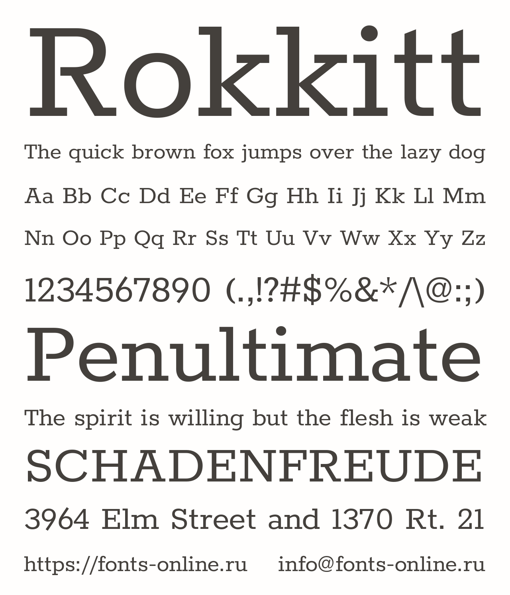
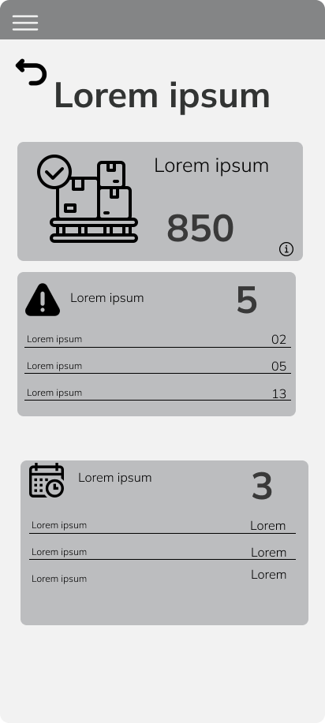
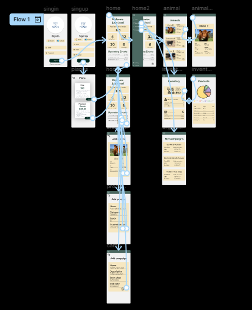

# 
COURSE PROJECT

    <strong>Universidad Peruana de Ciencias Aplicadas</strong> 
    </img> 
    <strong>Ingeniería de Software - 2025-20</strong> 
    <strong>Diseño de Experimentos de Ingeniería de Software - 14736</strong> 
    <strong>Profesor: Tinoco Licas, Juan Carlos</strong> 

    <strong>Startup: Bovinova</strong> 
    <strong>Producto: VacApp</strong>

    <h3>Team Members:</h3>
    <table align="center">
        <tr>
            <th style="text-align:center;">Member</th>
            <th style="text-align:center;">Code</th>
        </tr>
        <tr>
            <td>Checalla Apaza, Emanuel Renato</td>
            <td>U202322695</td>
        </tr>
        <tr>
            <td>Durand Vera, Gianfranco Angel</td>
            <td>U20201F640</td>
        </tr>
        <tr>
            <td>Gordillo Ramos, Santiago Alonso</td>
            <td>U202215160</td>
        </tr>
        <tr>
            <td>Inga Hernandez, Ayrton Damian</td>
            <td>U201924756</td>
        </tr>
         <tr>
            <td>Vargas Javier, Jose Enrique</td>
            <td>U20221F693</td>
         </tr>
    </table>

<b>
Septiembre, 2025
</b>

 

<h1 align="center">Registro de versiones del Informe</h1>
 
<table>
  <thead>
    <tr>
      <th>Versión</th>
      <th>Fecha</th>
      <th>Autor</th>
      <th>Descripción de modificaciones</th>
    </tr>
  </thead>
  <tbody>
    <tr>
      <td></td>
      <td></td>
      <td></td>
      <td></td>
    </tr>
  </tbody>
</table>

# Project Report Collaboration Insights

  

# Contenido
[Student Outcome](#student-outcome)

[Part I: As-Is Software Project](#part-i-as-is-software-project)

[Capítulo I: Introducción](#capitulo-i-introducción)
- [1.1. Startup Profile](#11-startup-profile)
  - [1.1.1. Descripción de la Startup](#111-descripción-de-la-startup)
  - [1.1.2. Perfiles de integrantes del equipo](#112-perfiles-de-integrantes-del-equipo)
- [1.2. Solution Profile](#12-solution-profile)
  - [1.2.1 Antecedentes y problemática](#121-antecedentes-y-problemática)
  - [1.2.2 Lean UX Process](#122-lean-ux-process)
    - [1.2.2.1. Lean UX Problem Statements](#1221-lean-ux-problem-statements)
    - [1.2.2.2. Lean UX Assumptions](#1222-lean-ux-assumptions)
    - [1.2.2.3. Lean UX Hypothesis Statements](#1223-lean-ux-hypothesis-statements)
    - [1.2.2.4. Lean UX Canvas](#1224-lean-ux-canvas)
- [1.3. Segmentos objetivo](#13-segmentos-objetivo)

[Capítulo II: Requirements Elicitation & Analysis](#capítulo-ii-requirements-elicitation--analysis)
- [2.1. Competidores](#21-competidores)
  - [2.1.1. Análisis competitivo](#211-análisis-competitivo)
  - [2.1.2. Estrategias y tácticas frente a competidores](#212-estrategias-y-tácticas-frente-a-competidores)
- [2.2. Entrevistas](#22-entrevistas)
  - [2.2.1. Diseño de entrevistas](#221-diseño-de-entrevistas)
  - [2.2.2. Registro de entrevistas](#222-registro-de-entrevistas)
  - [2.2.3. Análisis de entrevistas](#223-análisis-de-entrevistas)
- [2.3. Needfinding](#23-needfinding)
  - [2.3.1. User Personas](#231-user-personas)
  - [2.3.2. User Task Matrix](#232-user-task-matrix)
  - [2.3.3. User Journey Mapping](#233-user-journey-mapping)
  - [2.3.4. Empathy Mapping](#234-empathy-mapping)
  - [2.3.5. As-is Scenario Mapping](#235-as-is-scenario-mapping)
- [2.4. Ubiquitous Language](#24-ubiquitous-language)

[Capítulo III: Requirements Specification](#capítulo-iii-requirements-specification)
- [3.1. To-Be Scenario Mapping](#31-to-be-scenario-mapping)
- [3.2. User Stories](#32-user-stories)
- [3.3. Product Backlog](#33-product-backlog)
- [3.4. Impact Mapping](#34-impact-mapping)

[Capítulo IV: Product Design](#capítulo-iv-product-design)
- [4.1. Style Guidelines](#41-style-guidelines)
  - [4.1.1. General Style Guidelines](#411-general-style-guidelines)
  - [4.1.2. Web Style Guidelines](#412-web-style-guidelines)
  - [4.1.3. Mobile Style Guidelines](#413-mobile-style-guidelines)
    - [4.1.3.1. iOS Mobile Style Guidelines](#4131-ios-mobile-style-guidelines)
    - [4.1.3.2. Android Mobile Style Guidelines](#4132-android-mobile-style-guidelines)
- [4.2. Information Architecture](#42-information-architecture)
  - [4.2.1. Organization Systems](#421-organization-systems)
  - [4.2.2. Labeling Systems](#422-labeling-systems)
  - [4.2.3. SEO Tags and Meta Tags](#423-seo-tags-and-meta-tags)
  - [4.2.4. Searching Systems](#424-searching-systems)
  - [4.2.5. Navigation Systems](#425-navigation-systems)
- [4.3. Landing Page UI Design](#43-landing-page-ui-design)
  - [4.3.1. Landing Page Wireframe](#431-landing-page-wireframe)
  - [4.3.2. Landing Page Mock-up](#432-landing-page-mock-up)
- [4.4. Mobile Applications UX/UI Design](#44-mobile-applications-uxui-design)
  - [4.4.1. Mobile Applications Wireframes](#441-mobile-applications-wireframes)
  - [4.4.2. Mobile Applications Wireflow Diagrams](#442-mobile-applications-wireflow-diagrams)
  - [4.4.3. Mobile Applications Mock-ups](#443-mobile-applications-mock-ups)
  - [4.4.4. Mobile Applications User Flow Diagrams](#444-mobile-applications-user-flow-diagrams)
- [4.5. Mobile Applications Prototyping](#45-mobile-applications-prototyping)
  - [4.5.1. Android Mobile Applications Prototyping](#451-android-mobile-applications-prototyping)
  - [4.5.2. iOS Mobile Applications Prototyping](#452-ios-mobile-applications-prototyping)
- [4.6. Web Applications UX/UI Design](#46-web-applications-uxui-design)
  - [4.6.1. Web Applications Wireframes](#461-web-applications-wireframes)
  - [4.6.2. Web Applications Wireflow Diagrams](#462-web-applications-wireflow-diagrams)
  - [4.6.3. Web Applications Mock-ups](#463-web-applications-mock-ups)
  - [4.6.4. Web Applications User Flow Diagrams](#464-web-applications-user-flow-diagrams)
- [4.7. Web Applications Prototyping](#47-web-applications-prototyping)
- [4.8. Domain-Driven Software Architecture](#48-domain-driven-software-architecture)
  - [4.8.1. Software Architecture Context Diagram](#481-software-architecture-context-diagram)
  - [4.8.2. Software Architecture Container Diagrams](#482-software-architecture-container-diagrams)
  - [4.8.3. Software Architecture Components Diagrams](#483-software-architecture-components-diagrams)
- [4.9. Software Object-Oriented Design](#49-software-object-oriented-design)
  - [4.9.1. Class Diagrams](#491-class-diagrams)
  - [4.9.2. Class Dictionary](#492-class-dictionary)
- [4.10. Database Design](#410-database-design)
  - [4.10.1. Relational/Non-Relational Database Diagram](#4101-relationalnon-relational-database-diagram)

[Capítulo V: Product Implementation](#capítulo-v-product-implementation)
- [5.1. Software Configuration Management](#51-software-configuration-management)
  - [5.1.1. Software Development Environment Configuration](#511-software-development-environment-configuration)
  - [5.1.2. Source Code Management](#512-source-code-management)
  - [5.1.3. Source Code Style Guide & Conventions](#513-source-code-style-guide--conventions)
  - [5.1.4. Software Deployment Configuration](#514-software-deployment-configuration)
- [5.2. Product Implementation & Deployment](#52-product-implementation--deployment)
  - [5.2.1. Sprint Backlogs](#521-sprint-backlogs)
  - [5.2.2. Implemented Landing Page Evidence](#522-implemented-landing-page-evidence)
  - [5.2.3. Implemented Frontend-Web Application Evidence](#523-implemented--frontend-web-application-evidence)
  - [5.2.4. Acuerdo de Servicio - SaaS](#524-acuerdo-de-servicio---saas)
  - [5.2.5. Implemented Native-Mobile Application Evidence](#525-implemented-native-mobile-application-evidence)
  - [5.2.6. Implemented RESTful API and/or Serverless Backend Evidence](#526-implemented-restful-api-andor-serverless-backend-evidence)
  - [5.2.7. RESTful API documentation](#527-restful-api-documentation)
  - [5.2.8. Team Collaboration Insights](#528-team-collaboration-insights)
- [5.3. Video About-the-Product](#53-video-about-the-product)

[Part II: Verification, Validation & Pipeline](#part-ii-verification-validation--pipeline)

[Capítulo VI: Product Verification & Validation](#capítulo-vi-product-verification--validation)
- [6.1. Testing Suites & Validation](#61-testing-suites--validation)
  - [6.1.1. Core Entities Unit Tests](#611-core-entities-unit-tests)
  - [6.1.2. Core Integration Tests](#612-core-integration-tests)
  - [6.1.3. Core Behavior-Driven Development](#613-core-behavior-driven-development)
  - [6.1.4. Core System Tests](#614-core-system-tests)
- [6.2. Static Testing & Verification](#62-static-testing--verification)
  - [6.2.1. Static Code Analysis](#621-static-code-analysis)
    - [6.2.1.1. Coding Standard & Code Conventions](#6211-coding-standard--code-conventions)
    - [6.2.1.2. Code Quality & Code Security](#6212-code-quality--code-security)
  - [6.2.2. Reviews](#622-reviews)
- [6.3. Validation Interviews](#63-validation-interviews)
  - [6.3.1. Diseño de Entrevistas](#631-diseño-de-entrevistas)
  - [6.3.2. Registro de Entrevistas](#632-registro-de-entrevistas)
  - [6.3.3. Evaluaciones según heurísticas](#633-evaluaciones-según-heurísticas)
- [6.4. Auditoría de Experiencias de Usuario](#64-auditoría-de-experiencias-de-usuario)
  - [6.4.1. Auditoría realizada](#641-auditoría-realizada)
    - [6.4.1.1. Información del grupo auditado](#6411-información-del-grupo-auditado)
    - [6.4.1.2. Cronograma de auditoría realizada](#6412-cronograma-de-auditoría-realizada)
    - [6.4.1.3. Contenido de auditoría realizada](#6413-contenido-de-auditoría-realizada)
  - [6.4.2. Auditoría recibida](#642-auditoría-recibida)
    - [6.4.2.1. Información del grupo auditor](#6421-información-del-grupo-auditor)
    - [6.4.2.2. Cronograma de auditoría recibida](#6422-cronograma-de-auditoría-recibida)
    - [6.4.2.3. Contenido de auditoría recibida](#6423-contenido-de-auditoría-recibida)
    - [6.4.2.4. Resumen de modificaciones para subsanar hallazgos](#6424-resumen-de-modificaciones-para-subsanar-hallazgos)

[Capítulo VII: DevOps Practices](#capítulo-vii-devops-practices)
- [7.1. Continuous Integration](#71-continuous-integration)
  - [7.1.1. Tools and Practices](#711-tools-and-practices)
  - [7.1.2. Build & Test Suite Pipeline Components](#712-build--test-suite-pipeline-components)
- [7.2. Continuous Delivery](#72-continuous-delivery)
  - [7.2.1. Tools and Practices](#721-tools-and-practices)
  - [7.2.2. Stages Deployment Pipeline Components](#722-stages-deployment-pipeline-components)
- [7.3. Continuous Deployment](#73-continuous-deployment)
  - [7.3.1. Tools and Practices](#731-tools-and-practices)
  - [7.3.2. Production Deployment Pipeline Components](#732-production-deployment-pipeline-components)
- [7.4. Continuous Monitoring](#74-continuous-monitoring)
  - [7.4.1. Tools and Practices](#741-tools-and-practices)
  - [7.4.2. Monitoring Pipeline Components](#742-monitoring-pipeline-components)
  - [7.4.3. Alerting Pipeline Components](#743-alerting-pipeline-components)
  - [7.4.4. Notification Pipeline Components](#744-notification-pipeline-components)

[Part III: Experiment-Driven Lifecycle](#part-iii-experiment-driven-lifecycle)

[Capítulo VIII: Experiment-Driven Development](#capítulo-viii-experiment-driven-development)
- [8.1. Experiment Planning](#81-experiment-planning)
  - [8.1.1. As-Is Summary](#811-as-is-summary)
  - [8.1.2. Raw Material: Assumptions, Knowledge Gaps, Ideas, Claims](#812-raw-material-assumptions-knowledge-gaps-ideas-claims)
  - [8.1.3. Experiment-Ready Questions](#813-experiment-ready-questions)
  - [8.1.4. Question Backlog](#814-question-backlog)
  - [8.1.5. Experiment Cards](#815-experiment-cards)
- [8.2. Experiment Design](#82-experiment-design)
  - [8.2.1. Hypotheses](#821-hypotheses)
  - [8.2.2. Domain Business Metrics](#822-domain-business-metrics)
  - [8.2.3. Measures](#823-measures)
  - [8.2.4. Conditions](#824-conditions)
  - [8.2.5. Scale Calculations and Decisions](#825-scale-calculations-and-decisions)
  - [8.2.6. Methods Selection](#826-methods-selection)
  - [8.2.7. Data Analytics: Goals, KPIs and Metrics Selection](#827-data-analytics-goals-kpis-and-metrics-selection)
  - [8.2.8. Web and Mobile Tracking Plan](#828-web-and-mobile-tracking-plan)
- [8.3. Experimentation](#83-experimentation)
  - [8.3.1. To-Be User Stories](#831-to-be-user-stories)
  - [8.3.2. To-Be Product Backlog](#832-to-be-product-backlog)
  - [8.3.3. Pipeline-supported, Experiment-Driven To-Be Software Platform Lifecycle](#833-pipeline-supported-experiment-driven-to-be-software-platform-lifecycle)
    - [8.3.3.1. To-Be Sprint Backlogs](#8331-to-be-sprint-backlogs)
    - [8.3.3.2. Implemented To-Be Landing Page Evidence](#8332-implemented-to-be-landing-page-evidence)
    - [8.3.3.3. Implemented To-Be Frontend-Web Application Evidence](#8333-implemented-to-be-frontend-web-application-evidence)
    - [8.3.3.4. Implemented To-Be Native-Mobile Application Evidence](#8334-implemented-to-be-native-mobile-application-evidence)
    - [8.3.3.5. Implemented To-Be RESTful API and/or Serverless Backend Evidence](#8335-implemented-to-be-restful-api-andor-serverless-backend-evidence)
    - [8.3.3.6. Team Collaboration Insights](#8336-team-collaboration-insights)
  - [8.3.4. To-Be Validation Interviews](#834-to-be-validation-interviews)
    - [8.3.4.1. Diseño de Entrevistas](#8341-diseño-de-entrevistas)
    - [8.3.4.2. Registro de Entrevistas](#8342-registro-de-entrevistas)
- [8.4. Experiment Aftermath & Analysis](#84-experiment-aftermath--analysis)
  - [8.4.1. Analysis and Interpretation of Results](#841-analysis-and-interpretation-of-results)
  - [8.4.2. Re-scored and Re-prioritized Question Backlog](#842-re-scored-and-re-prioritized-question-backlog)
- [8.5. Continuous Learning](#85-continuous-learning)
  - [8.5.1. Shareback Session Artifacts: Learning Workflow](#851-shareback-session-artifacts-learning-workflow)
- [8.6. To-Be Software Platform Pre-launch](#86-to-be-software-platform-pre-launch)
  - [8.6.1. About-the-Product Intro Video](#861-about-the-product-intro-video)

[Conclusiones](#conclusiones)
- [Conclusiones y recomendaciones](#conclusiones-y-recomendaciones)
- [Video App Validation](#video-app-validation)
- [Video About-the-Team](#video-about-the-team)

[Bibliografía](#bibliografía)

[Anexos](#anexos)

# Student Outcome  
ABET – EAC - Student Outcome 4  

**Criterio:** Capacidad de reconocer responsabilidades éticas y profesionales en situaciones de ingeniería y hacer juicios informados, considerando el impacto de las soluciones en contextos globales, económicos, ambientales y sociales.  

<table>
  <tr>
    <td><b>Criterio específico</b></td>
    <td><b>Acciones realizadas</b></td>
    <td><b>Conclusiones</b></td>
  </tr>
  <tbody>
    <tr>
      <td><b>Reconoce responsabilidad ética y profesional en situaciones de ingeniería de software</b></td>
      <td>
        
<b>Emanuel Checalla Apaza</b>

        
<b>TB1:</b> [Acciones]

        
<b>TP1:</b> [Acciones]

        
<b>TB2:</b> [Acciones]

        
<b>TF:</b> [Acciones]

         
        
<b>Gianfranco Durand Vera</b>

        
<b>TB1:</b> [Acciones]

        
<b>TP1:</b> [Acciones]

        
<b>TB2:</b> [Acciones]

        
<b>TF:</b> [Acciones]

         
        
<b>Santiago Gordillo Ramos</b>

        
<b>TB1:</b> [Acciones]

        
<b>TP1:</b> [Acciones]

        
<b>TB2:</b> [Acciones]

        
<b>TF:</b> [Acciones]

         
        
<b>Ayrton Inga Hernandez</b>

        
<b>TB1:</b> [Acciones]

        
<b>TP1:</b> [Acciones]

        
<b>TB2:</b> [Acciones]

        
<b>TF:</b> [Acciones]

         
        
<b>Jose Vargas Javier</b>

        
<b>TB1:</b> [Acciones]

        
<b>TP1:</b> [Acciones]

        
<b>TB2:</b> [Acciones]

        
<b>TF:</b> [Acciones]

      </td>
      <td>
        
<b>TB1:</b> [Conclusiones]

        
<b>TP1:</b> [Conclusiones]

        
<b>TB2:</b> [Conclusiones]

        
<b>TF:</b> [Conclusiones]

      </td>
    </tr>
    <tr>
      <td><b>Emite juicios informados considerando el impacto de las soluciones de ingeniería de software en contextos globales, económicos, ambientales y sociales</b></td>
      <td>
        
<b>Emanuel Checalla Apaza</b>

        
<b>TB1:</b> [Acciones]

        
<b>TP1:</b> [Acciones]

        
<b>TB2:</b> [Acciones]

        
<b>TF:</b> [Acciones]

         
        
<b>Gianfranco Durand Vera</b>

        
<b>TB1:</b> [Acciones]

        
<b>TP1:</b> [Acciones]

        
<b>TB2:</b> [Acciones]

        
<b>TF:</b> [Acciones]

         
        
<b>Santiago Gordillo Ramos</b>

        
<b>TB1:</b> [Acciones]

        
<b>TP1:</b> [Acciones]

        
<b>TB2:</b> [Acciones]

        
<b>TF:</b> [Acciones]

         
        
<b>Ayrton Inga Hernandez</b>

        
<b>TB1:</b> [Acciones]

        
<b>TP1:</b> [Acciones]

        
<b>TB2:</b> [Acciones]

        
<b>TF:</b> [Acciones]

         
        
<b>Jose Vargas Javier</b>

        
<b>TB1:</b> [Acciones]

        
<b>TP1:</b> [Acciones]

        
<b>TB2:</b> [Acciones]

        
<b>TF:</b> [Acciones]

      </td>
      <td>
        
<b>TB1:</b> [Conclusiones]

        
<b>TP1:</b> [Conclusiones]

        
<b>TB2:</b> [Conclusiones]

        
<b>TF:</b> [Conclusiones]

      </td>
    </tr>
  </tbody>
</table>

# Part I: As-Is Software Project

# Capítulo I: Introducción
## 1.1. Startup Profile
### 1.1.1. Descripción de la Startup
### 1.1.2. Perfiles de integrantes del equipo
<table>
  <tr>
    <th>
      
    </th>
    <td valign="top">
      
<b></b>

      

    </td>
  </tr>
  <tr>
    <th>
      
    </th>
    <td valign="top">
      
<b></b>

      

    </td>
  </tr>
  <tr>
    <th>
      
    </th>
    <td valign="top">
      
<b></b>

      

    </td>
  </tr>
  <tr>
    <th>
      
    </th>
    <td valign="top">
      
<b></b>

      

    </td>
  </tr>
  <tr>
    <th>
      
    </th>
    <td valign="top">
      
<b></b>

      

    </td>
  </tr>
</table>

## 1.2. Solution Profile
### 1.2.1. Antecedentes y problemática
### 1.2.2. Lean UX Process
#### 1.2.2.1. Lean UX Problem Statements
#### 1.2.2.2. Lean UX Assumptions
#### 1.2.2.3. Lean UX Hypothesis Statements
#### 1.2.2.4. Lean UX Canvas
## 1.3. Segmentos objetivo

# Capítulo II: Requirements Elicitation & Analysis 
## 2.1. Competidores
### 2.1.1. Análisis competitivo
### 2.1.2. Estrategias y tácticas frente a competidores
## 2.2. Entrevistas
### 2.2.1. Diseño de entrevistas
### 2.2.2. Registro de entrevistas
### 2.2.3. Análisis de entrevistas
## 2.3. Needfinding
### 2.3.1. User Personas
### 2.3.2. User Task Matrix
### 2.3.3. User Journey Mapping
### 2.3.4. Empathy Mapping
### 2.3.5. As-is Scenario Mapping
## 2.4. Ubiquitous Language

# Capítulo III: Requirements Specification
## 3.1. To-Be Scenario Mapping
## 3.2. User Stories
## 3.3. Product Backlog
## 3.4. Impact Mapping

# Capítulo IV: Product Design
## 4.1. Style Guidelines
Para asegurar una comunicación visual coherente y profesional en todos los aspectos del proyecto VacApp, es fundamental contar con unas Style Guidelines. Estas directrices son aplicables a cualquier plataforma de difusión, ya sea impresa o digital. 

En esta sección, se establecen las pautas que el equipo deberá seguir para la creación de VacApp, definiendo elementos clave como la elección de colores, la tipografía, y la estructura visual en general.

El diseño tanto de la aplicación móvil como de la landing page se realizará en Figma. La paleta de colores principal estará compuesta por tonos verdes y cremas, elegidos para evocar la naturaleza y transmitir una sensación de confianza y responsabilidad en el cuidado de los animales.

### 4.1.1. General Style Guidelines
**Branding**

El branding de VacApp está diseñado para generar confianza y solidez, destacando el compromiso con la ganadería bovina sostenible. La identidad visual se conecta con la naturaleza y la productividad del campo, usando elementos gráficos que reflejan el cuidado responsable del ganado. El objetivo es crear una imagen fuerte, clara y fácil de reconocer para los productores y profesionales del sector.

**Typography**

La tipografía de VacApp es moderna, clara y optimizada para la legibilidad en pantallas móviles. Usamos la fuente Rokkitt para los títulos, lo que ayuda a jerarquizar la información. Para el cuerpo del texto, la fuente Mulish garantiza una lectura cómoda, incluso durante un uso prolongado. El diseño tipográfico busca ser serio, pero sin perder cercanía ni accesibilidad.

    
    

**Colors**

La paleta de colores de VacApp incluye tonos verdes y cremas, elegidos para evocar la naturaleza y la confianza en la gestión sostenible de animales. Los verdes simbolizan frescura, salud y sostenibilidad, mientras que los tonos crema refuerzan la conexión con la tierra y la tradición del campo. Estos colores se usarán estratégicamente para crear una interfaz armoniosa y accesible en dispositivos móviles.

    

**Spacing**

Se ha implementado un espaciado adecuado en toda la interfaz para evitar la sobrecarga visual y asegurar una navegación fluida. Los márgenes y los espacios entre los componentes están diseñados cuidadosamente para lograr un diseño equilibrado y organizado. Esto es clave para facilitar la interacción en dispositivos móviles, donde la precisión es fundamental.

**Tono de Comunicación**

El tono de comunicación de VacApp es informativo, respetuoso y cercano, dirigiéndose directamente a los profesionales de la ganadería bovina. El lenguaje es claro, profesional y accesible, buscando transmitir confianza y conocimiento sobre el manejo del ganado. El objetivo es que el usuario se sienta apoyado y bien informado, manteniendo siempre la seriedad y la responsabilidad propias del sector.

### 4.1.2. Web Style Guidelines
La aplicación web VacApp se enfoca en la eficiencia, la productividad y la sostenibilidad en el sector ganadero. Su estructura se divide en secciones principales —Inicio, Registro, Animales, Inventario, Reportes y Contacto— que se ubican en la interfaz para permitir una navegación intuitiva y una experiencia de usuario clara y uniforme.

- **Imágenes:**
En el diseño web de VacApp, las imágenes se utilizan de manera estratégica y descriptiva. La página de inicio mostrará fotografías del ganado y las instalaciones, con el logotipo de la empresa en la esquina superior izquierda para un fácil reconocimiento. Cada sección principal incluirá imágenes representativas del ganado, reforzando el enfoque en la gestión animal de la plataforma. Para mejorar la experiencia en dispositivos de escritorio, se evitan las imágenes de fondo, usando en su lugar imágenes laterales que guíen al usuario de manera funcional a lo largo de la interfaz.

- **Botones:**
Los botones de la aplicación web VacApp están diseñados siguiendo las pautas de estilo generales. Por lo general, se ubican en la parte inferior de la sección principal de la pantalla, lo que permite que las acciones del usuario se reflejen en la parte superior. Para operaciones que inician nuevos procesos o afectan el funcionamiento global, se incorporan botones de confirmación. Todos los botones tienen un diseño visualmente destacado y un alto contraste para garantizar su fácil identificación. Se utiliza la teoría del color para indicar el propósito de cada botón, empleando colores específicos para acciones como finalizar o eliminar procesos.

- **Pantallas Emergentes:**
Las ventanas emergentes en VacApp están diseñadas para validar acciones importantes que afectan directamente la operación ganadera. Estas ventanas resaltan la necesidad de confirmar la situación presentada antes de continuar, fomentando la toma de decisiones conscientes en momentos clave del proceso de gestión.

### 4.1.3. Mobile Style Guidelines
#### 4.1.3.1. iOS Mobile Style Guidelines
El diseño de la aplicación VacApp en dispositivos iOS sigue las convenciones de Apple, priorizando una interfaz limpia, funcional y coherente con la experiencia nativa del sistema operativo.

- **Diseño y Navegación:**
Se implementa un diseño centrado en el usuario, con una barra de pestañas (tab bar) en la parte inferior para facilitar el acceso rápido a las secciones principales. Las transiciones entre pantallas son suaves y fluidas, respetando las guías de movimiento de Apple para una experiencia natural.

- **Tipografía y Espaciado:**
Se utiliza el sistema tipográfico de Apple, San Francisco, para garantizar legibilidad y consistencia visual. Los espacios entre los elementos se ajustan automáticamente para respetar la jerarquía visual y evitar la saturación en la pantalla.

- **Iconografía y Controles:**
Se usan íconos del sistema de iOS y personalizados que siguen la línea visual de VacApp, con un enfoque minimalista. Los controles como toggles, sliders y pickers conservan la apariencia nativa, adaptándose al diseño funcional y ganadero de la aplicación.

- **Botones e Interacciones:**
Los botones se ubican en la parte inferior de la pantalla y usan colores de alto contraste. Se aplica la teoría del color para indicar las funciones críticas (confirmar, cancelar, continuar). Además, se utiliza la respuesta háptica (Haptic Feedback) para confirmar interacciones clave, mejorando la experiencia sensorial del usuario.

- **Accesibilidad:**
Para garantizar la accesibilidad, se respeta el contraste recomendado por Apple y se integra VoiceOver, permitiendo la navegación a través de un lector de pantalla.

#### 4.1.3.2. Android Mobile Style Guidelines
La versión de VacApp para Android adopta las guías de diseño de Material Design de Google, integrando los principios de sostenibilidad y eficiencia en su estructura visual e interactiva.

- **Diseño y Navegación:**
La aplicación utiliza una arquitectura basada en Material 3. La navegación se realiza a través de una barra de navegación inferior (Bottom Navigation Bar) para las secciones principales y un menú tipo hamburguesa para las opciones secundarias. Las transiciones entre pantallas son fluidas, con animaciones de entrada y salida que garantizan una experiencia continua.

- **Tipografía y Espaciado:**
Se usa la fuente Roboto o Google Sans para asegurar la legibilidad en diferentes dispositivos. Los márgenes y los espacios entre los elementos están cuidadosamente diseñados para evitar la saturación visual y ofrecer una experiencia limpia.

- **Iconografía y Controles:**
La aplicación prioriza el uso de componentes estándar de Material Design, como botones flotantes (FAB) para acciones destacadas, chips para filtros y bottom sheets para formularios extensos. Se emplean íconos vectoriales (Material Icons), acompañados de texto cuando es necesario para una mayor claridad.

- **Botones e Interacciones:**
Los botones principales, como los de confirmar o cancelar, tienen un estilo Elevated Button y usan colores que representan la acción (verde para confirmar, rojo para cancelar, etc.). Estos botones se ubican en la parte inferior de la pantalla para que sean fácilmente accesibles con una sola mano.

- **Accesibilidad:**
Para garantizar la accesibilidad, la aplicación es compatible con TalkBack, soporta la navegación por gestos y asegura un contraste adecuado en todos los elementos interactivos. Además, el contenido se adapta al ajuste de tamaño de fuente del sistema, asegurando la escalabilidad.

## 4.2. Information Architecture
La arquitectura de información de VacApp está diseñada para ofrecer una experiencia de usuario fluida y natural en la aplicación web, aplicación móvil y en la Landing Page. Nuestro objetivo principal es que los usuarios puedan encontrar las funciones clave de la plataforma de manera rápida y sencilla. Para lograr esto, hemos implementado principios de organización claros, etiquetas simples, sistemas de búsqueda eficientes y una navegación intuitiva.

### 4.2.1. Organization Systems
Para VacApp, los esquemas de organización se adaptan al tipo de contenido:

- **Jerárquica:** Usada en la Landing Page y en la pantalla principal para destacar las funciones más importantes, como el registro de ganado y el control sanitario.
- **Secuencial:** Guía al usuario en procesos paso a paso, como el registro de animales.
- **Por Tópicos:** La información técnica (manuales o ayuda) se organiza por temas relevantes: salud animal, nutrición, etc.
- **Según Audiencia:** Ciertas vistas, como el panel administrativo o el perfil del veterinario, muestran información personalizada según el rol del usuario.

### 4.2.2. Labeling Systems
El sistema de etiquetado de VacApp se enfoca en la claridad y el uso de un lenguaje directo que el sector ganadero ya reconoce. 

- Se evitan las jergas.
- Se utilizan verbos directos como "Registrar", "Consultar" y "Programar".
- Las categorías principales tienen nombres claros ("Animales", "Citas").
- Se usan iconos para reforzar su significado visualmente.

### 4.2.3. SEO Tags and Meta Tags
Para mejorar la visibilidad de VacApp en motores de búsqueda y tiendas de aplicaciones, se han definido los siguientes valores:

- **Landing Page y Web App:**
  - **Título:** VacApp – Gestión inteligente para la ganadería bovina
  - **Meta Descripción:** Plataforma digital que optimiza el control sanitario, inventario y manejo del ganado bovino.
  - **Keywords:** ganadería, salud animal, veterinaria, bovino, control de ganado, app ganadera

- **App Store Optimization (ASO):**
  - **Título de la App:** VacApp
  - **Subtítulo:** Manejo digital de tu ganado bovino
  - **Keywords:** ganadería, bovinos, recetas, veterinarios, animales
  - **Descripción:** VacApp es una aplicación móvil para modernizar la gestión ganadera en Perú, ideal para ganaderos independientes y empresas del sector.

### 4.2.4. Searching Systems
VacApp incluirá sistemas de búsqueda contextual y filtros adaptados a cada sección, diseñados para facilitar la localización de información.

- **Búsqueda global:** Permite encontrar datos por nombre, código de animal o categoría.
- **Filtros personalizados:** Permite refinar los resultados por criterios como el estado de salud, el tipo de ganado o las fechas de registro.
- **Sugerencias automáticas:** Ofrece resultados predictivos mientras el usuario escribe (auto-complete).
- **Resultados claros:** Se presentan con etiquetas, íconos e información resumida, como el nombre, la fecha y la categoría.

### 4.2.5. Navigation Systems
La navegación de VacApp está diseñada para ser intuitiva y fácil de aprender, basándose en patrones comunes de aplicaciones móviles.

- **Navegación Inferior:** Proporciona accesos rápidos a secciones clave como Inicio, Animales y Perfil.
- **Menú Hamburguesa:** Incluye opciones complementarias como configuración, soporte y la opción de cerrar sesión.
- **Enlaces Jerárquicos:** Permiten al usuario moverse entre secciones sin perder el contexto de dónde se encuentra.
- **Flujos de Usuario Optimizados:** Guían al usuario con pasos claros en tareas importantes como el registro de un animal.
- **Indicadores Visuales:** Elementos como breadcrumbs y estados activos mantienen al usuario siempre informado sobre su ubicación actual dentro de la app.

## 4.3. Landing Page UI Design
### 4.3.1. Landing Page Wireframe
*Landing Page Wireframe Desktop*

  

*Landing Page Wireframe Mobile*

  

### 4.3.2. Landing Page Mock-up
*Landing Page Mock-up Desktop*

  

*Landing Page Mock-up Mobile*

  

[Figma:](https://shorturl.at/qj7Kv) https://shorturl.at/qj7Kv

## 4.4. Mobile Applications UX/UI Design
### 4.4.1. Mobile Applications Wireframes
*Inicio sesión*

  

*Registro*

  

*Planes*

  

*Home*

  
  
  

*Animals*

  
  

*Inventario*

  
  

*Campaña*

  

*Agregar animal*

  

*Agregar inventario*

  

*Agregar campaña*

  

### 4.4.2. Mobile Applications Wireflow Diagrams
*User Goal: Iniciar sesión y Registrarse*

  

*User Goal: Home y navegar por las secciones "Animals","Campaigns" e "Inventory"*

  

*User Goal: Registro de un nuevo dato ya sea "Animals","Campaigns" o "Inventory"*

  

### 4.4.3. Mobile Applications Mock-ups
*Inicio Sesion*

  

*Registro*

  

*Planes*

  

*Home*

  
  
  

*Animals*

  
  

*Inventario*

  
  

*Campaña*

  

*Agregar animal*

  

*Agregar inventario*

  

*Agregar campaña*

  

### 4.4.4. Mobile Applications User Flow Diagrams
*User Goal: Iniciar sesión y Registrarse*

  

*User Goal: Home y navegar por las secciones "Animals","Campaigns" e "Inventory"*

  

*User Goal: Registro de un nuevo dato ya sea "Animals","Campaigns" o "Inventory"*

  

## 4.5. Mobile Applications Prototyping
### 4.5.1. Android Mobile Applications Prototyping

  

[Figma:](https://shorturl.at/zcgdp) https://shorturl.at/zcgdp

### 4.5.2. iOS Mobile Applications Prototyping

  

[Figma:](https://shorturl.at/zcgdp) https://shorturl.at/zcgdp

## 4.6. Web Applications UX/UI Design
### 4.6.1. Web Applications Wireframes
*Inicio de sesión y registro de usuarios*

  

*User Home y vistas previas para el usuario en Organizaciones y Gestión del Ganado*

  

*Menú de opciones y vista previa a los menus de registro y registro de Campaña*

  

*Vista previa de Registro de Bovino y Registro Alimentario por cada Bovino*

  

### 4.6.2. Web Applications Wireflow Diagrams
*Inicio de sesión y registro de usuarios*

  

*User Home y vistas previas para el usuario en Organizaciones y Gestión del Ganado*

  

*Menú de opciones y vista previa a los menus de registro y registro de Campaña*

  

*Vista previa de Registro de Bovino y Registro Alimentario por cada Bovino*

  

### 4.6.3. Web Applications Mock-ups
*Inicio de sesión y registro de usuarios*

  

*User Home y vistas previas para el usuario en Organizaciones y Gestión del Ganado*

  

*Menú de opciones y vista previa a los menus de registro y registro de Campaña*

  

*Vista previa de Registro de Bovino y Registro Alimentario por cada Bovino*

  

### 4.6.4. Web Applications User Flow Diagrams
*Inicio de sesión y registro de usuarios*

  

*User Home y vistas previas para el usuario en Organizaciones y Gestión del Ganado*

  

*Menú de opciones y vista previa a los menus de registro y registro de Campaña*

  

*Vista previa de Registro de Bovino y Registro Alimentario por cada Bovino*

  

## 4.7. Web Applications Prototyping

  

## 4.8. Domain-Driven Software Architecture
### 4.8.1. Software Architecture Context Diagram

  

### 4.8.2. Software Architecture Container Diagrams

  

### 4.8.3. Software Architecture Components Diagrams

  

## 4.9. Software Object-Oriented Design
### 4.9.1. Class Diagrams

  

### 4.9.2. Class Dictionary

| Entidad | Nombre de Atributos | Definición | Tipo de dato | Unidad de Medida | Valores Restringidos |
|---------|---------------------|------------|--------------|------------------|----------------------|
| User |
| 1 | id | Identificador del usuario | integer | 2 bytes | Mayor a Cero |
| 2 | emailAddress | Correo del usuario | string | Cadena de caracteres | Permite solo caracteres o letras |
| 3 | password | Contraseña del usuario | string | Cadena de caracteres | Permite solo caracteres o letras |
| 4 | loginDate | Fecha de inicio de sesión | boolean | 2 bytes | uno o cero |
| 5 | registerDate | Fecha de registro | date | Días | Permite solo fechas |
| 6 | subscriptionType | Tipo de suscripción | string | Cadena de caracteres | Permite solo caracteres o letras |
| Business Account |
| 1 | businessName | Nombre del negocio | string | Cadena de caracteres | Permite solo caracteres o letras |
| 2 | businessAdress | Dirección fisica del negocio | string | Cadena de caracteres | Permite solo caracteres o letras |
| 3 | numberRuc | Número de Ruc del negocio | int | 2 bytes | Mayor a Cero |
| Customer |
| 1 | firstName | Nombre del cliente | string | Cadena de caracteres | Permite solo caracteres o letras |
| 2 | lastName | Apellido del cliente | string | Cadena de caracteres | Permite solo caracteres o letras |
| 3 | numberDNI | Número de DNI | int | 2 bytes | Mayor a Cero |
| Subscription |
| 1 | id | Identificador de la suscripción | int | 2 bytes | Mayor a Cero |
| 2 | subscriptionType | Tipo de suscripción | string | Cadena de caracteres | Permite solo caracteres o letras |
| 3 | subscriptionOwner | Dueño de la suscripción | string | Cadena de caracteres | Permite solo caracteres o letras |
| Livestock Producer |
| 1 | firstName | Nombre del productor ganadero | string | Cadena de caracteres | Permite solo caracteres o letras |
| 2 | lastName | Apellido del productor ganadero | string | Cadena de caracteres | Permite solo caracteres o letras |
| 3 | numberDNI | Número de DNI | int | 2 bytes | Mayor a Cero |
| Animal Manager |
| 1 | id | Identificador del administrador de animales | int | 2 bytes | Mayor a Cero |
| Animal |
| 1 | animalId | Identificador del animal | int | 2 bytes | Mayor a Cero |
| 2 | animalName | Nombre del animal | string | Cadena de caracteres | Permite solo caracteres o letras |
| 3 | bornDate | Fecha de nacimiento del animal | date | Días | Permite solo fechas |
| 4 | motherId | Identificador del administrador de animales | string | Cadena de caracteres | Permite solo caracteres o letras |
| 5 | originCountry | Identificador del administrador de animales | string | Cadena de caracteres | Permite solo caracteres o letras |
| 6 | animalGender | Identificador del administrador de animales | string | Cadena de caracteres | Permite solo caracteres o letras |
| 7 | animalLocation | Identificador del administrador de animales | string | Cadena de caracteres | Permite solo caracteres o letras |
| Animal Groups |
| 1 | groupId | Identificador de los grupos de animales | int | 2 bytes | Mayor a Cero |
| 2 | groupLocation | Ubicacion del grupo | string | Cadena de caracteres | Permite solo caracteres o letras |
| Bovine Identification Document |
| 1 | documentId | Identificador del documento | int | 2 bytes | Mayor a Cero |
| 2 | expiryDate | Fecha de expiración del documento | date | Días | Permite solo fechas |
| Animal Performance |
| 1 | id | Identificador para el redimiento del animal | int | 2 bytes | Mayor a Cero |
| 2 | animalState | Descripción estado del animal | string | Cadena de caracteres | Permite solo caracteres o letras |
| 3 | createDate | Registro fecha de creación | date | Días | Permite solo fechas |
| 4 | performance | Rendimiento del animal como porcentaje | int | 2 bytes | Mayor a Cero |
| Animal Status Report |
| 1 | reportId | Identificador para cada reporte | int | 2 bytes | Mayor a Cero |
| 2 | createdDate | Registro fecha de creación del reporte | date | Días | Permite solo fechas |
| Animal Medical History |
| 1 | historyId | Identificador para historia medica | int | 2 bytes | Mayor a Cero |
| 2 | createdDate | Registro fecha de creación de la historia medica | date | Días | Permite solo fechas |
| 3 | acessDate | Registro fecha de acceso a la historia medica | date | Días | Permite solo fechas |
| Notification |
| 1 | notificationId | Identificador para cada notificación | int | 2 bytes | Mayor a Cero |
| 2 | notificationType | Tipo de cada notificación | string | Cadena de caracteres | Permite solo caracteres o letras |
| 3 | notificationContent | Contenido de la notificación | string | Cadena de caracteres | Permite solo caracteres o letras |
| Meal Plans |
| 1 | mealPlanId | Identificador para cada plan alimenticio | int | 2 bytes | Mayor a Cero |
| 2 | typeFood | Tipo de comida de cada plan alimenticio | string | Cadena de caracteres | Permite solo caracteres o letras |
| 3 | modifiedDate | Fecha de modificación | date | Días | Permite solo fechas |
| Vaccine |
| 1 | vaccineId | Identificador para cada registro de vacunación | int | 2 bytes | Mayor a Cero |
| 2 | vaccineName | Nombre del cada vacuna | string | Cadena de caracteres | Permite solo caracteres o letras |
| 3 | vaccineCode | Codigo de cada vacuna | int | 2 bytes | Mayor a Cero |
| 4 | applicationReason | Razón de aplicación | string | Cadena de caracteres | Permite solo caracteres o letras |
| Reproduction |
| 1 | reproductionId | Identificador para cada registro de reproducción | int | 2 bytes | Mayor a Cero |
| 2 | registerDate | Fecha de registro | date | Días | Permite solo fechas |
| 3 | offspringNumber | Número de crías | int | 2 bytes | Mayor a Cero |
| Veterinary |
| 1 | veterinaryId | Identificador para cada veterinario | int | 2 bytes | Mayor a Cero |
| 2 | firstName | Nombre del veterinario | string | Cadena de caracteres | Permite solo caracteres o letras |
| 3 | lastName | Apellido del veterinario | string | Cadena de caracteres | Permite solo caracteres o letras |
| 4 | vetPermit | Autorización del veterinario | int | 2 bytes | Mayor a Cero |
| Veterinary Report |
| 1 | reportId | Identificador para cada reporte | int | 2 bytes | Mayor a Cero |
| 2 | createdDate | Fecha de creación de cada reporte | date | Días | Permite solo fechas |
| 3 | animalId | Identificador de cada animal | int | 2 bytes | Mayor a Cero |
| 4 | contactNumber | Número de contacto del veterinario | int | 2 bytes | Mayor a Cero |

## 4.10. Database Design
### 4.10.1. Relational/Non-Relational Database Diagram

  

# Capítulo V: Product Implementation
## 5.1. Software Configuration Management
### 5.1.1. Software Development Environment Configuration
### 5.1.2. Source Code Management
### 5.1.3. Source Code Style Guide & Conventions
### 5.1.4. Software Deployment Configuration
## 5.2. Product Implementation & Deployment
### 5.2.1. Sprint Backlogs
### 5.2.2. Implemented Landing Page Evidence
### 5.2.3. Implemented Frontend-Web Application Evidence
### 5.2.4. Acuerdo de Servicio - SaaS
### 5.2.5. Implemented Native-Mobile Application Evidence
### 5.2.6. Implemented RESTful API and/or Serverless Backend Evidence
### 5.2.7. RESTful API documentation
### 5.2.8. Team Collaboration Insights
## 5.3. Video About-the-Product

# Part II: Verification, Validation & Pipeline

# Capítulo VI: Product Verification & Validation
## 6.1. Testing Suites & Validation
### 6.1.1. Core Entities Unit Tests
### 6.1.2. Core Integration Tests
### 6.1.3. Core Behavior-Driven Development
### 6.1.4. Core System Tests
## 6.2. Static Testing & Verification
### 6.2.1. Static Code Analysis
#### 6.2.1.1. Coding Standard & Code Conventions
#### 6.2.1.2. Code Quality & Code Security
### 6.2.2. Reviews
## 6.3. Validation Interviews
### 6.3.1. Diseño de Entrevistas
### 6.3.2. Registro de Entrevistas
### 6.3.3. Evaluaciones según heurísticas
## 6.4. Auditoría de Experiencias de Usuario
### 6.4.1. Auditoría realizada
#### 6.4.1.1. Información del grupo auditado
#### 6.4.1.2. Cronograma de auditoría realizada
#### 6.4.1.3. Contenido de auditoría realizada
### 6.4.2. Auditoría recibida
#### 6.4.2.1. Información del grupo auditor
#### 6.4.2.2. Cronograma de auditoría recibida
#### 6.4.2.3. Contenido de auditoría recibida
#### 6.4.2.4. Resumen de modificaciones para subsanar hallazgos

# Capítulo VII: DevOps Practices
## 7.1. Continuous Integration
### 7.1.1. Tools and Practices
### 7.1.2. Build & Test Suite Pipeline Components
## 7.2. Continuous Delivery
### 7.2.1. Tools and Practices
### 7.2.2. Stages Deployment Pipeline Components
## 7.3. Continuous Deployment
### 7.3.1. Tools and Practices
### 7.3.2. Production Deployment Pipeline Components
## 7.4. Continuous Monitoring
### 7.4.1. Tools and Practices
### 7.4.2. Monitoring Pipeline Components
### 7.4.3. Alerting Pipeline Components
### 7.4.4. Notification Pipeline Components

# Part III: Experiment-Driven Lifecycle

# Capítulo VIII: Experiment-Driven Development
## 8.1. Experiment Planning
### 8.1.1. As-Is Summary
### 8.1.2. Raw Material: Assumptions, Knowledge Gaps, Ideas, Claims
### 8.1.3. Experiment-Ready Questions
### 8.1.4. Question Backlog
### 8.1.5. Experiment Cards
## 8.2. Experiment Design
### 8.2.1. Hypotheses
### 8.2.2. Domain Business Metrics
### 8.2.3. Measures
### 8.2.4. Conditions
### 8.2.5. Scale Calculations and Decisions
### 8.2.6. Methods Selection
### 8.2.7. Data Analytics: Goals, KPIs and Metrics Selection
### 8.2.8. Web and Mobile Tracking Plan
## 8.3. Experimentation
### 8.3.1. To-Be User Stories
### 8.3.2. To-Be Product Backlog
### 8.3.3. Pipeline-supported, Experiment-Driven To-Be Software Platform Lifecycle
#### 8.3.3.1. To-Be Sprint Backlogs
#### 8.3.3.2. Implemented To-Be Landing Page Evidence
#### 8.3.3.3. Implemented To-Be Frontend-Web Application Evidence
#### 8.3.3.4. Implemented To-Be Native-Mobile Application Evidence
#### 8.3.3.5. Implemented To-Be RESTful API and/or Serverless Backend Evidence
#### 8.3.3.6. Team Collaboration Insights
### 8.3.4. To-Be Validation Interviews
#### 8.3.4.1. Diseño de Entrevistas
#### 8.3.4.2. Registro de Entrevistas
## 8.4. Experiment Aftermath & Analysis
### 8.4.1. Analysis and Interpretation of Results
### 8.4.2. Re-scored and Re-prioritized Question Backlog
## 8.5. Continuous Learning
### 8.5.1. Shareback Session Artifacts: Learning Workflow
## 8.6. To-Be Software Platform Pre-launch
### 8.6.1. About-the-Product Intro Video

# Conclusiones
## Conclusiones y recomendaciones

## Video About-the-Team

# Bibliografía

# Anexos