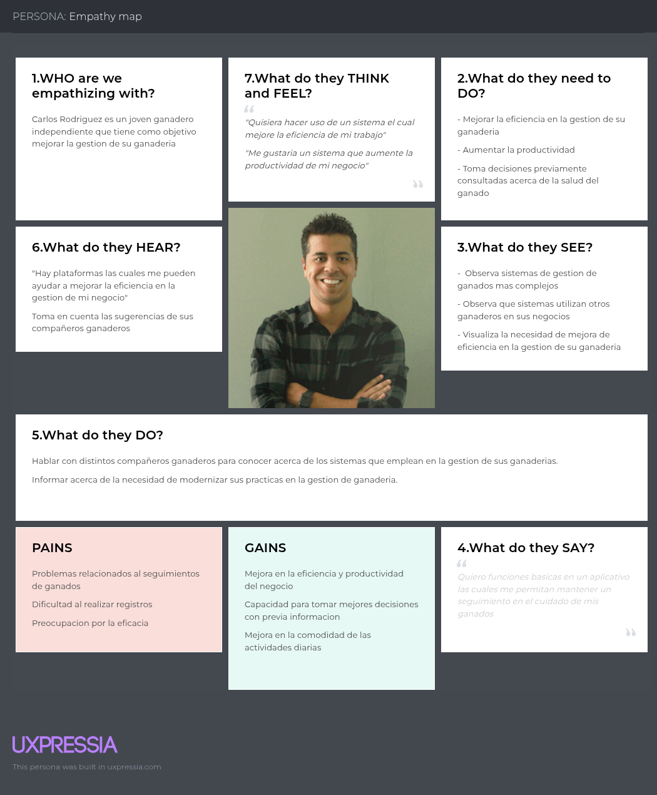

<hr>

# <center>COURSE PROJECT</center>

<p align="center">
    <strong>Universidad Peruana de Ciencias Aplicadas</strong><br>
    </img><br>
    <strong>Ingeniería de Software - 2025-20</strong><br>
    <strong>Diseño de Experimentos de Ingeniería de Software - 14736</strong><br>
    <strong>Profesor: Tinoco Licas, Juan Carlos</strong><br>
</p>

</p>

<p align="center">
    <strong>Startup: Bovinova</strong><br>
    <strong>Producto: VacApp</strong>
</p>

<div style="text-align:center;">
    <h3>Team Members:</h3>
    <table align="center">
        <tr>
            <th style="text-align:center;">Member</th>
            <th style="text-align:center;">Code</th>
        </tr>
        <tr>
            <td>Checalla Apaza, Emanuel Renato</td>
            <td>U202322695</td>
        </tr>
        <tr>
            <td>Durand Vera, Gianfranco Angel</td>
            <td>U20201F640</td>
        </tr>
        <tr>
            <td>Gordillo Ramos, Santiago Alonso</td>
            <td>U202215160</td>
        </tr>
        <tr>
            <td>Inga Hernandez, Ayrton Damian</td>
            <td>U201924756</td>
        </tr>
         <tr>
            <td>Vargas Javier, Jose Enrique</td>
            <td>U20221F693</td>
         </tr>
    </table>
</div>

<b><center>Septiembre, 2025</center></b>

<br>

<h1 align="center">Registro de versiones del Informe</h1>
</br>
<table>
  <thead>
    <tr>
      <th>Versión</th>
      <th>Fecha</th>
      <th>Autor</th>
      <th>Descripción de modificaciones</th>
    </tr>
  </thead>
  <tbody>
    <tr>
      <td>TB1</td>
      <td>20/09/2025</td>
      <td>
      Checalla Apaza, Emanuel Renato<br>
      Durand Vera, Gianfranco Angel<br>
      Gordillo Ramos, Santiago Alonso<br>
      Inga Hernandez, Ayrton Damian<br>
      Vargas Javier, Jose Enrique<br>
      </td>
      <td>
      Capítulo I: Introducción<br>
      Capítulo II: Requirements Elicitation & Analysis<br>
      Capítulo III: Requirements Specification<br>
      Capítulo IV: Product Design<br>
      Capítulo V: Product Implementation<br>
      </td>
    </tr>
     <tr>
      <td>TP1</td>
      <td>09/10/2025</td>
      <td>
      Checalla Apaza, Emanuel Renato<br>
      Durand Vera, Gianfranco Angel<br>
      Gordillo Ramos, Santiago Alonso<br>
      Inga Hernandez, Ayrton Damian<br>
      Vargas Javier, Jose Enrique<br>
      </td>
      <td>
      6.1. Testing Suites & Validation<br>
      6.1.1. Core Entities Unit Tests.<br>
      6.1.2. Core Integration Tests.<br>
      6.1.3. Core Behavior-Driven Development<br>
      6.1.4. Core System Tests.<br>
      7.1. Continuous Integration<br>
      7.1.1. Tools and Practices.<br>
      7.1.2. Build & Test Suite Pipeline Components.<br>
      7.2. Continuous Delivery<br>
      7.2.1. Tools and Practices.<br>
      7.2.2. Stages Deployment Pipeline Components.<br>
      7.3. Continuous deployment<br>
      7.3.1. Tools and Practices.<br>
      7.3.2. Production Deployment Pipeline Components.<br>
      </td>
    </tr>
  </tbody>
</table>


# Project Report Collaboration Insights
TB1:

 


TP1:

 
 
<br><br>

# Contenido
[Student Outcome](#student-outcome)

[Part I: As-Is Software Project](#part-i-as-is-software-project)

[Capítulo I: Introducción](#capitulo-i-introducción)
- [1.1. Startup Profile](#11-startup-profile)
  - [1.1.1. Descripción de la Startup](#111-descripción-de-la-startup)
  - [1.1.2. Perfiles de integrantes del equipo](#112-perfiles-de-integrantes-del-equipo)
- [1.2. Solution Profile](#12-solution-profile)
  - [1.2.1 Antecedentes y problemática](#121-antecedentes-y-problemática)
  - [1.2.2 Lean UX Process](#122-lean-ux-process)
    - [1.2.2.1. Lean UX Problem Statements](#1221-lean-ux-problem-statements)
    - [1.2.2.2. Lean UX Assumptions](#1222-lean-ux-assumptions)
    - [1.2.2.3. Lean UX Hypothesis Statements](#1223-lean-ux-hypothesis-statements)
    - [1.2.2.4. Lean UX Canvas](#1224-lean-ux-canvas)
- [1.3. Segmentos objetivo](#13-segmentos-objetivo)

[Capítulo II: Requirements Elicitation & Analysis](#capítulo-ii-requirements-elicitation--analysis)
- [2.1. Competidores](#21-competidores)
  - [2.1.1. Análisis competitivo](#211-análisis-competitivo)
  - [2.1.2. Estrategias y tácticas frente a competidores](#212-estrategias-y-tácticas-frente-a-competidores)
- [2.2. Entrevistas](#22-entrevistas)
  - [2.2.1. Diseño de entrevistas](#221-diseño-de-entrevistas)
  - [2.2.2. Registro de entrevistas](#222-registro-de-entrevistas)
  - [2.2.3. Análisis de entrevistas](#223-análisis-de-entrevistas)
- [2.3. Needfinding](#23-needfinding)
  - [2.3.1. User Personas](#231-user-personas)
  - [2.3.2. User Task Matrix](#232-user-task-matrix)
  - [2.3.3. User Journey Mapping](#233-user-journey-mapping)
  - [2.3.4. Empathy Mapping](#234-empathy-mapping)
  - [2.3.5. As-is Scenario Mapping](#235-as-is-scenario-mapping)
- [2.4. Ubiquitous Language](#24-ubiquitous-language)

[Capítulo III: Requirements Specification](#capítulo-iii-requirements-specification)
- [3.1. To-Be Scenario Mapping](#31-to-be-scenario-mapping)
- [3.2. User Stories](#32-user-stories)
- [3.3. Product Backlog](#33-product-backlog)
- [3.4. Impact Mapping](#34-impact-mapping)

[Capítulo IV: Product Design](#capítulo-iv-product-design)
- [4.1. Style Guidelines](#41-style-guidelines)
  - [4.1.1. General Style Guidelines](#411-general-style-guidelines)
  - [4.1.2. Web Style Guidelines](#412-web-style-guidelines)
  - [4.1.3. Mobile Style Guidelines](#413-mobile-style-guidelines)
    - [4.1.3.1. iOS Mobile Style Guidelines](#4131-ios-mobile-style-guidelines)
    - [4.1.3.2. Android Mobile Style Guidelines](#4132-android-mobile-style-guidelines)
- [4.2. Information Architecture](#42-information-architecture)
  - [4.2.1. Organization Systems](#421-organization-systems)
  - [4.2.2. Labeling Systems](#422-labeling-systems)
  - [4.2.3. SEO Tags and Meta Tags](#423-seo-tags-and-meta-tags)
  - [4.2.4. Searching Systems](#424-searching-systems)
  - [4.2.5. Navigation Systems](#425-navigation-systems)
- [4.3. Landing Page UI Design](#43-landing-page-ui-design)
  - [4.3.1. Landing Page Wireframe](#431-landing-page-wireframe)
  - [4.3.2. Landing Page Mock-up](#432-landing-page-mock-up)
- [4.4. Mobile Applications UX/UI Design](#44-mobile-applications-uxui-design)
  - [4.4.1. Mobile Applications Wireframes](#441-mobile-applications-wireframes)
  - [4.4.2. Mobile Applications Wireflow Diagrams](#442-mobile-applications-wireflow-diagrams)
  - [4.4.3. Mobile Applications Mock-ups](#443-mobile-applications-mock-ups)
  - [4.4.4. Mobile Applications User Flow Diagrams](#444-mobile-applications-user-flow-diagrams)
- [4.5. Mobile Applications Prototyping](#45-mobile-applications-prototyping)
  - [4.5.1. Android Mobile Applications Prototyping](#451-android-mobile-applications-prototyping)
  - [4.5.2. iOS Mobile Applications Prototyping](#452-ios-mobile-applications-prototyping)
- [4.6. Web Applications UX/UI Design](#46-web-applications-uxui-design)
  - [4.6.1. Web Applications Wireframes](#461-web-applications-wireframes)
  - [4.6.2. Web Applications Wireflow Diagrams](#462-web-applications-wireflow-diagrams)
  - [4.6.3. Web Applications Mock-ups](#463-web-applications-mock-ups)
  - [4.6.4. Web Applications User Flow Diagrams](#464-web-applications-user-flow-diagrams)
- [4.7. Web Applications Prototyping](#47-web-applications-prototyping)
- [4.8. Domain-Driven Software Architecture](#48-domain-driven-software-architecture)
  - [4.8.1. Software Architecture Context Diagram](#481-software-architecture-context-diagram)
  - [4.8.2. Software Architecture Container Diagrams](#482-software-architecture-container-diagrams)
  - [4.8.3. Software Architecture Components Diagrams](#483-software-architecture-components-diagrams)
- [4.9. Software Object-Oriented Design](#49-software-object-oriented-design)
  - [4.9.1. Class Diagrams](#491-class-diagrams)
  - [4.9.2. Class Dictionary](#492-class-dictionary)
- [4.10. Database Design](#410-database-design)
  - [4.10.1. Relational/Non-Relational Database Diagram](#4101-relationalnon-relational-database-diagram)

[Capítulo V: Product Implementation](#capítulo-v-product-implementation)
- [5.1. Software Configuration Management](#51-software-configuration-management)
  - [5.1.1. Software Development Environment Configuration](#511-software-development-environment-configuration)
  - [5.1.2. Source Code Management](#512-source-code-management)
  - [5.1.3. Source Code Style Guide & Conventions](#513-source-code-style-guide--conventions)
  - [5.1.4. Software Deployment Configuration](#514-software-deployment-configuration)
- [5.2. Product Implementation & Deployment](#52-product-implementation--deployment)
  - [5.2.1. Sprint Backlogs](#521-sprint-backlogs)
  - [5.2.2. Implemented Landing Page Evidence](#522-implemented-landing-page-evidence)
  - [5.2.3. Implemented Frontend-Web Application Evidence](#523-implemented--frontend-web-application-evidence)
  - [5.2.4. Acuerdo de Servicio - SaaS](#524-acuerdo-de-servicio---saas)
  - [5.2.5. Implemented Native-Mobile Application Evidence](#525-implemented-native-mobile-application-evidence)
  - [5.2.6. Implemented RESTful API and/or Serverless Backend Evidence](#526-implemented-restful-api-andor-serverless-backend-evidence)
  - [5.2.7. RESTful API documentation](#527-restful-api-documentation)
  - [5.2.8. Team Collaboration Insights](#528-team-collaboration-insights)
- [5.3. Video About-the-Product](#53-video-about-the-product)

[Part II: Verification, Validation & Pipeline](#part-ii-verification-validation--pipeline)

[Capítulo VI: Product Verification & Validation](#capítulo-vi-product-verification--validation)
- [6.1. Testing Suites & Validation](#61-testing-suites--validation)
  - [6.1.1. Core Entities Unit Tests](#611-core-entities-unit-tests)
  - [6.1.2. Core Integration Tests](#612-core-integration-tests)
  - [6.1.3. Core Behavior-Driven Development](#613-core-behavior-driven-development)
  - [6.1.4. Core System Tests](#614-core-system-tests)
- [6.2. Static Testing & Verification](#62-static-testing--verification)
  - [6.2.1. Static Code Analysis](#621-static-code-analysis)
    - [6.2.1.1. Coding Standard & Code Conventions](#6211-coding-standard--code-conventions)
    - [6.2.1.2. Code Quality & Code Security](#6212-code-quality--code-security)
  - [6.2.2. Reviews](#622-reviews)
- [6.3. Validation Interviews](#63-validation-interviews)
  - [6.3.1. Diseño de Entrevistas](#631-diseño-de-entrevistas)
  - [6.3.2. Registro de Entrevistas](#632-registro-de-entrevistas)
  - [6.3.3. Evaluaciones según heurísticas](#633-evaluaciones-según-heurísticas)
- [6.4. Auditoría de Experiencias de Usuario](#64-auditoría-de-experiencias-de-usuario)
  - [6.4.1. Auditoría realizada](#641-auditoría-realizada)
    - [6.4.1.1. Información del grupo auditado](#6411-información-del-grupo-auditado)
    - [6.4.1.2. Cronograma de auditoría realizada](#6412-cronograma-de-auditoría-realizada)
    - [6.4.1.3. Contenido de auditoría realizada](#6413-contenido-de-auditoría-realizada)
  - [6.4.2. Auditoría recibida](#642-auditoría-recibida)
    - [6.4.2.1. Información del grupo auditor](#6421-información-del-grupo-auditor)
    - [6.4.2.2. Cronograma de auditoría recibida](#6422-cronograma-de-auditoría-recibida)
    - [6.4.2.3. Contenido de auditoría recibida](#6423-contenido-de-auditoría-recibida)
    - [6.4.2.4. Resumen de modificaciones para subsanar hallazgos](#6424-resumen-de-modificaciones-para-subsanar-hallazgos)

[Capítulo VII: DevOps Practices](#capítulo-vii-devops-practices)
- [7.1. Continuous Integration](#71-continuous-integration)
  - [7.1.1. Tools and Practices](#711-tools-and-practices)
  - [7.1.2. Build & Test Suite Pipeline Components](#712-build--test-suite-pipeline-components)
- [7.2. Continuous Delivery](#72-continuous-delivery)
  - [7.2.1. Tools and Practices](#721-tools-and-practices)
  - [7.2.2. Stages Deployment Pipeline Components](#722-stages-deployment-pipeline-components)
- [7.3. Continuous Deployment](#73-continuous-deployment)
  - [7.3.1. Tools and Practices](#731-tools-and-practices)
  - [7.3.2. Production Deployment Pipeline Components](#732-production-deployment-pipeline-components)
- [7.4. Continuous Monitoring](#74-continuous-monitoring)
  - [7.4.1. Tools and Practices](#741-tools-and-practices)
  - [7.4.2. Monitoring Pipeline Components](#742-monitoring-pipeline-components)
  - [7.4.3. Alerting Pipeline Components](#743-alerting-pipeline-components)
  - [7.4.4. Notification Pipeline Components](#744-notification-pipeline-components)

[Part III: Experiment-Driven Lifecycle](#part-iii-experiment-driven-lifecycle)

[Capítulo VIII: Experiment-Driven Development](#capítulo-viii-experiment-driven-development)
- [8.1. Experiment Planning](#81-experiment-planning)
  - [8.1.1. As-Is Summary](#811-as-is-summary)
  - [8.1.2. Raw Material: Assumptions, Knowledge Gaps, Ideas, Claims](#812-raw-material-assumptions-knowledge-gaps-ideas-claims)
  - [8.1.3. Experiment-Ready Questions](#813-experiment-ready-questions)
  - [8.1.4. Question Backlog](#814-question-backlog)
  - [8.1.5. Experiment Cards](#815-experiment-cards)
- [8.2. Experiment Design](#82-experiment-design)
  - [8.2.1. Hypotheses](#821-hypotheses)
  - [8.2.2. Domain Business Metrics](#822-domain-business-metrics)
  - [8.2.3. Measures](#823-measures)
  - [8.2.4. Conditions](#824-conditions)
  - [8.2.5. Scale Calculations and Decisions](#825-scale-calculations-and-decisions)
  - [8.2.6. Methods Selection](#826-methods-selection)
  - [8.2.7. Data Analytics: Goals, KPIs and Metrics Selection](#827-data-analytics-goals-kpis-and-metrics-selection)
  - [8.2.8. Web and Mobile Tracking Plan](#828-web-and-mobile-tracking-plan)
- [8.3. Experimentation](#83-experimentation)
  - [8.3.1. To-Be User Stories](#831-to-be-user-stories)
  - [8.3.2. To-Be Product Backlog](#832-to-be-product-backlog)
  - [8.3.3. Pipeline-supported, Experiment-Driven To-Be Software Platform Lifecycle](#833-pipeline-supported-experiment-driven-to-be-software-platform-lifecycle)
    - [8.3.3.1. To-Be Sprint Backlogs](#8331-to-be-sprint-backlogs)
    - [8.3.3.2. Implemented To-Be Landing Page Evidence](#8332-implemented-to-be-landing-page-evidence)
    - [8.3.3.3. Implemented To-Be Frontend-Web Application Evidence](#8333-implemented-to-be-frontend-web-application-evidence)
    - [8.3.3.4. Implemented To-Be Native-Mobile Application Evidence](#8334-implemented-to-be-native-mobile-application-evidence)
    - [8.3.3.5. Implemented To-Be RESTful API and/or Serverless Backend Evidence](#8335-implemented-to-be-restful-api-andor-serverless-backend-evidence)
    - [8.3.3.6. Team Collaboration Insights](#8336-team-collaboration-insights)
  - [8.3.4. To-Be Validation Interviews](#834-to-be-validation-interviews)
    - [8.3.4.1. Diseño de Entrevistas](#8341-diseño-de-entrevistas)
    - [8.3.4.2. Registro de Entrevistas](#8342-registro-de-entrevistas)
- [8.4. Experiment Aftermath & Analysis](#84-experiment-aftermath--analysis)
  - [8.4.1. Analysis and Interpretation of Results](#841-analysis-and-interpretation-of-results)
  - [8.4.2. Re-scored and Re-prioritized Question Backlog](#842-re-scored-and-re-prioritized-question-backlog)
- [8.5. Continuous Learning](#85-continuous-learning)
  - [8.5.1. Shareback Session Artifacts: Learning Workflow](#851-shareback-session-artifacts-learning-workflow)
- [8.6. To-Be Software Platform Pre-launch](#86-to-be-software-platform-pre-launch)
  - [8.6.1. About-the-Product Intro Video](#861-about-the-product-intro-video)

[Conclusiones](#conclusiones)
- [Conclusiones y recomendaciones](#conclusiones-y-recomendaciones)
- [Video App Validation](#video-app-validation)
- [Video About-the-Team](#video-about-the-team)

[Bibliografía](#bibliografía)

[Anexos](#anexos)

# Student Outcome  
ABET – EAC - Student Outcome 4  

**Criterio:** Capacidad de reconocer responsabilidades éticas y profesionales en situaciones de ingeniería y hacer juicios informados, considerando el impacto de las soluciones en contextos globales, económicos, ambientales y sociales.  

<table>
  <tr>
    <td><b>Criterio específico</b></td>
    <td><b>Acciones realizadas</b></td>
    <td><b>Conclusiones</b></td>
  </tr>
  <tbody>
    <tr>
      <td><b>Reconoce responsabilidad ética y profesional en situaciones de ingeniería de software</b></td>
      <td>
        <p><b>Emanuel Checalla Apaza</b></p>
        <p><b>TB1:</b> Durante la especificación de requisitos, me aseguré de que cada User Story y cada impacto identificado considerara la privacidad, seguridad y accesibilidad de los usuarios. Esto refleja mi responsabilidad ética y profesional al garantizar que las soluciones propuestas sean confiables, inclusivas y respeten los derechos de todos los stakeholders involucrados.</p>
        <p><b>TP1:</b> [Acciones]</p>
        <p><b>TB2:</b> [Acciones]</p>
        <p><b>TF:</b> [Acciones]</p>
        <br>
        <p><b>Gianfranco Durand Vera</b></p>
        <p><b>TB1:</b> En el desarrollo del Capítulo 4, me aseguré de aplicar principios de responsabilidad ética y profesional al diseñar la experiencia de usuario y la arquitectura de la plataforma. </p>
        <p><b>TP1:</b> Participé en la refactorización del backend y llevé a cabo pruebas unitarias y de integración para asegurar la calidad y el cumplimiento de los estándares profesionales.</p>
        <p><b>TB2:</b> [Acciones]</p>
        <p><b>TF:</b> [Acciones]</p>
        <br>
        <p><b>Santiago Gordillo Ramos</b></p>
        <p><b>TB1:</b> Durante el desarrollo del Capítulo 2, me aseguré de aplicar los principios de ética y responsbilidad al diseñar el informe y las entrevistas de la aplicación.</p>
        <p><b>TP1:</b> [Acciones]</p>
        <p><b>TB2:</b> [Acciones]</p>
        <p><b>TF:</b> [Acciones]</p>
        <br>
        <p><b>Ayrton Inga Hernandez</b></p>
        <p><b>TB1:</b> Asumi la responsabilidad de completar el capitulo 1, donde desarrollo el Solution Profile el cual nos servira como base de todo nuestro proyecto.</p>
        <p><b>TP1:</b> Fomente la creación de pruebas unitarias claras y fáciles de mantener, sin que interrumpiera con el codigo base</p>
        <p><b>TB2:</b> [Acciones]</p>
        <p><b>TF:</b> [Acciones]</p>
        <br>
        <p><b>Jose Vargas Javier</b></p>
        <p><b>TB1:</b> “En mi rol como responsable del Capítulo 5, asumí la responsabilidad de prácticas de desarrollo (control de versiones, convenciones de código, despliegue seguro y documentación clara), velando por la trazabilidad y la colaboración efectiva en el equipo.”</p>
        <p><b>TP1:</b> [Acciones]</p>
        <p><b>TB2:</b> [Acciones]</p>
        <p><b>TF:</b> [Acciones]</p>
      </td>
      <td>
        <p><b>TB1:</b> En la TB1, el equipo actuó con responsabilidad ética y profesional en todo el trabajo, desde la recolección de requisitos hasta el diseño y la implementación inicial, documentando cada decisión y asegurando que la solución sea clara, justa y confiable para los usuarios.</p>
        <p><b>TP1:</b> Distribuimos las responsabilidades en función de las fortalezas individuales del equipo, lo que garantizó una ejecución ordenada, ética y altamente eficaz del proyecto.</p>
        <p><b>TB2:</b> [Conclusiones]</p>
        <p><b>TF:</b> [Conclusiones]</p>
      </td>
    </tr>
    <tr>
      <td><b>Emite juicios informados considerando el impacto de las soluciones de ingeniería de software en contextos globales, económicos, ambientales y sociales</b></td>
      <td>
        <p><b>Emanuel Checalla Apaza</b></p>
        <p><b>TB1:</b> Al desarrollar el Product Backlog y el Impact Mapping, evalué cómo cada funcionalidad afectaría a los usuarios, la empresa y el entorno. Consideré impactos económicos, posibles implicaciones sociales y el uso responsable de recursos tecnológicos, tomando decisiones fundamentadas para maximizar beneficios y minimizar riesgos a nivel global y local.</p>
        <p><b>TP1:</b> [Acciones]</p>
        <p><b>TB2:</b> [Acciones]</p>
        <p><b>TF:</b> [Acciones]</p>
        <br>
        <p><b>Gianfranco Durand Vera</b></p>
        <p><b>TB1:</b> Adapté la guía de estilos de la plataforma según las necesidades de todos los segmentos objetivo, asegurando que los colores, tipografías y layouts cumplan con estándares de accesibilidad para reducir barreras de uso</p>
        <p><b>TP1:</b> Al establecer la integración continua (CI) y ejecutar pruebas, confirmé que una arquitectura robusta es clave para la eficiencia, sostenibilidad y adaptabilidad del sistema a futuro.</p>
        <p><b>TB2:</b> [Acciones]</p>
        <p><b>TF:</b> [Acciones]</p>
        <br>
        <p><b>Santiago Gordillo Ramos</b></p>
        <p><b>TB1:</b> Apliqué responsabilidad al momento de evaluar cada entrevista, segmento por segmento, además consideré a los usuarios al momento de realizar el needfinding.</p>
        <p><b>TP1:</b> [Acciones]</p>
        <p><b>TB2:</b> [Acciones]</p>
        <p><b>TF:</b> [Acciones]</p>
        <br>
        <p><b>Ayrton Inga Hernandez</b></p>
        <p><b>TB1:</b> Aplique tecnicas de Leaun UX para un mejor desarrollo del proyecto, tambien investigue sobre la probematica y el analisis del problema a resolver.</p>
        <p><b>TP1:</b> Evaluó cómo las pruebas unitarias afectan el rendimiento de la aplicación, asegurándose de que no generaran lentitud.</p>
        <p><b>TB2:</b> [Acciones]</p>
        <p><b>TF:</b> [Acciones]</p>
        <br>
        <p><b>Jose Vargas Javier</b></p>
        <p><b>TB1:</b> Emití juicios informados al evaluar que las soluciones implementadas (landing page, aplicaciones móviles y backend en la nube) favorecen la transformación digital en el sector ganadero, mejoran la eficiencia económica de los usuarios, promueven prácticas responsables en la gestión de recursos y generan un impacto social positivo al facilitar el acceso a herramientas tecnológicas</p>
        <p><b>TP1:</b> [Acciones]</p>
        <p><b>TB2:</b> [Acciones]</p>
        <p><b>TF:</b> [Acciones]</p>
      </td>
      <td>
        <p><b>TB1:</b> Durante la TB1, el equipo tomó decisiones de diseño y desarrollo considerando la accesibilidad, la inclusión y la eficiencia de recursos, asegurando que la plataforma tenga un impacto positivo y responsable en los usuarios y en su contexto social, económico y ambiental.</p>
        <p><b>TP1:</b> Analizamos las implicaciones sociales de cada avance técnico, asegurando que nuestras soluciones respondan directamente a las necesidades reales del entorno.</p>
        <p><b>TB2:</b> [Conclusiones]</p>
        <p><b>TF:</b> [Conclusiones]</p>
      </td>
    </tr>
  </tbody>
</table>


# Part I: As-Is Software Project

# Capítulo I: Introducción
## 1.1. Startup Profile
### 1.1.1. Descripción de la Startup

### Nombre del Start: VacApp
VacApp es una amigable aplicación movil diseñada para preparar a los ganaderos en la gestión sostenible y eficiente de su ganado. Esta plataforma cuenta con una amplia variedad de caracteristicas internas que permiten a los usuarios realizar un seguimiento detallado de la salud, alimentación y reproducción de sus animales, lo que ayudara con una mejor eleccion de decisiones en la granja. Con esta aplicacion, los usuarios pueden mejorar sus operaciones y aumentar sus ingresos, y a la par promueven prácticas agrícolas sostenibles y éticas, ayudando asi al bienestar de los animales y al desarrollo sostenible de la industria ganadera.

### **Colaboraciones Estrategicas:**

En VacApp, nos dedicamos a construir alianzas sólidas con cadenas ganaderas, pequeños productores y empresas del sector. Colaboramos estrechamente con cada socio para que nuestras soluciones tecnológicas se adapten a sus necesidades operativas, simplifiquen la gestión diaria y eleven la satisfacción de sus clientes. Alentamos a los ganaderos a incorporar nuestras herramientas para optimizar el manejo del ganado, la administración de la alimentación y la atención al cliente, generando así una experiencia más ágil y eficiente.

### **Innovación y Tecnología**
VacApp integra tecnología de vanguardia para optimizar la gestión ganadera. Abarca desde el control de la salud, alimentación y reproducción del ganado, hasta la automatización de procesos esenciales en la granja. Su propósito es mejorar la manera en que los productores administran sus labores cotidianas, ofreciéndoles una herramienta tecnológica que los ayude a tomar decisiones fundamentadas, aumentar la eficiencia operativa y fomentar una producción sostenible y responsable.

### **Comunidad y Funciones Sociales**
VacApp va más allá de ser una herramienta de gestión; es un espacio para el aprendizaje y la colaboración entre ganaderos. La plataforma integra funciones que facilitan el intercambio de buenas prácticas, estrategias de manejo y la actualización constante sobre las últimas innovaciones del sector. Esta comunidad activa impulsa la mejora continua, promueve el intercambio de conocimientos y refuerza una red ganadera comprometida con el desarrollo sostenible y el bienestar animal.

### **Visión**
Visualizamos un futuro en el que la tecnología y la ganadería se fusionan para lograr una producción más eficiente, responsable y rentable. Queremos que VacApp se convierta en referente de innovación en la gestión ganadera y en un socio esencial para los productores que buscan avanzar hacia un modelo más moderno, conectado y sostenible. Nuestra meta es encabezar una transformación positiva del sector, sustentada en la tecnología, la ética y el compromiso con el campo.

### **Misión**
Trabajamos para brindar una plataforma integral que otorgue a los ganaderos herramientas inteligentes de gestión, elevando su productividad y calidad de vida. Tenemos la firme convicción de utilizar la tecnología como motor de transformación en el sector, promoviendo el bienestar animal, la sostenibilidad ambiental y el desarrollo económico de las comunidades rurales. VacApp, impulsado por su propia visión, aspira a ser un referente de excelencia, innovación y compromiso con el futuro de la ganadería.

### 1.1.2. Perfiles de integrantes del equipo
<table>
  <tr>
    <th>
      
    </th>
    <td valign="top">
      <p><b>Jose Enrique Vargas Javier</b></p>
      <p>Me considero una persona proactiva y responsable, decidi optar por esta carrera ya que siempre me fascino la idea de crear un videojuego, busco aprender y mejorar mis habilidades como programador para cumplir mi proposito como desarrollador de videojuegos</p>
    </td>
  </tr>
  <tr>
    <th>
      
    </th>
    <td valign="top">
      <p><b>Gianfranco Durand Vera</b></p>
      <p>Estudiante de 8vo ciclo. Me considero una persona curiosa y proactiva, apasionado por el desarrollo de software y la creación de aplicaciones que sean útiles y escalables. Me interesa aprender nuevas tecnologías y mejorar constantemente mis habilidades en proyectos tanto académicos como personales.</p>
    </td>
  </tr>
  <tr>
    <th>
      
    </th>
    <td valign="top">
      <p><b>Ayrton Inga Hernandez</b></p>
      <p>Soy estudiante de la UPC en la carrera de ingenieria de software y me considero una persona comprometida cuando se trata de mi vida educacional, cuento con conocimientos de desarrollo frontend y backend, base de datos con distintos lenguajes de programacion.</p>
    </td>
  </tr>
  <tr>
    <th>
      
    </th>
    <td valign="top">
      <p><b>Santiago Alonso Gordillo Ramos</b></p>
      <p>Mi nombre es Santiago Gordillo Ramos, mi código es U202215160 y me encuentro estudiando ingeniería de software, cuento con conocimiento de frontend, me interesa javascript, cuento con base sólida con html y css, trabajo bien en equipo, trato de organizarme de manera eficaz para poder terminar el trabajo correctamente. A futuro busco especializarme en ciberseguridad ya que es una rubro que me interesa mucho.</p>
    </td>
  </tr>
  <tr>
    <th>
      
    </th>
    <td valign="top">
      <p><b>Emanuel Renato Checalla Apaza</b></p>
      <p>Mi nombre es Emanuel Checalla, mi codigo u202322695, soy estudiante de la carrera de ingenieria de software, cuento con conocimientos en diseño grafico, desarrollo frontend, me interesa la arquitectura de software. En cuanto a trabajo en equipo, realizo las tareas asignadas, puedo liderar equipos. A futuro busco especalizarme en arquitectura de Software</p>
    </td>
  </tr>
</table>

## 1.2. Solution Profile
#### **Descripción General de la Solución**

VacApp es una aplicación móvil innovadora creada especialmente para los ganaderos peruanos, tanto independientes como empresas del sector. La plataforma ofrece un conjunto completo de herramientas para gestionar de manera eficiente y sostenible el ganado, abarcando el control de la salud, la alimentación y la reproducción de los animales. Su propósito es aumentar la productividad de los productores y fomentar prácticas éticas y responsables que favorezcan el bienestar animal y el desarrollo sostenible de la ganadería en el Perú.

#### **Características Clave de la Solución**

- **Monitoreo Integral del Ganado:** Permite un seguimiento detallado de la salud y el bienestar de los animales, asegurando que reciban la atención adecuada en el momento oportuno.

- **Gestión de Alimentación:** Ayuda a planificar y controlar las raciones necesarias para el crecimiento y la producción saludable del ganado.

- **Gestión Reproductiva:** Facilita el control de los ciclos reproductivos, desde el celo hasta el parto, mejorando la productividad y la calidad del hato.

- **Acceso a Servicios Veterinarios:** Integra un sistema para coordinar consultas y servicios veterinarios, reforzando la atención médica y reduciendo pérdidas por falta de cuidados.

- **Automatización de Procesos:** Simplifica las operaciones rutinarias de la granja, ahorrando tiempo y recursos a los productores.

- **Espacio Comunitario de Colaboración:** Además de ser una herramienta de gestión, es un lugar donde los ganaderos pueden intercambiar buenas prácticas, consejos y mantenerse al día con las innovaciones del sector.

#### **Beneficios de la Solución**

- **Mejor Gestión y Salud Animal:** Los ganaderos tienen acceso a herramientas que les permiten realizar un seguimiento eficiente de la salud y el bienestar de su ganado, reduciendo las pérdidas económicas causadas por enfermedades y accidentes.

- **Optimización de Recursos:** La solución permite una mejor administración de la alimentación y reproducción del ganado, lo que se traduce en una mayor productividad y rentabilidad.

- **Acceso a Tecnología Sostenible:** VacApp promueve prácticas de ganadería sostenible, mejorando las condiciones de vida del ganado y promoviendo el respeto por el medio ambiente.

- **Reducción de Costos:** La automatización y la mejora en la gestión operativa ayudan a reducir los costos en diversas áreas de la granja, mejorando la eficiencia general.

- **Educación y Soporte Continuo:** La plataforma ofrece recursos educativos que permiten a los ganaderos mantenerse actualizados con las mejores prácticas y desarrollos tecnológicos del sector.

#### **Tecnología y Arquitectura**

VacApp ha sido concebida como una solución móvil accesible tanto en Android como en iOS, desarrollada con tecnología de vanguardia para garantizar un alto rendimiento y una experiencia de uso sencilla. La plataforma se basa en el análisis de datos para ofrecer recomendaciones personalizadas y predicciones que optimicen la gestión de la granja. Asimismo, permite integrarse con sistemas de salud animal y automatizar tareas administrativas, facilitando así el trabajo diario de los ganaderos.

### 1.2.1. Antecedentes y problemática

Mediante la técnica de **“5W's & 2H’s”**, hemos identificado los antecedentes y la problemática que enfrentan los ganaderos peruanos en su día a día, lo que ha llevado al desarrollo de **VacApp**.

#### **What? (¿Qué?)**

El sector ganadero peruano afronta retos importantes en la gestión del ganado, así como en aspectos clave como la salud, la alimentación, la reproducción y la producción animal. Sin embargo, la ausencia de herramientas tecnológicas adecuadas ha limitado la eficiencia en estos procesos. Muchos ganaderos, en especial los pequeños productores, no cuentan con sistemas que les permitan realizar un seguimiento detallado de sus animales ni tomar decisiones basadas en datos, lo que disminuye su capacidad para optimizar las operaciones y aumentar sus ingresos.


#### **When? (¿Cuándo?)**

Se trata de un problema de carácter permanente. La demanda de una plataforma tecnológica que apoye la gestión del ganado y optimice la producción es actual y constante. Los productores necesitan contar con un sistema que les brinde acceso a información en tiempo real, con actualizaciones continuas sobre la salud, la alimentación, la reproducción y la comercialización del ganado.

#### **Where? (¿Dónde?)**

Esta problemática impacta sobre todo a las zonas rurales y áreas productivas del Perú, donde la mayoría de ganaderos enfrenta un acceso limitado a servicios veterinarios y tecnológicos. Aunque la falta de conectividad a internet en ciertas regiones restringe el uso de soluciones digitales, el incremento de la cobertura móvil permite que VacApp funcione en dispositivos accesibles desde prácticamente cualquier ubicación rural.

#### **Who? (¿Quién?)**

Los principales afectados por esta situación son los ganaderos peruanos, tanto productores independientes como grandes empresas del sector. Los pequeños ganaderos, con rebaños reducidos, cuentan con recursos limitados para acceder a tecnologías y servicios de salud adecuados para sus animales. A su vez, las grandes compañías enfrentan retos vinculados con la gestión masiva del ganado y el cumplimiento de estándares de bienestar animal. Asimismo, veterinarios, responsables de alimentación y otros actores del ámbito ganadero constituyen usuarios clave de la plataforma.

#### **Why? (¿Por qué?)**

La ausencia de herramientas adecuadas para gestionar de forma eficiente el ganado provoca diversos problemas, como deficiencias en la alimentación, enfermedades no atendidas oportunamente, baja productividad y pérdidas económicas. Tomar decisiones con información incompleta o inexacta repercute directamente en el bienestar de los animales y en las utilidades de los productores. VacApp pretende dar respuesta a esta situación al ofrecer a los ganaderos una solución que optimice sus operaciones, mejore la trazabilidad del ganado y facilite la toma de decisiones fundamentadas.

#### **How? (¿Cómo?)**

La propuesta de VacApp consiste en una plataforma web y móvil que reúne diversas herramientas para la gestión ganadera. La aplicación permite a los usuarios monitorear en detalle la salud, la alimentación y la reproducción de sus animales, generar reportes y recibir alertas sobre eventos relevantes relacionados con su ganado. Gracias al uso de tecnologías modernas de desarrollo web y móvil, VacApp se ajusta a las necesidades de los productores en zonas rurales, ofreciendo acceso a la información en tiempo real desde cualquier dispositivo con conexión a internet.

#### **How much? (¿Cuánto?)**

El desarrollo y mantenimiento de VacApp estará determinado por la inversión en infraestructura tecnológica, la creación de nuevas funcionalidades y la implementación de servicios de soporte técnico. No obstante, para los ganaderos el impacto económico será favorable, ya que la plataforma les ayudará a incrementar su rentabilidad, optimizar recursos y disminuir las pérdidas ocasionadas por una gestión ineficiente. Además, permitirá reducir los costos en atención veterinaria al ofrecer acceso oportuno a datos que faciliten la prevención de enfermedades y potencien la productividad del ganado.
### 1.2.2. Lean UX Process
#### 1.2.2.1. Lean UX Problem Statements
En un contexto donde los pequeños y medianos productores pecuarios dependían de métodos manuales y poco eficientes para administrar la información de su ganado, nuestra aplicación móvil VacApp logró diferenciarse al ofrecer una solución moderna, accesible y optimizada para el trabajo en campo. Esta propuesta atrajo en un inicio a ganaderos interesados en digitalizar sus operaciones y aumentar su productividad. Sin embargo, con el ingreso de nuevos competidores con aplicaciones móviles similares y mayores presupuestos, el mercado ha comenzado a saturarse. Esto ha incrementado los costos de adquisición de usuarios, ha estancado nuestra participación de mercado y ha elevado las demandas de soporte, afectando la rentabilidad e impidiendo invertir en nuevas funcionalidades.
#### 1.2.2.2. Lean UX Assumptions
**User Assumptions**

1. Los ganaderos, sin importar su nivel tecnológico, valorarán una app móvil fácil de usar, con interfaz intuitiva y accesible desde diferentes dispositivos.

2. Los usuarios están dispuestos a adoptar tecnología si les permite ahorrar tiempo y mejorar la gestión de su ganado.

3. Los usuarios usarán la aplicación incluso en áreas de baja conectividad si funciona correctamente offline.

4. Los usuarios confiarán en la app si ven beneficios concretos en su productividad y en la salud del ganado.

5. Los ganaderos prefieren soluciones prácticas y rápidas, por lo tanto, las funciones más utilizadas deben estar siempre accesibles con pocos pasos.

**Business Assumptions**

1. Si digitalizamos los registros del ganado, los usuarios podrán mejorar la organización y el control de su inventario animal.

2. Si ofrecemos recordatorios automáticos y herramientas para gestionar la salud del ganado, los ganaderos reducirán los costos por enfermedades y mejorarán el bienestar animal.

3. Si proporcionamos herramientas para planificar la alimentación, los productores optimizarán el uso de recursos y reducirán desperdicios.

4. Si permitimos un seguimiento eficiente de la fertilidad y reproducción, los ganaderos incrementarán la productividad de sus animales.

5. Si ofrecemos una experiencia fluida y confiable en dispositivos móviles incluso sin conexión, mejoraremos la adopción en zonas rurales con conectividad limitada.

6. Si garantizamos privacidad y seguridad de los datos, los usuarios confiarán más en la plataforma y estarán dispuestos a almacenar información crítica en ella.
#### 1.2.2.3. Lean UX Hypothesis Statements
1. **Creemos que** los ganaderos valorarán una app fácil de usar con interfaz intuitiva,
**porque** podrán gestionar su ganado sin necesidad de capacitación extensa.
**Lo sabremos** cuando al menos el 70% complete el registro de animales en su primer uso sin asistencia.

2. **Creemos que** los usuarios adoptarán la aplicación si les permite ahorrar tiempo en tareas diarias,
**porque** desean enfocarse en actividades productivas más que en tareas administrativas.
**Lo sabremos** cuando se reduzca en un 40% el tiempo promedio que reportan en registros manuales.

3. **Creemos que** los ganaderos en zonas rurales usarán la app si funciona offline,
**porque** tienen conectividad limitada en sus áreas de trabajo.
**Lo sabremos** cuando el 60% de los usuarios active la app en modo sin conexión al menos una vez por semana.

4. **Creemos que** los usuarios confiarán en la plataforma si garantizamos la privacidad de sus datos,
**porque** manejan información sensible sobre su producción y operaciones.
**Lo sabremos** cuando menos del 5% exprese preocupaciones sobre seguridad en encuestas de retroalimentación.

5. **Creemos que** si destacamos funciones clave como salud animal, alimentación y reproducción,
**los usuarios las usarán frecuentemente** para gestionar su ganado.
**Lo sabremos** cuando estas funciones representen al menos el 70% del uso total dentro de la app.

6. **Creemos que** los usuarios percibirán beneficios concretos en productividad y salud del ganado,
**porque** tendrán herramientas para tomar decisiones informadas.
**Lo sabremos** cuando el 60% reporte mejoras en rendimiento animal tras tres meses de uso.
#### 1.2.2.4. Lean UX Canvas

## 1.3. Segmentos objetivo

### Descripción de cada segmento objetivo:

VacApp ha sido concebida tomando en cuenta la diversidad del sector ganadero peruano, desde pequeños productores independientes hasta grandes empresas dedicadas a la actividad pecuaria. Cada uno de estos segmentos posee necesidades, metas y desafíos particulares que nuestra plataforma busca atender mediante soluciones tecnológicas prácticas, accesibles y sostenibles.

A continuación, presentamos el perfil de nuestros principales segmentos objetivo, destacando sus características, motivaciones y problemáticas, con el propósito de adaptar y mejorar continuamente nuestros servicios para brindarles el máximo valor posible.

#### Productores Ganadores independientes:
Este segmento de nuestra plataforma está conformado por ganaderos independientes del Perú, comprometidos con obtener ingresos de forma ética y sostenible, al mismo tiempo que garantizan un cuidado de alta calidad para sus animales. Se trata de productores que poseen diversas especies —como ovejas, vacas, reses, corderos, gallinas, entre otras— y que priorizan mantener en óptimas condiciones la salud y el bienestar de su ganado. Además, se interesan por realizar prácticas de comercialización honestas, orientadas a ofrecer productos más naturales y de calidad superior, así como por acceder a información actualizada sobre nuevos métodos y técnicas de cuidado animal.

#### Empresas Ganaderas:
El público objetivo de nuestra plataforma está compuesto principalmente por grandes empresas corporativas dedicadas a la gestión y cuidado de animales. Estas organizaciones se distinguen por su sólido compromiso con prácticas éticas y sostenibles en la producción ganadera. Su prioridad es asegurar que cada animal reciba una alimentación precisa, equilibrada y transparente, poniendo en primer plano su salud y bienestar. Asimismo, se enfocan en ofrecer un cuidado individualizado para garantizar la atención necesaria en cada etapa de desarrollo. Del mismo modo, valoran contar con un sistema integral de gestión veterinaria que les permita disponer de acceso constante y adecuado a servicios médicos veterinarios para sus animales.

### Datos cuantitativos del problema:

#### Productores Ganadores independientes:
Se han documentado numerosos casos en los que los productores ganaderos peruanos no reciben una remuneración justa en los mercados y afrontan serias dificultades para gestionar el cuidado de sus animales, debido a la escasez de recursos económicos y al limitado acceso a servicios veterinarios para consultas y atención adecuada. Estas condiciones han impuesto retos considerables a los ganaderos, que deben esforzarse por mantener la salud y el bienestar de su ganado mientras buscan garantizar su propio sustento en un entorno cada vez más exigente y competitivo. Se estima que al menos el 15 % de las muertes de animales en las granjas se relaciona con la falta de acceso oportuno a servicios veterinarios, lo que se traduce en pérdidas económicas significativas para los productores, calculadas en alrededor del 20 % de sus ingresos anuales por la ausencia de una compensación justa en los mercados.

#### Empresas Ganaderas:
En el Perú, el bienestar animal en las empresas ganaderas sigue siendo insuficiente: alrededor del 60 % de las operaciones no cumple con estándares aceptables en este aspecto. Esta carencia se traduce en condiciones de vida inadecuadas para el ganado, como falta de espacio y alimentación deficiente, que repercuten negativamente en su salud y bienestar. Asimismo, cerca del 70 % de estas empresas presenta una gestión inadecuada de residuos, lo que conlleva una disposición incorrecta de los desechos animales y potenciales riesgos de contaminación ambiental. Esta situación supone un reto considerable para la industria ganadera, pues no solo compromete el bienestar de los animales, sino que también puede tener efectos adversos sobre la salud pública y el entorno.
### Variables geográficas, demográficas y psicológicas:

#### Variable geográfica:
- País: Perú
- Ciudad: zonas rurales 

#### Variable demográfica:
- Género: Femenino / Masculino.
- Ocupación: Productores ganaderos 
- Estado civil: Todos los estados
- Edad y etapa de ciclo de vida:
- Ciudadanos mayores a 18 años.

#### Variable psicográfica:
- Nivel Socioeconómico (NSE): todos los niveles socioeconomicos
- Características de personalidad:
 - Altruismo 
 - Perseverante
 - Honestidad

# Capítulo II: Requirements Elicitation & Analysis 
## 2.1. Competidores
## 2.1.1. Análisis competitivo  
### Competitive Analysis Landscape  

**¿Por qué llevar a cabo este análisis?**  
¿Cómo podemos proporcionar un buen servicio entre los restaurantes y los consumidores de manera que la comunicación entre ambos sea efectiva y agradable?  

| Perfil / Aspecto | VacApp | Control Ganadero | Agroptima | App Ganadera |
|------------------|--------|------------------|-----------|--------------|
| **Overview** | VacApp es una plataforma móvil accesible que optimiza la gestión ganadera con enfoque en sostenibilidad, bienestar animal y eficiencia, adaptada a pequeños y grandes productores. | Es una aplicación española, británica y brasileña en el sector de la ganadería. | Agroptima es un sitio web multiplataforma cofundado por la Unión Europea para España, Francia e Inglaterra. | Es una empresa fundada en Colombia que cuenta con una app para la gestión de ganado. |
| **Ventaja competitiva** | Integra tecnología accesible con enfoque en sostenibilidad y bienestar animal, ofreciendo soluciones prácticas para productores de todos los tamaños. | App enfocada en gestión de vacas y para móviles. | Cuenta con multiplataforma y algoritmos matemáticos para mayor gestión del ganado. | Tiene gran variedad de herramientas y distribuidores. |
| **Mercado Objetivo** | Productores ganaderos (independientes y empresas) que buscan optimizar cuidado del ganado y rentabilidad. | Ganaderos en España, Brasil e Inglaterra. | Ganaderos en España, Francia e Inglaterra. | Ganaderos colombianos. |
| **Estrategias de Marketing** | Difusión en redes sociales y anuncios pagados. | Estrategia de posicionamiento. | Estrategia de segmentación. | Estrategia. |
| **Productos & Servicios** | App móvil con gestión de ganado, monitoreo de salud, alimentación y reproducción. | Web app de gestión de ganado. | Web app de gestión de ganado. | Web app de gestión de ganado. |
| **Precios & Costos** | Suscripción de bajo costo. | Suscripción de bajo costo. | Suscripción de bajo costo. | Suscripción de bajo costo. |
| **Canales de distribución** | App. | App. | Web y móvil. | App. |
| **Fortalezas** | Última tecnología, innovación en productividad y servicio. | App enfocada en vacas, buena personalización. | Reconocida en Europa, usa algoritmos matemáticos. | Conoce bien a sus clientes locales, adaptación cultural. |
| **Debilidades** | En pleno desarrollo, riesgo de éxito o fracaso. | Solo en móvil, no multiplataforma. | Solo en Europa, dependiente de regulaciones de la UE. | Disponible solo en Colombia. |
| **Oportunidades** | Aumentar productividad y eficiencia de ganaderos y empresas. | Ideal para expandirse a Europa, público objetivo amplio. | Ideal para expandirse a Europa, público objetivo amplio. | Fuerte penetración en Colombia. |
| **Amenazas** | Competencia de otras apps y cambios regulatorios en la industria ganadera. | Poca adopción tecnológica en la ganadería tradicional. | Poca adopción tecnológica en la ganadería tradicional. | Falta de apoyo económico y riesgo de desaparición. |

---


## 2.1.2. Estrategias y tácticas frente a competidores  

Para enfrentarnos a la competencia en el sector ganadero, nuestra **estrategia** se centrará en ofrecer una plataforma **accesible, intuitiva y adaptada a las necesidades locales de los ganaderos peruanos**.  

A diferencia de competidores como Agroptima o Control Ganadero, **VacApp destacará por su simplicidad y enfoque en la sostenibilidad y el bienestar animal**, facilitando la gestión de la salud, alimentación y reproducción del ganado.  

**Tácticas principales**:  
- Marketing digital segmentado.  
- Campañas en redes sociales.  
- Alianzas con organizaciones locales.  
- Educación a usuarios sobre beneficios de la aplicación.  
- Precios flexibles y modelos de suscripción accesibles.  

De esta manera, tanto pequeños como grandes productores podrán optimizar sus operaciones sin complicaciones, mientras seguimos mejorando la plataforma para adaptarnos a las necesidades cambiantes del sector ganadero.

## 2.2. Entrevistas  

### 2.2.1. Diseño de entrevistas  

#### Segmento #1: Productores Ganaderos Independientes  

VacApp ha desarrollado preguntas específicas para conocer las necesidades, experiencias y expectativas de los productores ganaderos independientes. Buscamos ayudarlos a gestionar mejor sus operaciones, optimizar el cuidado de sus animales y evaluar su impacto ambiental y social. A través de una plataforma intuitiva, VacApp ofrece herramientas que mejoran la eficiencia, el control de calidad y la conexión con los consumidores, simplificando los procesos diarios del productor.  

**Datos Generales del Entrevistado:**  
- Nombre:  
- Edad:  
- Tiempo de experiencia en la ganadería:  

**Preguntas de la Entrevista:**  
1. ¿Cómo decide la dieta de sus animales y qué factores considera al elegir su alimentación?  
   - (¿Sigue asesoría veterinaria, experiencia personal o recomendaciones externas?)  
2. ¿Qué medidas toma para garantizar la salud y el bienestar de sus animales?  
3. ¿Qué aspectos considera más importantes en la gestión de la salud veterinaria de su ganado?  
4. ¿Lleva algún tipo de registro sobre la salud y el crecimiento de sus animales? ¿Cómo lo hace?  
   - (¿Utiliza cuadernos, hojas de cálculo, aplicaciones móviles, etc.?)  
5. ¿Cuáles son los principales desafíos que enfrenta al administrar su ganadería?  
6. ¿Cómo cree que una aplicación podría ayudarle a resolver esos desafíos?  
7. Si contara con una aplicación para apoyar su trabajo ganadero, ¿qué funciones le serían más útiles?  
8. ¿Qué tipo de información le gustaría tener siempre disponible desde su celular o computadora?  
9. ¿Cómo le gustaría registrar la alimentación y consumo de sus animales dentro de la aplicación?  
10. ¿Qué beneficios espera lograr al implementar una solución como VacApp en su ganadería?  

---

#### Segmento #2: Empresas Ganaderas  

VacApp se orienta a mejorar la eficiencia y sostenibilidad en empresas ganaderas de gran escala. Mediante entrevistas con administradores, identificamos sus necesidades y estrategias clave para una gestión efectiva. Preguntamos qué herramientas consideran esenciales y cómo esperan apoyo para mejorar el bienestar animal y la productividad. Así, VacApp adapta sus soluciones a los retos específicos de la ganadería corporativa.  

**Datos Generales del Entrevistado:**  
- Nombre:  
- Edad:  
- Tiempo de experiencia en la ganadería:  

**Preguntas de la Entrevista:**  
1. ¿Cuántos animales maneja actualmente su empresa y cómo varía esa cantidad durante el año?  
2. Si su empresa tuviera acceso a una plataforma digital para gestión ganadera, ¿qué funciones considera imprescindibles para mejorar la eficiencia?  
3. ¿Cuáles son los mayores retos que enfrentan en la gestión ganadera a gran escala y cómo los abordan hoy en día?  
4. ¿Qué tipo de información o datos son clave para la toma de decisiones en su operación ganadera?  
5. ¿Qué funcionalidades le gustaría tener para facilitar la gestión del personal y la planificación de tareas?  
6. ¿Qué tipo de informes o análisis considera importantes para evaluar el desempeño de su empresa?  
7. ¿Cómo le gustaría interactuar con proveedores y socios comerciales a través de una plataforma como VacApp?  
8. ¿Qué tan importante es que una aplicación como VacApp se adapte a los procesos actuales de su empresa?  
9. ¿Qué aspectos considera que deberían ser completamente personalizables dentro de la plataforma?  
10. ¿Qué mejoras espera obtener al integrar una solución como VacApp en su operación ganadera?  

### 2.2.2. Registro de entrevistas

#### Segmento #1: Productores Ganaderos Independientes


Entrevistado: Sandro Arevalo<br>
Sexo: Masculino<br>
Edad: 18<br>

Resumen de la Entrevista:

Sandro Arevalo, con 18 años cuenta con 2 años de experiencia ayudando en el negocio de crianza de animales perteneciente a sus abuelos. Participó mayormente en el cuidado y limpieza de los animales pero tiene conocimientos del area administrativa del negocio independiente.

Considera que es complicado principalmente gestionar a cada animal de forma separada y que es preferible agruparlos segun su llegada para facilitar el trabajo administrativo y que no tome tanto tiempo ya que lo llevan de forma escrita.

Nos comenta que seria interesante tener una aplicacion, pero que sea solo de movil ya que solo cuentan con celulares y que preferiria que en dicha aplicacion se tenga siempre los contactos de veterinarios disponibles al momento en caso de emergencia y que por defecto indique la cantidad de comida necesaria para cierta especie segun el numero y que sea sencillo de editarlo segun conveniencia


Entrevistada: Marcia Mascco <br>
Sexo: Femenino<br>
Edad: 26<br>

Resumen de la Entrevista:

Marcia tiene 26 años y es ganadera independiente. Se caracteriza por alimentar a cada animal de manera personalizada, según sus metas de crecimiento y producción. Además, sigue asesorías veterinarias y se preocupa por el cuidado integral de su ganado, manteniendo un calendario de vacunación, chequeos periódicos y asegurando siempre agua limpia.

Su enfoque es principalmente preventivo: prefiere evitar la aparición de enfermedades antes que tener que tratarlas. Por ello, es constante con las vacunas y revisiones de su ganado. Para llevar un control, utiliza cuadernos donde anota fechas y tratamientos, además de archivos en computadora donde registra el costo de la alimentación y otros datos relevantes.

Marcia considera que una herramienta tecnológica podría ayudarla, ya que le facilitaría el registro de información y los recordatorios. Entre las funciones que más valora estarían un calendario con alertas automáticas y el historial clínico de cada animal, lo que le permitiría mejorar su organización y optimizar el manejo de su ganado.


Entrevistado: Alonso<br>
Sexo: Masculino<br>

Resumen de la Entrevista:

Los productores ganaderos deciden la dieta de sus animales combinando experiencia y asesoría veterinaria, considerando costos, clima y etapa de crecimiento.
Priorizan la prevención en salud con vacunas, desparasitación y buen manejo, pero sus registros suelen hacerse en cuadernos o Excel, lo que limita la organización.
Los principales desafíos son el control de costos, la falta de personal capacitado, la gestión de datos y los efectos del clima. Una aplicación puede ayudarles 
centralizando información, recordando tareas, facilitando registros y generando reportes claros. 
Valoran especialmente funciones de control sanitario,alimentación, alertas y reportes económicos, siempre con un uso simple y práctico.
En conclusión, esperan que VacApp les brinde organización, ahorro de tiempo, mejor control sanitario y mayor productividad,
actuando como un asistente digital para la gestión diaria de la ganadería.

#### Segmento #2: Empresas Ganaderas


Entrevistada: Camila Sanchez <br>
Sexo: Femenino<br>
Edad: 23<br>

Resumen de la Entrevista:

Camila Sánchez, de 23 años, cuenta con cinco años de experiencia como trabajadora en el sector ganadero. Actualmente participa en la gestión de una empresa con más de 2000 cabezas de ganado, número que puede variar según nacimientos o ventas estacionales. La gestión actual se basa mayormente en registros manuales y hojas de Excel, lo cual genera errores y retrasos.

Camila considera fundamental contar con una plataforma digital que centralice la información, mejore la coordinación del personal y permita una mejor toma de decisiones. Entre los retos más importantes que enfrentan están la gestión de recursos, el bienestar animal y la rentabilidad del negocio.

En cuanto a funcionalidades deseadas, menciona la planificación de tareas, seguimiento del desempeño del personal, generación de reportes, comunicación interna y gestión de incidentes. También valora informes sobre producción, análisis de costos, salud animal y herramientas para identificar áreas de mejora.

Para la interacción con proveedores, ve útil una plataforma que facilite la comunicación, el seguimiento de pedidos, la gestión de inventarios y la negociación. Finalmente, destaca la importancia de que la plataforma se adapte a sus procesos y sea personalizable en aspectos como roles, alertas, datos del ganado e informes, con el fin de mejorar la eficiencia y reducir errores, siempre priorizando el bienestar animal y la rentabilidad.


Entrevistada: André Vizcarra<br>
Sexo: Masculino<br>
Edad: 23<br>

Resumen de la Entrevista:

Las respuestas proporcionadas por el empresario ganadero reflejan una operación de escala media con aproximadamente 50 cabezas de ganado, donde la estabilidad del hato es relativa y sujeta a fluctuaciones por prácticas comerciales como la compra de terneros o ventas puntuales. Sus necesidades giran en torno a la eficiencia operativa y la reducción de errores humanos, actualmente asociados al uso de métodos manuales como planillas físicas y dependencia de la memoria. Las funcionalidades imprescindibles que menciona—registro detallado por animal, alertas sanitarias y gestión de inventario—ponen en evidencia que la digitalización debe apuntar a centralizar datos críticos como peso, historial de vacunación y costos de alimentación, lo cual es coherente con sus desafíos actuales en control sanitario y trazabilidad. Además, la expectativa de interactuar con proveedores y socios a través de la plataforma, junto con la fuerte exigencia de adaptabilidad y personalización de campos, flujos y reportes, sugiere que VacApp debe ser una herramienta flexible que se integre sin disruptir sus procesos actuales, pero que a la vez permita una gestión más basada en datos para mejorar la toma de decisiones y el retorno de inversión. En esencia, el análisis revela que el valor percibido de la plataforma reside en su capacidad para mitigar pérdidas por olvidos, ahorrar tiempo en planificación y mejorar la trazabilidad para agregar valor comercial a su operación.


### 2.2.3. Análisis de entrevistas

Se realizaron entrevistas a dos segmentos clave del sector ganadero: **Productores Ganaderos Independientes** y **Empresas Ganaderas**.  
El objetivo fue identificar necesidades, desafíos, herramientas utilizadas y expectativas sobre una posible solución digital como **VacApp**.  

---

## Segmento 1: Productores Ganaderos Independientes  

**Entrevistados**  
- Alonso (masculino)  
- Marcia Mascco (femenino, 26 años)  
- Sandro Arévalo (masculino, 18 años)  

### Principales Hallazgos  

**Manejo de la Ganadería**  
- Alonso y Marcia deciden la dieta de los animales combinando experiencia personal y asesoría veterinaria.  
- Marcia alimenta a cada animal de forma personalizada según metas de crecimiento/producción.  
- Sandro propone agrupar animales según llegada para simplificar la gestión.  
- Coinciden en la importancia de la prevención sanitaria (vacunas, desparasitación, limpieza, agua limpia).  

**Registro de Información**  
- Uso de cuadernos y Excel como métodos principales.  
- Problemas: desorganización, pérdida de datos y demora en acceder a la información.  
- Sandro enfatiza la necesidad de una solución móvil, ya que solo cuentan con celulares.  

**Desafíos Identificados**  
- Control de costos de alimentación.  
- Falta de personal capacitado y asesoría veterinaria constante.  
- Gestión de datos dispersa y poco organizada.  
- Factores externos (clima) afectan la productividad.  

**Requerimientos para VacApp**  
- Recordatorios y alertas de vacunación, alimentación y chequeos.  
- Registro digital de salud, peso, nacimientos y costos.  
- Historial clínico individual o por lote.  
- Versión móvil prioritaria, simple y práctica.  
- Contactos de veterinarios disponibles en la app.  
- Recomendaciones automáticas de alimento según especie y cantidad de animales.  

**Beneficios Esperados**  
- Mejor organización y control sanitario.  
- Ahorro de tiempo en tareas administrativas.  
- Reducción de pérdidas por enfermedades y mayor productividad.  
- Una herramienta práctica de consulta diaria que funcione como “asistente digital”.  

---

## Segmento 2: Empresas Ganaderas  

**Entrevistados**  
- Camila Sánchez (femenino, 23 años, 5 años de experiencia)  
- André Vizcarra (empresario ganadero, 23 años, 3 años de experiencia)  

### Principales Hallazgos  

**Gestión de Gran Escala y Media**  
- Camila gestiona más de 2000 cabezas de ganado, con variaciones estacionales.  
- André Vizcarra maneja una operación de escala media (~50 cabezas), con fluctuaciones por compra de terneros y ventas puntuales.  
- Ambos señalan que aún dependen de registros manuales y Excel, lo que genera errores y retrasos.  

**Información Clave**  
- Camila requiere reportes sobre producción, costos, salud animal y desempeño reproductivo.  
- André prioriza el **registro detallado por animal**, peso, historial de vacunación y costos de alimentación.  
- Ambos coinciden en que la digitalización debe apuntar a centralizar datos críticos y mejorar la trazabilidad.  

**Gestión del Personal y Proveedores**  
- Camila enfatiza la planificación de tareas, comunicación interna y gestión de proveedores.  
- André destaca la importancia de que la plataforma permita interactuar con proveedores y socios, reforzando la trazabilidad comercial.  

**Personalización y Adaptabilidad**  
- Ambos valoran la capacidad de adaptar la plataforma a sus procesos actuales.  
- André subraya la necesidad de personalización de campos, flujos y reportes, sin generar disrupción en sus prácticas de trabajo.  

**Beneficios Esperados**  
- Reducción de errores humanos asociados a registros manuales.  
- Ahorro de tiempo en planificación y gestión operativa.  
- Mitigación de pérdidas por olvidos y mejor control sanitario.  
- Mayor trazabilidad para generar valor comercial y mejorar el retorno de inversión.  
- En ambos casos, la digitalización se percibe como un paso estratégico hacia decisiones más basadas en datos.
- 
---

## Conclusiones Generales  

| Categoría                  | Productores Independientes                        | Empresas Ganaderas                          |
|-----------------------------|--------------------------------------------------|---------------------------------------------|
| **Registro de datos**       | Cuadernos y Excel, riesgo de pérdida/desorden    | Cuadernos y Excel, errores por gran volumen |
| **Desafíos principales**    | Organización, tiempo, falta de personal, clima   | Coordinación de personal, errores, análisis de datos |
| **Interacción con tecnología** | Prefieren móvil, simple, práctico               | Necesidad crítica de digitalización estructurada |
| **Funciones clave esperadas** | Alertas, historial clínico, alimentación, contactos veterinarios | Reportes, planificación, comunicación interna, gestión de proveedores |
| **Relevancia de personalización** | Media (prefieren simple y directo)            | Alta (adaptación a procesos existentes)     |

## 2.3. Needfinding
### 2.3.1. User Personas
Para construir nuestros User Persona, nos basamos en la información obtenida y analizada a partir de las entrevistas realizadas. Se identificó que ambos segmentos debían estar representados por perfiles masculinos. A partir de las respuestas recopiladas, se elaboró un User Persona que refleja los objetivos, motivaciones y frustraciones más comunes entre los participantes. Finalmente, se realizó un análisis que permitió definir los valores y habilidades que resume las características más destacadas de cada uno de los segmentos definidos.

**Ganadero Independiente**


**Empresa Ganadera**


### 2.3.2. User Task Matrix

| Tarea                                   | Ganadero Independiente                              | Empresa Ganadera                                      |
|-----------------------------------------|----------------------------------------------------|------------------------------------------------------|
| Registrar nuevos animales               | Alta (Manualmente con papel y lápiz)               | Alta (Manualmente con registros en cuadernos)        |
| Controlar la alimentación del ganado    | Alta (Registro manual en cuadernos)                | Alta (Registro manual en registros de alimentación)  |
| Programar citas con el veterinario      | Media (Llamadas telefónicas)                       | Alta (Agenda manual de citas)                        |
| Gestionar vacunaciones                  | Alta (Registro manual en registros de vacunación)  | Alta (Registro manual en cuadernos de vacunación)    |
| Control de gastos de la producción      | Media (Apuntes manuales en cuadernos)              | Alta (Registros contables manuales)                  |
| Venta de productos (leche, carne, etc.) | Media (Ventas locales, contacto directo)           | Alta (Gestión manual de pedidos y clientes)          |
| Transporte de ganado                    | Media (Coordinación directa con transportistas)    | Alta (Registro manual de traslados en documentos)    |
| Mantenimiento de infraestructura        | Alta (Reparaciones manuales y limpieza)            | Alta (Reparaciones manuales y limpieza)              |
| Manejo de la reproducción y cría        | Alta (Observación y gestión manual del ciclo)      | Alta (Observación y gestión manual del ciclo)        |
| Reportes de producción                  | Baja (Datos dispersos en cuadernos)                | Alta (Registros manuales periódicos)                 |


### 2.3.3. User Journey Mapping
**Ganadero Indepeniente**


**Empresa Ganadera**


### 2.3.4. Empathy Mapping
**Ganadero Indepeniente**


**Empresa Ganadera**


### 2.3.5. As-is Scenario Mapping


## 2.4. Ubiquitous Language

| Palabra                              | Descripción                                                                                         |
|--------------------------------------|-----------------------------------------------------------------------------------------------------|
| **Animal Health (Salud Animal)**     | Mantener la salud y prevenir enfermedades en el ganado.                                              |
| **Balanced Feeding (Alimentación Equilibrada)** | Proporcionar una dieta equilibrada que cumpla con los requisitos nutricionales específicos de los animales. |
| **Artificial Insemination (Inseminación Artificial)** | Introducir esperma en el tracto reproductivo de una hembra sin necesidad de apareamiento natural. |
| **Rectal Palpation (Palpación Rectal)** | Examen para evaluar la condición reproductiva de una hembra, especialmente en el ganado vacuno. |
| **Deworming (Desparasitación)**      | Administrar medicamentos antiparasitarios para controlar y prevenir la infestación de parásitos internos y externos en el ganado. |
| **Branding (Marcado)**                | Identificación de ganado mediante la aplicación de un sello metálico caliente en la piel del animal. |
| **Weaning (Destete)**                 | Separación gradual de los terneros de sus madres para cesar la lactancia y promover la independencia alimentaria. |
| **Grazing Rotation (Rotación de Pastoreo)** | Mover el ganado entre diferentes áreas de pastoreo para optimizar el uso del suelo y prevenir el sobrepastoreo. |
| **Dystocia (Distocia)**               | Dificultades durante el parto que pueden requerir intervención veterinaria. |
| **Dusting (Aplicación de Polvos)**    | Aplicación de insecticidas en polvo o en aerosol sobre el pelaje del ganado para controlar infestaciones de insectos y parásitos externos. |
| **Campaign (Campaña)**                | Período durante el cual se llevan a cabo actividades específicas en la gestión de ganadería, con objetivos definidos y metas establecidas. |
| **Batch (Lote)**                      | Grupo de animales criados o tratados juntos, que se manejan y monitorean como una unidad durante un período específico de tiempo. |
| **Fumigation (Fumigación)**           | Aplicación de productos químicos o biológicos para eliminar o controlar plagas, insectos, parásitos o enfermedades en el ganado y su entorno. |

# Capítulo III: Requirements Specification
## 3.1. To-Be Scenario Mapping


## 3.2. User Stories

Las User Stories representan una herramienta fundamental dentro de las metodologías ágiles para capturar los requerimientos funcionales desde la perspectiva del usuario. Cada historia describe una necesidad concreta, quién la necesita y con qué propósito, facilitando la planificación, priorización y desarrollo iterativo del sistema. Esta técnica garantiza que cada funcionalidad responda a una necesidad real, fomentando un desarrollo orientado al valor y alineado con las expectativas del usuario final.

|Epic ID|Título|Descripción|||
| :-: | :-: | :-: | :- | :- |
|EP001|Registrar Vacuna|Como ganadero quiero poder registrar mi vacuna para que tenga control sobre la salud de mi bovino|||
|Story ID|Título|Descripción|Criterios de Aceptación|Relacionado con (Epic ID)|
|US001|Agregar Vacuna al Registro|Como ganadero, quiero agregar una nueva vacuna al registro de mis bovinos para mantener un control actualizado y efectivo de la salud de mi rebaño|<p>- **E01: Acceso al formulario para agregar vacuna**<br>  **Dado que** un ganadero autenticado.<br>  **Cuando** Accede al módulo/vacunas de la aplicación.<br>  **Entonces** Se muestra el formulario para el registro de una nueva vacuna, permitiéndole ingresar todos los datos necesarios.</p><p>- **E02: Registro exitoso de la vacuna**<br>  **Dado que** El ganadero tiene el formulario abierto.<br>  **Cuando** Ingresa todos los datos requeridos correctamente y envía el formulario.<br>  **Entonces:** La vacuna se registra exitosamente y se muestra una confirmación del registro.</p><p>- **E03: Manejo de errores en el formulario**<br>  **Dado que:** Un ganadero autenticado.<br>  **Cuando:** Ingresa datos incompletos o erróneos en el formulario.<br>  **Entonces:** El sistema muestra un mensaje de error específico, indicando los campos que deben corregirse.</p><p></p>|EP001|
|US002|Búsqueda de Vacunas|Como ganadero, quiero buscar vacunas previamente registradas para evitar la duplicación y garantizar que se administre la vacuna correcta a cada bovino.|<p>- **E01: Búsqueda por fecha de administración**<br>  **Dado que** el ganadero posee múltiples vacunas registradas.<br>  **Cuando:** Realiza una búsqueda filtrando por fecha de administración.<br>  **Entonces:** Se despliega una lista de vacunas administradas en la fecha especificada.</p><p>- **E02: Búsqueda por tipo de vacuna**<br>  **Dado que** el ganadero tiene varias vacunas en el registro.<br>  **Cuando** filtra la búsqueda por el tipo específico de vacuna.<br>  **Entonces** se muestran únicamente las vacunas que coinciden con el tipo seleccionado.</p><p>- **E03: Sin resultados en la búsqueda**<br>  **Dado que** el ganadero tiene vacunas registradas.<br>  **Cuando** busca con criterios que no concuerdan con ningún registro.<br>  **Entonces** se muestra un mensaje informando que no se encontraron coincidencias.</p><p></p>|EP001|
|US003 |Gestión de Registros de Vacunas|Como ganadero, necesito poder editar o eliminar el registro de una vacuna para garantizar que la información se mantenga precisa y actualizada.|<p>- **E01: Eliminación exitosa de vacuna**<br>  **Dado que** el ganadero selecciona una vacuna del registro.<br>  **Cuando** solicita eliminar dicha vacuna y confirma la acción.<br>  **Entonces** el sistema elimina la vacuna y muestra una confirmación de la eliminación.</p><p>- **E02: Edición exitosa de vacuna**<br>  **Dado que** el ganadero visualiza el registro de una vacuna.<br>  **Cuando** modifica los datos y guarda los cambios.<br>  **Entonces** el sistema actualiza la información de la vacuna y muestra un mensaje de confirmación.</p><p>- **E03: Error al eliminar vacuna**<br>  **Dado que** el ganadero intenta eliminar una vacuna.<br>  **Cuando** se produce un error interno en el sistema.<br>  **Entonces** no se elimina la vacuna y se muestra un mensaje de error descriptivo.</p><p>- **Escenario 4: Error al editar vacuna**<br>  **Dado que** el ganadero intenta modificar una vacuna.<br>  **Cuando** se produce un error durante la actualización (por ejemplo, validación fallida).<br>  **Entonces** el sistema no actualiza los datos y se notifica el error con detalle de los problemas encontrados.</p>|EP001|
|TS001|Crear Vacuna vía API|Como desarrollador, necesito exponer un endpoint para registrar una vacuna vía API, de modo que los features de la aplicación dispongan de este registro.|<p>- **E01: Registro exitoso**<br>  **Dado que** el endpoint /vacunas está disponible.<br>  **Cuando** se envía una solicitud POST con datos válidos.<br>  **Entonces** se recibe respuesta 201 (Created) con el recurso de vacuna recién creado.</p><p>- **E02: Error por datos inválidos**<br>  **Dado que** el endpoint /vacunas está disponible.<br>  **Cuando** se envía una solicitud POST sin el campo obligatorio "nombre" (u otro dato requerido).<br>  **Entonces:** Se recibe respuesta 400 (Bad Request) con el mensaje: "Falta el nombre de la vacuna".</p><p>- **E03: Error por formato incorrecto**<br>  **Dado que** El endpoint /vacunas está disponible.<br>  **Cuando:** Se envía una solicitud POST con un formato incorrecto (p.ej., fecha inválida).<br>  **Entonces:** Se recibe respuesta 400 con el mensaje: "Formato de fecha de vacunación no válido".</p><p>- **E04: Error por vacuna duplicada**<br>  **Dado que:** El endpoint /vacunas está disponible y ya existe una vacuna con el mismo nombre.<br>  **Cuando:** Se envía una solicitud POST con datos para una vacuna existente.<br>  **Entonces:** Se recibe respuesta 409 (Conflict) con el mensaje: "Ya existe una vacuna con el mismo nombre".</p><p>&emsp;</p>|EP001|
|TS002|API para Búsqueda de Vacunas|Como desarrollador, quiero implementar un endpoint para buscar vacunas mediante criterios específicos, permitiendo filtrar y obtener registros de manera eficiente.|<p>- **E01: Búsqueda exitosa**<br>  **Dado que:** El endpoint /vacunas está disponible.<br>  **Cuando:** Se realiza una solicitud GET con parámetros de búsqueda válidos.<br>  **Entonces:** Se recibe respuesta 200 (OK) con una lista de vacunas que cumplen los criterios.</p><p>- **E02: Búsqueda sin resultados**<br>  **Dado que:** El endpoint /vacunas está disponible.<br>  **Cuando:** Se realiza una solicitud GET con parámetros que no arrojan coincidencias.<br>  **Entonces:** Se recibe respuesta 200 con un mensaje informando que no se encontraron resultados.</p><p></p>|EP001|
|TS003|API para Gestión de Vacunas|Como desarrollador, necesito implementar endpoints para editar y eliminar registros de vacunas, asegurando que se mantenga la integridad y actualización de los datos.|<p>- **E01: Edición exitosa**<br>  **Dado que:** Existe un registro de vacuna y el endpoint /vacunas/{id} está disponible.<br>  **Cuando:** Se envía una solicitud PUT con datos válidos para actualizar.<br>  **Entonces:** Se recibe respuesta 200 (OK) con la vacuna actualizada.</p><p>- **E02: Error al editar vacuna**<br>  **Dado que:** El endpoint /vacunas/{id} está disponible.<br>  **Cuando:** Se envía una solicitud PUT con datos inválidos.<br>  **Entonces:** Se recibe respuesta 400 con un mensaje de error descriptivo.</p><p>&emsp;**E03: Eliminación exitosa**<br>&emsp;**Dado que:** Existe un registro de vacuna y el endpoint /vacunas/{id} está disponible.<br>&emsp;**Cuando:** Se envía una solicitud DELETE para eliminar la vacuna.<br>&emsp;**Entonces:** Se recibe respuesta 200 (OK) confirmando la eliminación.</p>|EP001|
|Epic ID|Título|Descripción|||
|EP002|Registrar Ganado|Como ganadero quiero registrar para llevar un control detallado de mi inventario de ganado y su trazabilidad sanitaria |||
|Story ID|Título|Descripción|Criterios de Aceptación|Relacionado con (Epic ID)|
|US004|Registro de Bovino en Lote|Como usuario autenticado, quiero registrar un bovino en un lote específico para tener control detallado de la crianza y manejo del animal.|<p>- **E01: Registro completo de un bovino**<br>  **Dado que** un usuario autenticado.<br>  **Cuando** selecciona la opción de registrar un nuevo bovino e ingresa los datos: procedencia, raza, peso inicial, fecha de registro, fotografía, estado de salud, fecha de nacimiento o edad, y observaciones.<br>  **Entonces** el sistema genera un ID único, asocia el bovino a un lote específico y confirma el registro exitoso.</p><p>- **E02: Registro sin autenticación**<br>  **Dado que** un usuario no autenticado.<br>  **Cuando** intenta acceder al módulo de gestión de lotes para registrar un bovino.<br>  **Entonces** se redirige al usuario a la página de inicio de sesión.</p><p>- **E03: Registro incompleto**<br>  **Dado que** un usuario autenticado en el registro de un bovino.<br>  **Cuando** envía el formulario sin completar todos los campos obligatorios.<br>  **Entonces** se muestra un mensaje de error solicitando la información faltante.</p><p>- **Escenario 4: Registro con datos inválidos**<br>  **Dado que** un usuario autenticado al registrar un bovino.<br>  **Cuando** ingresa datos en un formato incorrecto o no conforme a lo esperado.<br>  **Entonces** el sistema rechaza el registro y muestra un mensaje de error especificando el formato correcto.</p><p></p>|EP002|
|US005|Buscar Información de Bovinos|Como usuario, quiero poder buscar animales registrados para acceder de forma rápida y ordenada a la información necesaria.|<p>- **E01: Búsqueda exitosa**<br>  **Dado que:** El usuario autenticado en la plataforma.<br>  **Cuando:** Realiza una búsqueda (con filtros y criterios) desde el módulo respectivo.<br>  **Entonces:** Se muestra una lista clara y ordenada con los resultados correspondientes.</p><p></p>|EP002|
|US006|Actualizar Información de Bovinos|Como usuario, quiero gestionar la información de los animales registrados para mantener la base de datos actualizada y precisa.|<p>- **E01: Actualización exitosa**<br>  **Dado que** el usuario autenticado y accediendo al módulo de gestión de animales.<br>  **Cuando** actualiza la información requerida y guarda los cambios.<br>  **Entonces** el sistema confirma la actualización mediante un mensaje de éxito.</p><p></p>|EP002|
|TS004|API para Registro de Animales|Como desarrollador, quiero implementar un endpoint para registrar un bovino en un lote específico, permitiendo la correcta integración de los datos en la aplicación.|<p>- **E01: Registro exitoso**<br>  **Dado que** el endpoint /animales está disponible.<br>  **Cuando** se envía una solicitud POST con todos los datos válidos.<br>  **Entonces** se recibe respuesta 201 (Created) con el registro del animal.</p><p>- **E02: Error en el registro**<br>  **Dado que** el endpoint /animales está disponible.<br>  **Cuando** se envía una solicitud POST con datos inválidos o incompletos.<br>  **Entonces** se recibe respuesta 400 (Bad Request) con un mensaje de error.</p><p></p>|EP002|
|TS005|API para Búsqueda de Animales|Como desarrollador, necesito un endpoint que permita buscar animales registrados usando parámetros de búsqueda, facilitando la localización de registros específicos.|<p>- **E01: Búsqueda exitosa**<br>  **Dado que** el endpoint /animales está disponible.<br>  **Cuando** se realiza una solicitud GET con parámetros válidos.<br>  **Entonces** se recibe respuesta 200 (OK) con la lista de animales que cumplen los criterios.</p><p>- **E02:** En caso de parámetros sin resultados, se indica adecuadamente que no se encontraron animales.</p><p></p>|EP002|
|TS006|API para Gestión de Animales|Como desarrollador, quiero implementar funcionalidades para editar y eliminar animales registrados, asegurando la actualización y manejo correcto de la información.|<p>- **E01: Edición exitosa**<br>  **Dado que** el endpoint /animales/{id} está disponible y existe el animal.<br>  **Cuando** se envía una solicitud PUT con información actualizada y válida.<br>  **Entonces** se recibe respuesta 200 (OK) con el animal actualizado.</p><p>- **E02:  Eliminación exitosa**<br>  **Dado que** el endpoint /animales/{id} está disponible.<br>  **Cuando** se realiza una solicitud DELETE para el animal.<br>  **Entonces** se recibe respuesta 200 con un mensaje de éxito.</p><p></p>|EP002|
|Epic ID|Título|Descripción|||
|EP003|Registrar Campaña|Como usuario de la plataforma, quiero crear y gestionar campañas ganaderas para mejorar el rendimiento y control de las actividades relacionadas con el engorde del ganado.|||
|Story ID|Título|Descripción|Criterios de Aceptación|Relacionado con (Epic ID)|
|US007|Crear Campaña para Engorde de Ganado|Como usuario de la plataforma, quiero crear una campaña para engordar el ganado asignado, definiendo parámetros como duración, objetivo y selección de animales o establos.|**E01: Creación de campaña**<br>**Dado que** el usuario autenticado.<br>**Cuando** selecciona la opción de crear una campaña y completa los campos (duración, objetivo, selección de animales o establos).<br>**Entonces** se crea la campaña y se muestra una confirmación|EP003|
|US008|Asociar Empleados a Campaña|<p>Como empresario ganadero, quiero asignar empleados a una campaña para organizar mejor el personal durante la ejecución de esta.</p><p></p>|<p>- **E01: Asociación exitosa**<br>  **Dado que:** El empresario ganadero autenticado.<br>  **Cuando:** Selecciona una campaña existente y asigna empleados válidos.<br>  **Entonces:** Los empleados quedan asociados a la campaña y se muestra una notificación de éxito.</p><p></p>|EP003|
|US009|Gestión de Campañas|Como usuario, quiero gestionar (editar o modificar) la campaña creada para ajustarla según las necesidades y cambios en la planificación.|<p>- **E01: Gestión para ganadero independiente**<br>  **Dado que:** El usuario autenticado con una campaña creada.<br>  **Cuando:** Realiza cambios (añadir/eliminar tiempo, animales, establos o modificar el objetivo).<br>  **Entonces:** Los cambios se reflejan instantáneamente y se confirma la actualización.</p><p>- **E02: Gestión para empresa ganadera**<br>  **Dado que:** La empresa con campaña activa.<br>  **Cuando:** Realiza cambios adicionales como la asignación o eliminación de personal, además de otros ajustes en el objetivo.<br>  **Entonces:** El sistema actualiza y confirma los cambios en la campaña.</p><p></p>|EP003|
|TS007|API para Creación de Campaña|Como desarrollador, necesito crear un endpoint que permita la creación de campañas, de modo que se puedan iniciar campañas de engorde en la aplicación.|<p>- **E01: Creación exitosa**<br>  **Dado que** el endpoint /campanas está disponible.<br>  **Cuando** se envía una solicitud POST con datos válidos para la campaña.<br>  **Entonces**  Se recibe respuesta 201 (Created) con el registro de la campaña.</p><p>- **E02: Error en la creación**<br>  **Dado que** el endpoint /campanas está disponible.<br>  **Cuando** se envía una solicitud POST con datos incompletos o inválidos.<br>  **Entonces** se recibe respuesta 400 (Bad Request) con un mensaje de error.</p><p></p>|EP003|
|TS008|API para Asociar Empleados a Campaña|Como desarrollador, necesito un endpoint para asociar empleados a campañas, permitiendo la asignación de personal a cada campaña desde la aplicación.|<p>- **E01:  Asociación exitosa**<br>  **Dado que** el endpoint /campanas/{id}/empleados está disponible.<br>  **Cuando** se envía una solicitud POST con los datos de un empleado válido para la campaña seleccionada.<br>  **Entonces** se recibe respuesta 201 (Created) confirmando la asociación.</p><p>- **E02: Error al asociar**<br>  **Dado que** el endpoint /campanas/{id}/empleados está disponible.<br>  **Cuando** se envía una solicitud POST con un empleado inválido.<br>  **Entonces** se recibe respuesta 400 (Bad Request) con el mensaje de error correspondiente.</p><p></p>|EP003|
|TS009|API para Gestión de Campañas|Como desarrollador, necesito implementar endpoints que permitan editar y eliminar campañas, facilitando su gestión integral desde la plataforma.|<p>- **E01: Edición exitosa**<br>  **Dado que** el endpoint /campanas/{id} está disponible.<br>  **Cuando** se envía una solicitud PUT con información válida para actualizar la campaña.<br>  **Entonces** se recibe respuesta 200 (OK) con la campaña actualizada.</p><p>- **E02  Error al editar campaña**<br>  **Dado que** el endpoint /campanas/{id} está disponible.<br>  **Cuando** se envía una solicitud PUT con datos inválidos.<br>  **Entonces** se recibe respuesta 400 (Bad Request) con un mensaje de error.</p><p>- **E03  Eliminación exitosa**<br>  **Dado que** el endpoint /campanas/{id} está disponible.<br>  **Cuando** se envía una solicitud DELETE para eliminar la campaña.<br>  **Entonces** se recibe respuesta 200 (OK) con un mensaje confirmando la eliminación.</p>|EP003|
|Epic ID|Título|Descripción|||
|EP004|Registrar Personal|Como empresario ganadero, quiero poder registrar y gestionar a mis empleados para organizar eficazmente los recursos humanos de mi empresa,|||
|Story ID|Título|Descripción|Criterios de Aceptación|Relacionado con (Epic ID)|
|US010|Registro de Personal|Como empresario ganadero, quiero poder registrar a mis empleados para organizar y gestionar de forma efectiva los recursos humanos de mi empresa.|<p>- **E01: Registro completo de empleado**<br>  **Dado que:** El empresario autenticado.<br>  **Cuando:** Ingresa correctamente todos los datos requeridos para un empleado.<br>  **Entonces:** El sistema registra al empleado y muestra una confirmación exitosa.</p><p>- **E02: Registro incompleto o incorrecto**<br>  **Dado que:** El empresario autenticado.<br>  **Cuando:** Intenta registrar a un empleado sin ingresar toda la información esencial.<br>  **Entonces:** Se muestra un mensaje de error indicando la carencia de información requerida</p>|EP004|
|US011|Búsqueda de Personal|Como empresario ganadero, quiero buscar entre los empleados registrados para localizar y, de ser necesario, gestionar la información de un empleado en específico.|**E01: Búsqueda exitosa**<br>**Dado que:** El empresario con sesión iniciada.<br>**Cuando:** Realiza la búsqueda utilizando filtros (por nombre, cargo, etc.).<br>**Entonces:** Se muestra el empleado que cumple con los criterios de búsqueda.|EP004|
|US012|Gestión de Personal|Como empresario ganadero, necesito gestionar la plantilla de empleados, pudiendo agregar o eliminar registros para mantener la base de datos actualizada.|<p>- **E01: Agregar y eliminar empleados**<br>  **Dado que:** El empresario autenticado y accediendo al módulo de gestión de personal.<br>  **Cuando:** Realiza las operaciones de agregar y/o eliminar empleados.<br>  **Entonces:** El sistema confirma con un mensaje de éxito cada uno de los cambios efectuados.</p><p></p>|EP004|
|TS010|API para Registro de Empleados|Como desarrollador, necesito crear un endpoint para registrar empleados, asegurando que la información de cada uno se almacene correctamente y se confirme la creación.|<p>- **E01: Registro exitoso**<br>  **Dado que** el endpoint /empleados está disponible.<br>  **Cuando** se envía una solicitud POST con datos válidos para el empleado.<br>  **Entonces** se recibe respuesta 201 (Created) con el registro del empleado.</p><p>- **E02: Error al registrar empleado**<br>  **Dado que** el endpoint /empleados está disponible.<br>  **Cuando** se envía una solicitud POST con datos incompletos o inválidos.<br>  **Entonces** se recibe respuesta 400 (Bad Request) con el mensaje de error.</p><p></p>|EP004|
|TS011|API para Búsqueda de Empleados|Como desarrollador, necesito implementar un endpoint que permita buscar empleados utilizando filtros específicos, para facilitar la administración de los recursos humanos.|<p>- **E01: Búsqueda exitosa**<br>  **Dado que** el endpoint /empleados está disponible.<br>  **Cuando** se realiza una solicitud GET con parámetros válidos.<br>  **Entonces** se recibe respuesta 200 (OK) y se devuelve una lista de empleados que cumplen los criterios.</p><p>- **E02: Búsqueda sin resultados**<br>  **Dado que** el endpoint /empleados está disponible.<br>  **Cuando** se realiza una solicitud GET con parámetros que no arrojan resultados.<br>  **Entonces** se recibe respuesta 200 con un mensaje informando que no se encontraron empleados.</p><p></p>|EP004|
|TS012|API para Gestión de Empleados|Como desarrollador, necesito implementar funcionalidades para editar y eliminar empleados mediante la API, permitiendo que el empresario administre correctamente su plantilla.|<p>- **E01: Edición exitosa**<br>  **Dado que** el endpoint /empleados/{id} está disponible y existe el empleado.<br>  **Cuando** se envía una solicitud PUT con información válida para actualizar los datos del empleado.<br>  **Entonces** se recibe respuesta 200 (OK) con el registro actualizado.</p><p>- **E02 : Error al editar empleado**<br>  **Dado que** el endpoint /empleados/{id} está disponible.<br>  **Cuando** se envía una solicitud PUT con datos inválidos o incompletos.<br>  **Entonces** se recibe respuesta 400 (Bad Request) con el mensaje de error correspondiente.</p><p>- **E03: Eliminación exitosa**<br>  **Dado que** el endpoint /empleados/{id} está disponible y existe el empleado a eliminar.<br>  **Cuando** se envía una solicitud DELETE.<br>  **Entonces** se recibe respuesta 200 (OK) confirmando la eliminación con un mensaje de éxito.</p><p></p>|EP004|
|Epic ID|Título|Descripción|||
|EP005|Informarse sobre el Producto|Como visitante, quiero explorar la Landing Page de la aplicación para conocer sus funcionalidades y evaluar si satisface mis necesidades.|||
|Story ID|Título|Descripción|Criterios de Aceptación|Relacionado con (Epic ID)|
|US015|Explorar la Landing Page|<p>Como visitante, quiero explorar la Landing Page de la aplicación para conocer sus funcionalidades y determinar si satisface mis necesidades.</p><p></p>|<p>- **E01: Sección “Quiénes Somos”**<br>  **Dado que:** El visitante accede a la Landing Page.<br>  **Cuando:** Navega a la sección “Quiénes Somos”.<br>  **Entonces:** Encuentra información detallada sobre la misión, visión y valores de la empresa.</p><p></p>|EP005|
|US016|` `Explorar Secciones Informativas|<p>Como visitante, quiero explorar las secciones informativas (Quiénes Somos, Planes y Funciones) para entender completamente las características y beneficios de la aplicación.</p><p></p>|<p>- **E01: Navegación en secciones informativas**<br>  **Dado que:** El visitante ingresa a la Landing Page.<br>  **Cuando:** Navega por las secciones “Quiénes Somos”, “Planes” y “Funciones”.<br>  **Entonces:** Se le presenta información detallada y estructurada sobre la empresa, los distintos planes ofrecidos y las funcionalidades de la aplicación.</p><p></p>|EP005|

## 3.3. Product Backlog

El Product Backlog es un elemento esencial en la gestión ágil de proyectos, ya que representa una lista priorizada de funcionalidades, mejoras y tareas necesarias para el desarrollo del producto. Este backlog fue construido a partir de las necesidades identificadas en las entrevistas, el To-Be Scenario Mapping y las User Stories, permitiendo organizar y planificar el trabajo del equipo de forma estructurada y alineada con los objetivos del proyecto. Cada ítem del backlog está enfocado en generar valor para el usuario final y facilitar una entrega incremental y efectiva de la solución.

|**Orden**|**User Story ID**|**Título**|**Descripción**|**Story Points (1/2/3)**|
| :- | :- | :- | :- | :- |
|1|US001|Agregar Vacuna al Registro|Como ganadero, quiero agregar una nueva vacuna al registro de mis bovinos para mantener un control actualizado y efectivo de la salud de mi rebaño|2|
|2|TS001|Crear Vacuna vía API|Como desarrollador, necesito exponer un endpoint para registrar una vacuna vía API, de modo que los features de la aplicación dispongan de este registro.|2|
|3|TS002|API para Búsqueda de Vacunas|Como desarrollador, quiero implementar un endpoint para buscar vacunas mediante criterios específicos, permitiendo filtrar y obtener registros de manera eficiente.|2|
|4|US002|Búsqueda de Vacunas|Como ganadero, quiero buscar vacunas previamente registradas para evitar la duplicación y garantizar que se administre la vacuna correcta a cada bovino.|1|
|5|TS003|API para Gestión de Vacunas|Como desarrollador, necesito implementar endpoints para editar y eliminar registros de vacunas, asegurando que se mantenga la integridad y actualización de los datos.|2|
|6|TS004|API para Registro de Animales|Como desarrollador, quiero implementar un endpoint para registrar un bovino en un lote específico, permitiendo la correcta integración de los datos en la aplicación.|2|
|7|US003|Gestión de Registros de Vacunas|Como ganadero, necesito poder editar o eliminar el registro de una vacuna para garantizar que la información se mantenga precisa y actualizada.|2|
|8|TS005|API para Búsqueda de Animales|Como desarrollador, necesito un endpoint que permita buscar animales registrados usando parámetros de búsqueda, facilitando la localización de registros específicos.|2|
|9|TS006|API para Gestión de Animales|Como desarrollador, quiero implementar funcionalidades para editar y eliminar animales registrados, asegurando la actualización y manejo correcto de la información.|2|
|10|US004|Registro de Bovino en Lote|Como usuario autenticado, quiero registrar un bovino en un lote específico para tener control detallado de la crianza y manejo del animal.|3|
|11|TS007|API para Creación de Campaña|Como desarrollador, necesito crear un endpoint que permita la creación de campañas, de modo que se puedan iniciar campañas de engorde en la aplicación.|2|
|12|TS008|API para Asociar Empleados a Campaña|Como desarrollador, necesito un endpoint para asociar empleados a campañas, permitiendo la asignación de personal a cada campaña desde la aplicación.|2|
|13|US005|Buscar Información de Bovinos|Como usuario, quiero poder buscar animales registrados para acceder de forma rápida y ordenada a la información necesaria.|2|
|14|TS009|API para Gestión de Campañas|Como desarrollador, necesito implementar endpoints que permitan editar y eliminar campañas, facilitando su gestión integral desde la plataforma.|2|
|15|TS010|API para Registro de Veterinarios|Como desarrollador, necesito exponer un endpoint que permita registrar veterinarios en la aplicación, para que luego puedan ser contactados por los ganaderos.|2|
|16|US006|Actualizar Información de Bovinos|Como usuario, quiero gestionar la información de los animales registrados para mantener la base de datos actualizada y precisa.|1|
|17|TS011|API para Búsqueda de Veterinarios|Como desarrollador, necesito un endpoint que permita buscar veterinarios mediante criterios específicos, para brindar opciones de contacto efectivas.|1|
|18|TS012|API para Registro de Empleados|Como desarrollador, necesito crear un endpoint para registrar empleados, asegurando que la información de cada uno se almacene correctamente y se confirme la creación.|1|
|19|US07|Crear Campaña para Engorde de Ganado|Como usuario de la plataforma, quiero crear una campaña para engordar el ganado asignado, definiendo parámetros como duración, objetivo y selección de animales o establos.|1|
|20|TS013|API para Búsqueda de Empleados|Como desarrollador, necesito implementar un endpoint que permita buscar empleados utilizando filtros específicos, para facilitar la administración de los recursos humanos.|1|
|21|TS014|API para Gestión de Empleados|Como desarrollador, necesito implementar funcionalidades para editar y eliminar empleados mediante la API, permitiendo que el empresario administre correctamente su plantilla.|1|

## 3.4. Impact Mapping

A continuación presentaremos 3 Business Goals que consideramos importantes en nuestro proyecto: 

**Business Goal 1**

 

**Business Goal 2**

 

**Business Goal 3**

 

# Capítulo IV: Product Design
## 4.1. Style Guidelines
Para asegurar una comunicación visual coherente y profesional en todos los aspectos del proyecto VacApp, es fundamental contar con unas Style Guidelines. Estas directrices son aplicables a cualquier plataforma de difusión, ya sea impresa o digital. 

En esta sección, se establecen las pautas que el equipo deberá seguir para la creación de VacApp, definiendo elementos clave como la elección de colores, la tipografía, y la estructura visual en general.

El diseño tanto de la aplicación móvil como de la landing page se realizará en Figma. La paleta de colores principal estará compuesta por tonos verdes y cremas, elegidos para evocar la naturaleza y transmitir una sensación de confianza y responsabilidad en el cuidado de los animales.

### 4.1.1. General Style Guidelines
**Branding**

El branding de VacApp está diseñado para generar confianza y solidez, destacando el compromiso con la ganadería bovina sostenible. La identidad visual se conecta con la naturaleza y la productividad del campo, usando elementos gráficos que reflejan el cuidado responsable del ganado. El objetivo es crear una imagen fuerte, clara y fácil de reconocer para los productores y profesionales del sector.

**Typography**

La tipografía de VacApp es moderna, clara y optimizada para la legibilidad en pantallas móviles. Usamos la fuente Rokkitt para los títulos, lo que ayuda a jerarquizar la información. Para el cuerpo del texto, la fuente Mulish garantiza una lectura cómoda, incluso durante un uso prolongado. El diseño tipográfico busca ser serio, pero sin perder cercanía ni accesibilidad.

<div style="display: flex; justify-content: space-around;">
    
    
</div>

**Colors**

La paleta de colores de VacApp incluye tonos verdes y cremas, elegidos para evocar la naturaleza y la confianza en la gestión sostenible de animales. Los verdes simbolizan frescura, salud y sostenibilidad, mientras que los tonos crema refuerzan la conexión con la tierra y la tradición del campo. Estos colores se usarán estratégicamente para crear una interfaz armoniosa y accesible en dispositivos móviles.

<div style="display: flex; justify-content: center;">
    
</div>

**Spacing**

Se ha implementado un espaciado adecuado en toda la interfaz para evitar la sobrecarga visual y asegurar una navegación fluida. Los márgenes y los espacios entre los componentes están diseñados cuidadosamente para lograr un diseño equilibrado y organizado. Esto es clave para facilitar la interacción en dispositivos móviles, donde la precisión es fundamental.

**Tono de Comunicación**

El tono de comunicación de VacApp es informativo, respetuoso y cercano, dirigiéndose directamente a los profesionales de la ganadería bovina. El lenguaje es claro, profesional y accesible, buscando transmitir confianza y conocimiento sobre el manejo del ganado. El objetivo es que el usuario se sienta apoyado y bien informado, manteniendo siempre la seriedad y la responsabilidad propias del sector.

### 4.1.2. Web Style Guidelines
La aplicación web VacApp se enfoca en la eficiencia, la productividad y la sostenibilidad en el sector ganadero. Su estructura se divide en secciones principales —Inicio, Registro, Animales, Inventario, Reportes y Contacto— que se ubican en la interfaz para permitir una navegación intuitiva y una experiencia de usuario clara y uniforme.

- **Imágenes:**
En el diseño web de VacApp, las imágenes se utilizan de manera estratégica y descriptiva. La página de inicio mostrará fotografías del ganado y las instalaciones, con el logotipo de la empresa en la esquina superior izquierda para un fácil reconocimiento. Cada sección principal incluirá imágenes representativas del ganado, reforzando el enfoque en la gestión animal de la plataforma. Para mejorar la experiencia en dispositivos de escritorio, se evitan las imágenes de fondo, usando en su lugar imágenes laterales que guíen al usuario de manera funcional a lo largo de la interfaz.

- **Botones:**
Los botones de la aplicación web VacApp están diseñados siguiendo las pautas de estilo generales. Por lo general, se ubican en la parte inferior de la sección principal de la pantalla, lo que permite que las acciones del usuario se reflejen en la parte superior. Para operaciones que inician nuevos procesos o afectan el funcionamiento global, se incorporan botones de confirmación. Todos los botones tienen un diseño visualmente destacado y un alto contraste para garantizar su fácil identificación. Se utiliza la teoría del color para indicar el propósito de cada botón, empleando colores específicos para acciones como finalizar o eliminar procesos.

- **Pantallas Emergentes:**
Las ventanas emergentes en VacApp están diseñadas para validar acciones importantes que afectan directamente la operación ganadera. Estas ventanas resaltan la necesidad de confirmar la situación presentada antes de continuar, fomentando la toma de decisiones conscientes en momentos clave del proceso de gestión.

### 4.1.3. Mobile Style Guidelines
#### 4.1.3.1. iOS Mobile Style Guidelines
El diseño de la aplicación VacApp en dispositivos iOS sigue las convenciones de Apple, priorizando una interfaz limpia, funcional y coherente con la experiencia nativa del sistema operativo.

- **Diseño y Navegación:**
Se implementa un diseño centrado en el usuario, con una barra de pestañas (tab bar) en la parte inferior para facilitar el acceso rápido a las secciones principales. Las transiciones entre pantallas son suaves y fluidas, respetando las guías de movimiento de Apple para una experiencia natural.

- **Tipografía y Espaciado:**
Se utiliza el sistema tipográfico de Apple, San Francisco, para garantizar legibilidad y consistencia visual. Los espacios entre los elementos se ajustan automáticamente para respetar la jerarquía visual y evitar la saturación en la pantalla.

- **Iconografía y Controles:**
Se usan íconos del sistema de iOS y personalizados que siguen la línea visual de VacApp, con un enfoque minimalista. Los controles como toggles, sliders y pickers conservan la apariencia nativa, adaptándose al diseño funcional y ganadero de la aplicación.

- **Botones e Interacciones:**
Los botones se ubican en la parte inferior de la pantalla y usan colores de alto contraste. Se aplica la teoría del color para indicar las funciones críticas (confirmar, cancelar, continuar). Además, se utiliza la respuesta háptica (Haptic Feedback) para confirmar interacciones clave, mejorando la experiencia sensorial del usuario.

- **Accesibilidad:**
Para garantizar la accesibilidad, se respeta el contraste recomendado por Apple y se integra VoiceOver, permitiendo la navegación a través de un lector de pantalla.

#### 4.1.3.2. Android Mobile Style Guidelines
La versión de VacApp para Android adopta las guías de diseño de Material Design de Google, integrando los principios de sostenibilidad y eficiencia en su estructura visual e interactiva.

- **Diseño y Navegación:**
La aplicación utiliza una arquitectura basada en Material 3. La navegación se realiza a través de una barra de navegación inferior (Bottom Navigation Bar) para las secciones principales y un menú tipo hamburguesa para las opciones secundarias. Las transiciones entre pantallas son fluidas, con animaciones de entrada y salida que garantizan una experiencia continua.

- **Tipografía y Espaciado:**
Se usa la fuente Roboto o Google Sans para asegurar la legibilidad en diferentes dispositivos. Los márgenes y los espacios entre los elementos están cuidadosamente diseñados para evitar la saturación visual y ofrecer una experiencia limpia.

- **Iconografía y Controles:**
La aplicación prioriza el uso de componentes estándar de Material Design, como botones flotantes (FAB) para acciones destacadas, chips para filtros y bottom sheets para formularios extensos. Se emplean íconos vectoriales (Material Icons), acompañados de texto cuando es necesario para una mayor claridad.

- **Botones e Interacciones:**
Los botones principales, como los de confirmar o cancelar, tienen un estilo Elevated Button y usan colores que representan la acción (verde para confirmar, rojo para cancelar, etc.). Estos botones se ubican en la parte inferior de la pantalla para que sean fácilmente accesibles con una sola mano.

- **Accesibilidad:**
Para garantizar la accesibilidad, la aplicación es compatible con TalkBack, soporta la navegación por gestos y asegura un contraste adecuado en todos los elementos interactivos. Además, el contenido se adapta al ajuste de tamaño de fuente del sistema, asegurando la escalabilidad.

## 4.2. Information Architecture
La arquitectura de información de VacApp está diseñada para ofrecer una experiencia de usuario fluida y natural en la aplicación web, aplicación móvil y en la Landing Page. Nuestro objetivo principal es que los usuarios puedan encontrar las funciones clave de la plataforma de manera rápida y sencilla. Para lograr esto, hemos implementado principios de organización claros, etiquetas simples, sistemas de búsqueda eficientes y una navegación intuitiva.

### 4.2.1. Organization Systems
Para VacApp, los esquemas de organización se adaptan al tipo de contenido:

- **Jerárquica:** Usada en la Landing Page y en la pantalla principal para destacar las funciones más importantes, como el registro de ganado y el control sanitario.
- **Secuencial:** Guía al usuario en procesos paso a paso, como el registro de animales.
- **Por Tópicos:** La información técnica (manuales o ayuda) se organiza por temas relevantes: salud animal, nutrición, etc.
- **Según Audiencia:** Ciertas vistas, como el panel administrativo o el perfil del veterinario, muestran información personalizada según el rol del usuario.

### 4.2.2. Labeling Systems
El sistema de etiquetado de VacApp se enfoca en la claridad y el uso de un lenguaje directo que el sector ganadero ya reconoce. 

- Se evitan las jergas.
- Se utilizan verbos directos como "Registrar", "Consultar" y "Programar".
- Las categorías principales tienen nombres claros ("Animales", "Citas").
- Se usan iconos para reforzar su significado visualmente.

### 4.2.3. SEO Tags and Meta Tags
Para mejorar la visibilidad de VacApp en motores de búsqueda y tiendas de aplicaciones, se han definido los siguientes valores:

- **Landing Page y Web App:**
  - **Título:** VacApp – Gestión inteligente para la ganadería bovina
  - **Meta Descripción:** Plataforma digital que optimiza el control sanitario, inventario y manejo del ganado bovino.
  - **Keywords:** ganadería, salud animal, veterinaria, bovino, control de ganado, app ganadera

- **App Store Optimization (ASO):**
  - **Título de la App:** VacApp
  - **Subtítulo:** Manejo digital de tu ganado bovino
  - **Keywords:** ganadería, bovinos, recetas, veterinarios, animales
  - **Descripción:** VacApp es una aplicación móvil para modernizar la gestión ganadera en Perú, ideal para ganaderos independientes y empresas del sector.

### 4.2.4. Searching Systems
VacApp incluirá sistemas de búsqueda contextual y filtros adaptados a cada sección, diseñados para facilitar la localización de información.

- **Búsqueda global:** Permite encontrar datos por nombre, código de animal o categoría.
- **Filtros personalizados:** Permite refinar los resultados por criterios como el estado de salud, el tipo de ganado o las fechas de registro.
- **Sugerencias automáticas:** Ofrece resultados predictivos mientras el usuario escribe (auto-complete).
- **Resultados claros:** Se presentan con etiquetas, íconos e información resumida, como el nombre, la fecha y la categoría.

### 4.2.5. Navigation Systems
La navegación de VacApp está diseñada para ser intuitiva y fácil de aprender, basándose en patrones comunes de aplicaciones móviles.

- **Navegación Inferior:** Proporciona accesos rápidos a secciones clave como Inicio, Animales y Perfil.
- **Menú Hamburguesa:** Incluye opciones complementarias como configuración, soporte y la opción de cerrar sesión.
- **Enlaces Jerárquicos:** Permiten al usuario moverse entre secciones sin perder el contexto de dónde se encuentra.
- **Flujos de Usuario Optimizados:** Guían al usuario con pasos claros en tareas importantes como el registro de un animal.
- **Indicadores Visuales:** Elementos como breadcrumbs y estados activos mantienen al usuario siempre informado sobre su ubicación actual dentro de la app.

## 4.3. Landing Page UI Design
### 4.3.1. Landing Page Wireframe
*Landing Page Wireframe Desktop*

<div style="display: flex; justify-content: center;">
  
</div>

*Landing Page Wireframe Mobile*

<div style="display: flex; justify-content: center;">
  
</div>

### 4.3.2. Landing Page Mock-up
*Landing Page Mock-up Desktop*

<div style="display: flex; justify-content: center;">
  
</div>

*Landing Page Mock-up Mobile*

<div style="display: flex; justify-content: center;">
  
</div>

[Figma:](https://shorturl.at/qj7Kv) https://shorturl.at/qj7Kv

## 4.4. Mobile Applications UX/UI Design
### 4.4.1. Mobile Applications Wireframes
*Inicio sesión*

<div style="display: flex; justify-content: center;">
  
</div>

*Registro*

<div style="display: flex; justify-content: center;">
  
</div>

*Planes*

<div style="display: flex; justify-content: center;">
  
</div>

*Home*

<div style="display: flex; justify-content: space-evenly; flex-wrap:wrap">
  
  
  
</div>

*Animals*

<div style="display: flex; justify-content: space-evenly;">
  
  
</div>

*Inventario*

<div style="display: flex; justify-content: space-evenly;">
  
  
</div>

*Campaña*

<div style="display: flex; justify-content: center;">
  
</div>

*Agregar animal*

<div style="display: flex; justify-content: center;">
  
</div>

*Agregar inventario*

<div style="display: flex; justify-content: center;">
  
</div>

*Agregar campaña*

<div style="display: flex; justify-content: center;">
  
</div>

### 4.4.2. Mobile Applications Wireflow Diagrams
*User Goal: Iniciar sesión y Registrarse*

<div style="display: flex; justify-content: center;">
  
</div>

*User Goal: Home y navegar por las secciones "Animals","Campaigns" e "Inventory"*

<div style="display: flex; justify-content: center;">
  
</div>

*User Goal: Registro de un nuevo dato ya sea "Animals","Campaigns" o "Inventory"*

<div style="display: flex; justify-content: center;">
  
</div>

### 4.4.3. Mobile Applications Mock-ups
*Inicio Sesion*

<div style="display: flex; justify-content: center;">
  
</div>

*Registro*

<div style="display: flex; justify-content: center;">
  
</div>

*Planes*

<div style="display: flex; justify-content: center;">
  
</div>

*Home*

<div style="display: flex; justify-content: space-evenly; flex-wrap:wrap">
  
  
  
</div>

*Animals*

<div style="display: flex; justify-content: space-evenly;">
  
  
</div>

*Inventario*

<div style="display: flex; justify-content: space-evenly;">
  
  
</div>

*Campaña*

<div style="display: flex; justify-content: center;">
  
</div>

*Agregar animal*

<div style="display: flex; justify-content: center;">
  
</div>

*Agregar inventario*

<div style="display: flex; justify-content: center;">
  
</div>

*Agregar campaña*

<div style="display: flex; justify-content: center;">
  
</div>

### 4.4.4. Mobile Applications User Flow Diagrams
*User Goal: Iniciar sesión y Registrarse*

<div style="display: flex; justify-content: center;">
  
</div>

*User Goal: Home y navegar por las secciones "Animals","Campaigns" e "Inventory"*

<div style="display: flex; justify-content: center;">
  
</div>

*User Goal: Registro de un nuevo dato ya sea "Animals","Campaigns" o "Inventory"*

<div style="display: flex; justify-content: center;">
  
</div>

## 4.5. Mobile Applications Prototyping
### 4.5.1. Android Mobile Applications Prototyping

<div style="display: flex; justify-content: center;">
  
</div>

[Figma:](https://shorturl.at/zcgdp) https://shorturl.at/zcgdp

### 4.5.2. iOS Mobile Applications Prototyping

<div style="display: flex; justify-content: center;">
  
</div>

[Figma:](https://shorturl.at/zcgdp) https://shorturl.at/zcgdp

## 4.6. Web Applications UX/UI Design
### 4.6.1. Web Applications Wireframes
*Inicio de sesión y registro de usuarios*

<div style="display: flex; justify-content: center;">
  
</div>

*User Home y vistas previas para el usuario en Organizaciones y Gestión del Ganado*

<div style="display: flex; justify-content: center;">
  
</div>

*Menú de opciones y vista previa a los menus de registro y registro de Campaña*

<div style="display: flex; justify-content: center;">
  
</div>

*Vista previa de Registro de Bovino y Registro Alimentario por cada Bovino*

<div style="display: flex; justify-content: center;">
  
</div>

### 4.6.2. Web Applications Wireflow Diagrams
*Inicio de sesión y registro de usuarios*

<div style="display: flex; justify-content: center;">
  
</div>

*User Home y vistas previas para el usuario en Organizaciones y Gestión del Ganado*

<div style="display: flex; justify-content: center;">
  
</div>

*Menú de opciones y vista previa a los menus de registro y registro de Campaña*

<div style="display: flex; justify-content: center;">
  
</div>

*Vista previa de Registro de Bovino y Registro Alimentario por cada Bovino*

<div style="display: flex; justify-content: center;">
  
</div>

### 4.6.3. Web Applications Mock-ups
*Inicio de sesión y registro de usuarios*

<div style="display: flex; justify-content: center;">
  
</div>

*User Home y vistas previas para el usuario en Organizaciones y Gestión del Ganado*

<div style="display: flex; justify-content: center;">
  
</div>

*Menú de opciones y vista previa a los menus de registro y registro de Campaña*

<div style="display: flex; justify-content: center;">
  
</div>

*Vista previa de Registro de Bovino y Registro Alimentario por cada Bovino*

<div style="display: flex; justify-content: center;">
  
</div>

### 4.6.4. Web Applications User Flow Diagrams
*Inicio de sesión y registro de usuarios*

<div style="display: flex; justify-content: center;">
  
</div>

*User Home y vistas previas para el usuario en Organizaciones y Gestión del Ganado*

<div style="display: flex; justify-content: center;">
  
</div>

*Menú de opciones y vista previa a los menus de registro y registro de Campaña*

<div style="display: flex; justify-content: center;">
  
</div>

*Vista previa de Registro de Bovino y Registro Alimentario por cada Bovino*

<div style="display: flex; justify-content: center;">
  
</div>

## 4.7. Web Applications Prototyping

<div style="display: flex; justify-content: center;">
  
</div>

## 4.8. Domain-Driven Software Architecture
### 4.8.1. Software Architecture Context Diagram

<div style="display: flex; justify-content: center;">
  
</div>

### 4.8.2. Software Architecture Container Diagrams

<div style="display: flex; justify-content: center;">
  
</div>

### 4.8.3. Software Architecture Components Diagrams

<div style="display: flex; justify-content: center;">
  
</div>

## 4.9. Software Object-Oriented Design
### 4.9.1. Class Diagrams

<div style="display: flex; justify-content: center;">
  
</div>

### 4.9.2. Class Dictionary

| Entidad | Nombre de Atributos | Definición | Tipo de dato | Unidad de Medida | Valores Restringidos |
|---------|---------------------|------------|--------------|------------------|----------------------|
| User |
| 1 | id | Identificador del usuario | integer | 2 bytes | Mayor a Cero |
| 2 | emailAddress | Correo del usuario | string | Cadena de caracteres | Permite solo caracteres o letras |
| 3 | password | Contraseña del usuario | string | Cadena de caracteres | Permite solo caracteres o letras |
| 4 | loginDate | Fecha de inicio de sesión | boolean | 2 bytes | uno o cero |
| 5 | registerDate | Fecha de registro | date | Días | Permite solo fechas |
| 6 | subscriptionType | Tipo de suscripción | string | Cadena de caracteres | Permite solo caracteres o letras |
| Business Account |
| 1 | businessName | Nombre del negocio | string | Cadena de caracteres | Permite solo caracteres o letras |
| 2 | businessAdress | Dirección fisica del negocio | string | Cadena de caracteres | Permite solo caracteres o letras |
| 3 | numberRuc | Número de Ruc del negocio | int | 2 bytes | Mayor a Cero |
| Customer |
| 1 | firstName | Nombre del cliente | string | Cadena de caracteres | Permite solo caracteres o letras |
| 2 | lastName | Apellido del cliente | string | Cadena de caracteres | Permite solo caracteres o letras |
| 3 | numberDNI | Número de DNI | int | 2 bytes | Mayor a Cero |
| Subscription |
| 1 | id | Identificador de la suscripción | int | 2 bytes | Mayor a Cero |
| 2 | subscriptionType | Tipo de suscripción | string | Cadena de caracteres | Permite solo caracteres o letras |
| 3 | subscriptionOwner | Dueño de la suscripción | string | Cadena de caracteres | Permite solo caracteres o letras |
| Livestock Producer |
| 1 | firstName | Nombre del productor ganadero | string | Cadena de caracteres | Permite solo caracteres o letras |
| 2 | lastName | Apellido del productor ganadero | string | Cadena de caracteres | Permite solo caracteres o letras |
| 3 | numberDNI | Número de DNI | int | 2 bytes | Mayor a Cero |
| Animal Manager |
| 1 | id | Identificador del administrador de animales | int | 2 bytes | Mayor a Cero |
| Animal |
| 1 | animalId | Identificador del animal | int | 2 bytes | Mayor a Cero |
| 2 | animalName | Nombre del animal | string | Cadena de caracteres | Permite solo caracteres o letras |
| 3 | bornDate | Fecha de nacimiento del animal | date | Días | Permite solo fechas |
| 4 | motherId | Identificador del administrador de animales | string | Cadena de caracteres | Permite solo caracteres o letras |
| 5 | originCountry | Identificador del administrador de animales | string | Cadena de caracteres | Permite solo caracteres o letras |
| 6 | animalGender | Identificador del administrador de animales | string | Cadena de caracteres | Permite solo caracteres o letras |
| 7 | animalLocation | Identificador del administrador de animales | string | Cadena de caracteres | Permite solo caracteres o letras |
| Animal Groups |
| 1 | groupId | Identificador de los grupos de animales | int | 2 bytes | Mayor a Cero |
| 2 | groupLocation | Ubicacion del grupo | string | Cadena de caracteres | Permite solo caracteres o letras |
| Bovine Identification Document |
| 1 | documentId | Identificador del documento | int | 2 bytes | Mayor a Cero |
| 2 | expiryDate | Fecha de expiración del documento | date | Días | Permite solo fechas |
| Animal Performance |
| 1 | id | Identificador para el redimiento del animal | int | 2 bytes | Mayor a Cero |
| 2 | animalState | Descripción estado del animal | string | Cadena de caracteres | Permite solo caracteres o letras |
| 3 | createDate | Registro fecha de creación | date | Días | Permite solo fechas |
| 4 | performance | Rendimiento del animal como porcentaje | int | 2 bytes | Mayor a Cero |
| Animal Status Report |
| 1 | reportId | Identificador para cada reporte | int | 2 bytes | Mayor a Cero |
| 2 | createdDate | Registro fecha de creación del reporte | date | Días | Permite solo fechas |
| Animal Medical History |
| 1 | historyId | Identificador para historia medica | int | 2 bytes | Mayor a Cero |
| 2 | createdDate | Registro fecha de creación de la historia medica | date | Días | Permite solo fechas |
| 3 | acessDate | Registro fecha de acceso a la historia medica | date | Días | Permite solo fechas |
| Notification |
| 1 | notificationId | Identificador para cada notificación | int | 2 bytes | Mayor a Cero |
| 2 | notificationType | Tipo de cada notificación | string | Cadena de caracteres | Permite solo caracteres o letras |
| 3 | notificationContent | Contenido de la notificación | string | Cadena de caracteres | Permite solo caracteres o letras |
| Meal Plans |
| 1 | mealPlanId | Identificador para cada plan alimenticio | int | 2 bytes | Mayor a Cero |
| 2 | typeFood | Tipo de comida de cada plan alimenticio | string | Cadena de caracteres | Permite solo caracteres o letras |
| 3 | modifiedDate | Fecha de modificación | date | Días | Permite solo fechas |
| Vaccine |
| 1 | vaccineId | Identificador para cada registro de vacunación | int | 2 bytes | Mayor a Cero |
| 2 | vaccineName | Nombre del cada vacuna | string | Cadena de caracteres | Permite solo caracteres o letras |
| 3 | vaccineCode | Codigo de cada vacuna | int | 2 bytes | Mayor a Cero |
| 4 | applicationReason | Razón de aplicación | string | Cadena de caracteres | Permite solo caracteres o letras |
| Reproduction |
| 1 | reproductionId | Identificador para cada registro de reproducción | int | 2 bytes | Mayor a Cero |
| 2 | registerDate | Fecha de registro | date | Días | Permite solo fechas |
| 3 | offspringNumber | Número de crías | int | 2 bytes | Mayor a Cero |
| Veterinary |
| 1 | veterinaryId | Identificador para cada veterinario | int | 2 bytes | Mayor a Cero |
| 2 | firstName | Nombre del veterinario | string | Cadena de caracteres | Permite solo caracteres o letras |
| 3 | lastName | Apellido del veterinario | string | Cadena de caracteres | Permite solo caracteres o letras |
| 4 | vetPermit | Autorización del veterinario | int | 2 bytes | Mayor a Cero |
| Veterinary Report |
| 1 | reportId | Identificador para cada reporte | int | 2 bytes | Mayor a Cero |
| 2 | createdDate | Fecha de creación de cada reporte | date | Días | Permite solo fechas |
| 3 | animalId | Identificador de cada animal | int | 2 bytes | Mayor a Cero |
| 4 | contactNumber | Número de contacto del veterinario | int | 2 bytes | Mayor a Cero |

## 4.10. Database Design
### 4.10.1. Relational/Non-Relational Database Diagram

<div style="display: flex; justify-content: center;">
  
</div>

# Capítulo V: Product Implementation
## 5.1. Software Configuration Management
A continuación, se presentan las rutas de acceso correspondientes a cada producto de software, con el fin de que cualquier integrante del equipo pueda trabajar de manera ágil en el desarrollo de cada componente del proyecto.

### 5.1.1. Software Development Environment Configuration
* **Android Studio:** Entorno de desarrollo.\

* **GitHub:** Repositorio colaborativo en la nube.\

* **Netifly:** Plataforma que facilita implementar despliegues sencillos para nuestras páginas web.\

* **Vertabelo:** Plataforma colaborativa para la creación de diagramas de base de datos.\

* **Visual Studio Code:** Entorno de desarrollo para diseño de base de datos.\

* **Figma:** Herramienta colaborativa que permite elaborar wireframes y mockups.\

* **Azure:** Herramienta para subir nuestros servicios web en la nube.\
[](https://postimg.cc/k2qXBxL0)

### 5.1.2. Source Code Management

**Repositorio de la Landing Page:** 
**Implementación de GitFlow:**
Para nuestra estrategia de gestión de versiones con Git, nos hemos inspirado en el artículo "A successful Git branching model" de Vincent Driessen, adoptando el modelo de ramificación GitFlow. Este enfoque nos permite establecer claramente las convenciones de ramificación que aplicamos en nuestro proyecto.

* **Rama Principal (Main branch):** Contiene el código en producción y se conoce como la Master branch o Main branch.
    * Notación: main
* **Rama de Desarrollo (Develop branch):** Acumula las últimas actualizaciones y cambios para la próxima versión. Funciona como un entorno de integración y prueba continua.
    * Notación: develop
* **Rama de Lanzamiento (Release branch):** Facilita la preparación de una nueva versión del producto, permitiendo correcciones de errores y recibiendo más actualizaciones de Develop.
    * Debe derivarse de: develop
    * Debe fusionarse con: develop y master/main
    * Notación: release
* **Rama de Características (Feature branch):** Se utiliza para desarrollar nuevas funcionalidades para la siguiente versión o futuras iteraciones.
    * Debe derivarse de: develop
    * Debe fusionarse de vuelta a: develop
    * Notación: feature

**Conventional Commits:** 
Adoptamos esta metodología para estructurar los mensajes de confirmación de cambios de manera estándar y semántica, lo que facilita la comunicación y la automatización de registros de cambios.
**Tipos de Commits Convencionales:**
* feat: Nuevas características o funcionalidades.
* fix: Correcciones de errores.
* docs: Cambios o mejoras en la documentación.
* style: Cambios de formato que no afectan la funcionalidad.
* refactor: Mejoras en la estructura o legibilidad del código.
* test: Adición o modificación de pruebas.
* chore: Cambios en el proceso de construcción o tareas de mantenimiento.
* perf: Mejoras de rendimiento en el código.

### 5.1.3. Source Code Style Guide & Conventions

### HTML

| Regla                                   | Ejemplo / Explicación                                                   |
|----------------------------------------|--------------------------------------------------------------------------|
| Etiquetas y atributos en minúsculas    | `<div class="container">`, ``           |
| Atributos ordenados lógicamente        | `class`, `id`, `name`, `type`, `value`, etc.                           |
| Uso de comillas dobles                 | `<input type="text" name="username">`                                  |
| Indentación consistente (2 o 4 espacios) | No mezclar espacios con tabs                                            |

---

### CSS

| Regla                                   | Ejemplo / Explicación                                                   |
|----------------------------------------|--------------------------------------------------------------------------|
| Nombres de clases en `kebab-case`      | `.main-header`, `.user-profile-card`                                   |
| Propiedades en minúsculas y ordenadas  | `color: #333; font-size: 16px; margin-top: 20px;`                       |
| Uso de comentarios                     | `/* Sección de estilos para el header */`                              |
| Indentación consistente                | 2 o 4 espacios, no usar tabs                                            |

---

### JavaScript

| Regla                                       | Ejemplo / Explicación                                                   |
|--------------------------------------------|--------------------------------------------------------------------------|
| Variables y funciones en `camelCase`       | `let userName = "Juan";`, `function getUserData() {}`                  |
| Clases en `PascalCase`                     | `class UserProfile {}`                                                 |
| Constantes en `UPPER_SNAKE_CASE`           | `const API_URL = "https://api.example.com";`                           |
| Uso de `const` y `let`                     | Evitar `var`, usar `const` por defecto y `let` si se necesita mutabilidad |
| Punto y coma al final de líneas            | `let nombre = "Carlos";`                                               |
| Indentación consistente (2 o 4 espacios)   | Mantener el mismo estilo en todo el proyecto                           |

---

### Kotlin

| Regla                                         | Ejemplo / Explicación                                                   |
|----------------------------------------------|--------------------------------------------------------------------------|
| Variables y funciones en `camelCase`         | `val userName = "Juan"`, `fun getUserData() {}`                         |
| Clases y objetos en `PascalCase`             | `class UserProfile`, `object AppConfig`                                 |
| Constantes en `UPPER_SNAKE_CASE`             | `const val MAX_USERS = 100`                                             |
| Archivos nombrados igual que la clase        | `UserProfile.kt`                                                        |
| Indentación con 4 espacios                   | No usar tabs                                                            |
| Uso de `val` por defecto, `var` si mutable   | Promueve inmutabilidad                                                  |
| Expresiones lambda con `it`                  | `users.filter { it.isActive }`                                          |


### 5.1.4. Software Deployment Configuration
**Deployment Landing Page:** 
En esta sección, detallamos el proceso de implementación de nuestra landing page en la plataforma de GitHub.

1. Se crea un repositorio en GitHub para alojar el código de nuestra landing page.


2. Agregamos a los participantes:


3. Habilitamos Netlifly para poder importar nuestro proyecto:


4. Finalmente, se confirma el despliegue de nuestra página web después de completar todo el procedimiento.


##### Landing Page

Para el despliegue de la landing page se realizaron los siguientes pasos:

#### 1. Preparación del proyecto
Se organizó el proyecto con todos los archivos necesarios del sitio web:
- Archivos HTML, CSS, JavaScript e imágenes
- Estructura de carpetas clara (`/css`, `/js`, `/images`, etc.)

#### 2. Creación de cuenta o acceso a Netlify
Se accedió a [https://www.netlify.com](https://www.netlify.com) para iniciar sesión o crear una cuenta, vinculándola con un proveedor de repositorios como GitHub, GitLab o Bitbucket.

#### 3. Nuevo sitio desde Git
Se eligió la opción **"Add new site" > "Import an existing project"** para conectar el repositorio del proyecto de la landing page.

#### 4. Autorización y selección del repositorio
Se autorizó a Netlify a acceder al repositorio y se seleccionó el repositorio correspondiente al proyecto.

#### 5. Configuración del despliegue
Durante la configuración:
- Se indicó la rama que contiene el código (por ejemplo, `main`)
- Se dejó vacío el campo de build si el proyecto no requiere compilación
- Se indicó el directorio de publicación (por ejemplo, `/` si los archivos están en la raíz)

#### 6. Despliegue automático
Se lanzó el primer despliegue, y Netlify generó automáticamente una URL pública para acceder al sitio.

#### 7. Personalización de dominio (opcional)
Se puede añadir un dominio personalizado desde la sección de configuración de dominio. Netlify gestiona automáticamente el certificado SSL (HTTPS).

#### 8. Actualizaciones automáticas
Cada vez que se realice un push a la rama seleccionada, Netlify desplegará automáticamente los nuevos cambios.

#### 9. Monitoreo del sitio
Desde el panel de control de Netlify es posible:
- Consultar el historial de despliegues
- Ver errores si los hay
- Configurar variables de entorno
- Ver estadísticas básicas del sitio

[](https://postimg.cc/sBx57bvS)

Este proceso garantiza el despliegue satisfactorio de nuestra landing page en la plataforma de Netlifly, siguiendo las especificaciones y requisitos de nuestro proyecto.
**Enlace de la Landing Page: https://vacapp-landing.netlify.app/**
<br>
**About the product: https://www.youtube.com/watch?v=JmOW2IkXjeI**
<br>
**Deployment Backend:**
En esta sección, detallamos el proceso de implementación de nuestro backend en la plataforma de Microsoft Azure.

1. Se crea un servicio web alojado en azure y afiliado a un grupo de recursos determinado

[](https://postimg.cc/WFrQGykX)

2. Con la herramienta Azure Tool Kit, un plugin disponible en los entornos de desarrollo de jetbrains, podemos habilitar una vista con los recursos y elementos creados en nuestra cuenta de Azure. Esto nos permite poder publicar el backend directamente al servicio en la nube de Azure.

[](https://postimg.cc/CdwgCFc8)

3. Una vez realizado de manera satisfactoria este proceso, resolviendo errores y añadiendo configuraciones adicionales de ser requeridas, podremos confirmar que el enlace muestre correctamente los endpoints y observaremos nuestro backend desplegado en un browser predeterminado.

[](https://postimg.cc/SJw1rdmP)

**Enlace del backend: https://vacappapi.azurewebsites.net/swagger/index.html** 

## 5.2. Product Implementation & Deployment
### 5.2.1. Sprint Backlogs
### Sprint 1
Este informe documenta el progreso realizado durante la fase de definición de requisitos del proyecto, que incluye entrevistas con los interesados y creación de artefactos antes y después de la implementación de la aplicación mobile. Proporcionar una visión clara del avance y garantizar una comunicación efectiva entre el equipo de desarrollo y los interesados son los objetivos principales.

Durante esta etapa, se realizaron extensas entrevistas con los interesados para comprender sus necesidades, expectativas y requisitos particulares para la aplicación. Las entrevistas proporcionaron información útil que ayudó a definir los requisitos del proyecto.

Se realizaron actividades de creación de artefactos antes y después de la implementación de la aplicación mobile, además de entrevistas. Estos objetos fueron:

#### Sprint Planning 1
| Sprint # | Sprint 1  | 
|--------------------|------------|
| Sprint Planning Background | 
| Date | 2025-05-14 | 
| Time |  10:00 AM |
| Location |  UPC - Monterrico |
| Preparate by| Durand Vera, Gianfranco | 
|  Attendees (to planning meeting) | -  | 
| Sprint n-1 Review Summary | En resumen se desarrollaron avances en la landing page, backend y frontend mobile | 
| Sprint Planning Background | Durante esta etapa, se llevó a cabo una exhaustiva verificación de la funcionalidad de la landing page diseñada para el proyecto. El objetivo principal fue asegurar que la landing page cumpla con los estándares de calidad y proporcionar una experiencia óptima para los visitantes. Asimismo, se realizó la primera implementación de la aplicación mobil y el despliegue del backend |
| Sprint Goal & User Stories | 
| Sprint 1 Goal | Desarrolar la funcionalidad de la página web con i18n e implementar CRUD en el backend. Se considerará que el objetivo del sprint se ha cumplido si todas las historias de usuario relacionadas con la landing page están implementadas y si todas las historias de usuario relacionadas con la implementación de APIs para la gestión de una entidad están completadas en un 80%. |  
| Sprint Velocity | Se establece un Velocity de 36 Story Points para este Sprint. | 
| Sum of Story Points | 36 Story Points | 

#### Sprint Backlog 1

<table align="center" border="1" width="90%" style="text-align:center">
 <tr>
    <td colspan="2"><b>User Story</b></td>
    <td colspan="6"><b>Work-Item / Task</b></td>
  </tr>
  <tr>
    <td><b>Id</b></td>
    <td><b>Title</b></td>
    <td><b>Id</b></td>
    <td><b>Title</b></td>
    <td><b>Estimation</b></td>
    <td><b>Assigned To</b></td>
    <td><b>Status(To-do/ In-Process/ To-Review/ Done)</b></td>
  </tr>
  <tr>
    <td>TS015</td>
    <td>Acceso a la sección de Home</td>
    <td>T01</td>
    <td>Implementar acceso a la sección de Home</td>
    <td>2</td>
    <td>Gordillo Ramos, Santiago Alonso</td>
    <td>Done</td>
 </tr>
 <tr>
    <td>TS016</td>
    <td>Acceso a la sección de Características</td>
    <td>T02</td>
    <td>Implementar acceso a la sección de Características</td>
    <td>1</td>
    <td>Durand Vera, Gianfranco</td>
    <td>Done</td>
 </tr>
 <tr>
    <td>TS017</td>
    <td>Registro de Nuevos Usuarios</td>
    <td>T03</td>
    <td>Implementar registro de nuevos usuarios</td>
    <td>3</td>
    <td>Emanuel Renato Checalla Apaza</td>
    <td>Done</td>
 </tr>
 <tr>
    <td>TS018</td>
    <td>Información de Funcionalidades</td>
    <td>T04</td>
    <td>Implementar sección de funcionalidades</td>
    <td>2</td>
    <td>Inga Hernandez, Ayrton Damian</td>
    <td>Done</td>
 </tr>
 <tr>
    <td>TS019</td>
    <td>Sector de Planes Disponibles</td>
    <td>T05</td>
    <td>Implementar sector de planes disponibles</td>
    <td>3</td>
    <td>Vargas Javier, Jose Enrique</td>
    <td>Done</td>
 </tr>
 <tr>
    <td>TS020</td>
    <td>Incluir Internacionalización (i18n)</td>
    <td>T06</td>
    <td>Implementar el cambio de idioma</td>
    <td>2</td>
    <td>Inga Hernandez, Ayrton Damian</td>
    <td>Done</td>
 </tr>
 <tr>
    <td>TS001</td>
    <td>Crear Vacuna vía API</td>
    <td>T07</td>
    <td>Implementar POST para vacunas</td>
    <td>2</td>
    <td>Emanuel Renato Checalla Apaza</td>
    <td>Done</td>
 </tr>
 <tr>
    <td>TS002</td>
    <td>API para Búsqueda de Vacunas</td>
    <td>T08</td>
    <td>Implementar GET para vacunas</td>
    <td>2</td>
    <td>Gordillo Ramos, Santiago Alonso</td>
    <td>Done</td>
 </tr>
 <tr>
    <td>TS003</td>
    <td>Api Para Gestión de vacunas</td>
    <td>T09</td>
    <td>Implementar PUT y DELETE para vacunas</td>
    <td>3</td>
    <td>Vargas Javier, Jose Enrique</td>
    <td>Done</td>
 </tr>
 <tr>
    <td>TS004</td>
    <td>Api Para Registro de animales</td>
    <td>T10</td>
    <td>Implementar POST para animales</td>
    <td>2</td>
    <td>Emanuel Renato Checalla Apaza</td>
    <td>Done</td>
 </tr>
 <tr>
    <td>TS005</td>
    <td>Api Para Búsqueda de animales</td>
    <td>T11</td>
    <td>Implementar GET para animales</td>
    <td>2</td>
    <td>Durand Vera, Gianfranco</td>
    <td>Done</td>
 </tr>
 <tr>
    <td>TS006</td>
    <td>Api Para Gestión de animales</td>
    <td>T12</td>
    <td>Implementar PUT y DELETE para animales</td>
    <td>2</td>
    <td>Vargas Javier, Jose Enrique</td>
    <td>Done</td>
 </tr>
 <tr>
    <td>TS007</td>
    <td>Api Para Creación de campaña</td>
    <td>T13</td>
    <td>Implementar POST para campaña</td>
    <td>2</td>
    <td>Emanuel Renato Checalla Apaza</td>
    <td>Done</td>
 </tr>
  <tr>
    <td>TS009</td>
    <td>Api Para Gestión de campaña</td>
    <td>T14</td>
    <td>Implementar PUT y DELETE para campaña</td>
    <td>2</td>
    <td>Inga Hernandez, Ayrton Damian</td>
    <td>Done</td>
 </tr>
 <tr>
    <td>TS012</td>
    <td>Api Para Registro de empleados</td>
    <td>T15</td>
    <td>Implementar POST para empleados</td>
    <td>2</td>
    <td>Durand Vera, Gianfranco</td>
    <td>Done</td>
 </tr>

</table>

### Sprint 2

#### Sprint Planning 2

| Sprint # | Sprint 2  | 
|--------------------|------------|
| Sprint Planning Background | 
| Date | 2025-06-14 | 
| Time |  10:00 AM |
| Location |  UPC - Monterrico |
| Preparate by| Gordillo Ramos, Santiago Alonso | 
|  Attendees (to planning meeting) | Gómez Vallejos Sergio André ,Aranda Vallejos, Oscar Gabriel ,Ticona Panduro, Estrella del Pilar ,Durand Vera, Gianfranco Angel, Miranda Sinarahua, Piero Stephano  | 
| Sprint n-1 Review Summary | En resumen se desarrollaron avances del backend y frontend mobile | 
| Sprint Planning Background | Durante esta etapa, se llevó a cabo una exhaustiva verificación de la funcionalidad del backend y frontend mobile. El objetivo principal fue asegurar que el frontend mobile cumpla con los estándares de calidad y proporcionar una experiencia óptima para los visitantes. Asimismo, se realizó la primera implementación de la aplicación mobil junto al backend sobre iniciar sesión con google y usar el backend para inserta, actualizar, eliminar u obtener datos de ella en el frontend. |
| Sprint Goal & User Stories | 
| Sprint 2 Goal | Desarrolar la funcionalidad de la aplicación movil con el CRUD en el frontend junto al backend. Se considerará que el objetivo del sprint se ha cumplido si todas las historias de usuario relacionadas con la mayoria de la aplicación movil están implementadas y si todas las historias de usuario relacionadas con la implementación de APIs para la gestión de una entidad están completadas en un 100%. |  
| Sprint Velocity | Se establece un Velocity de 22 Story Points para este Sprint. | 
| Sum of Story Points | 22 Story Points | 

#### Sprint Backlog 2

<table align="center" border="1" width="90%" style="text-align:center">
 <tr>
    <td colspan="2"><b>User Story</b></td>
    <td colspan="6"><b>Work-Item / Task</b></td>
  </tr>
  <tr>
    <td><b>Id</b></td>
    <td><b>Title</b></td>
    <td><b>Id</b></td>
    <td><b>Title</b></td>
    <td><b>Estimation</b></td>
    <td><b>Assigned To</b></td>
    <td><b>Status(To-do/ In-Process/ To-Review/ Done)</b></td>
  </tr>
  <tr>
    <td>TS001</td>
    <td>Crear Vacuna vía API</td>
    <td>T01</td>
    <td>Implementar exponer un endpoint para registrar una vacuna vía API</td>
    <td>2</td>
    <td>Durand Vera, Gianfranco</td>
    <td>Done</td>
 </tr>
 <tr>
    <td>TS002</td>
    <td>API para Búsqueda de Vacunas</td>
    <td>T02</td>
    <td>Implementación de un endpoint para buscar vacunas mediante criterios específicos</td>
    <td>1</td>
    <td>Durand Vera, Gianfranco Angel </td>
    <td>Done</td>
 </tr>
 <tr>
    <td>US002</td>
    <td>Búsqueda de Vacunas</td>
    <td>T03</td>
    <td>Implementar busqueda de vacunas previamente registradas</td>
    <td>3</td>
    <td>Inga Hernandez, Ayrton Damian </td>
    <td>Done</td>
 </tr>
 <tr>
    <td>TS003</td>
    <td>API para Gestión de Vacunas</td>
    <td>T04</td>
    <td>Implementar endpoint para editar y eliminar registros de vacunas</td>
    <td>2</td>
    <td>Vargas Javier, Jose Enrique</td>
    <td>Done</td>
 </tr>
 <tr>
    <td>TS004</td>
    <td>API para Registro de Animales</td>
    <td>T05</td>
    <td>Implementar endpoint para registrar un bovino en un lote específico</td>
    <td>3</td>
    <td>Vargas Javier, Jose Enrique </td>
    <td>Done</td>
 </tr>
 <tr>
    <td>US003</td>
    <td>Gestión de Registros de Vacunas</td>
    <td>T06</td>
    <td>Implementar editar o eliminar el registro de una vacuna</td>
    <td>2</td>
    <td>Gordillo Ramos, Santiago Alonso </td>
    <td>Done</td>
 </tr>
 <tr>
    <td>TS005</td>
    <td>API para Búsqueda de Animales</td>
    <td>T07</td>
    <td>Implementar un endpoint que permita buscar animales registrados usando parámetros de búsqueda</td>
    <td>2</td>
    <td>Gordillo Ramos, Santiago Alonso </td>
    <td>Done</td>
 </tr>
 <tr>
    <td>TS006</td>
    <td>API para Gestión de Animales</td>
    <td>T08</td>
    <td>Implementar funcionalidades para editar y eliminar animales registrados</td>
    <td>2</td>
    <td>Gordillo Ramos, Santiago Alonso </td>
    <td>Done</td>
 </tr>
 <tr>
    <td>US004</td>
    <td>Registro de Bovino en Lote</td>
    <td>T09</td>
    <td>Implementar un registro de un bovino en un lote específico</td>
    <td>3</td>
    <td>Checalla Apaza, Emanuel Renato </td>
    <td>Done</td>
 </tr>
 <tr>
    <td>TS007</td>
    <td>API para Creación de Campaña</td>
    <td>T10</td>
    <td>Implementar un endpoint que permita la creación de campañas</td>
    <td>2</td>
    <td>Inga Hernandez, Ayrton Damian </td>
    <td>Done</td>
 </tr>
 

</table>

### Sprint 3

#### Sprint Planning 3

| Sprint # | Sprint 3  | 
|--------------------|------------|
| Sprint Planning Background | 
| Date | 2025-07-01 | 
| Time |  13:00 PM |
| Location |  UPC - Monterrico |
| Preparate by| Vargas Javier, Jose Enrique | 
|  Attendees (to planning meeting) | Gómez Vallejos Sergio André ,Aranda Vallejos, Oscar Gabriel ,Ticona Panduro, Estrella del Pilar ,Durand Vera, Gianfranco Angel, Miranda Sinarahua, Piero Stephano  | 
| Sprint n-1 Review Summary | Se concluyo el desarrollo parcial del mobile application para Kotlin y Flutter. Al igual que nuevas caracteristicas implementadas en el backend. | 
| Sprint Planning Background | Para este tercer Sprint se busca concluir el desarrollo de las versiones del aplicativo, tanto en Flutter como Android. El objetivo es proporcionar 2 aplicaciones correctamente funcionales que se encuentren a disposicion de los usuarios. |
| Sprint Goal & User Stories |  
| Sprint 3 Goal | Culminar los features restantes de la aplicacion desarrollada previamente en Kotlin. Y finalizar el desarrollo de la aplicacion en la version de Flutter.  |  
| Sprint Velocity | Se establece un Velocity de 26 Story points para este Sprint. | 
| Sum of Story Points | 26 Story Points | 
#### 6.2.3.2. Sprint Backlog 3

<table align="center" border="1" width="90%" style="text-align:center">
 <tr>
    <td colspan="2"><b>User Story</b></td>
    <td colspan="6"><b>Work-Item / Task</b></td>
  </tr>
  <tr>
    <td><b>Id</b></td>
    <td><b>Title</b></td>
    <td><b>Id</b></td>
    <td><b>Title</b></td>
    <td><b>Estimation</b></td>
    <td><b>Assigned To</b></td>
    <td><b>Status(To-do/ In-Process/ To-Review/ Done)</b></td>
  </tr>
  <tr>
    <td> US01 </td>
    <td> Agregar vacuna al registro </td>
    <td> T01 </td>
    <td> Implementar la opcion de registro de vacuna </td>
    <td> 2  </td>
    <td> Checalla Apaza, Emanuel Renato  </td>
    <td> Done </td>
 </tr>
 <tr>
    <td> US03 </td>
    <td> Gestion de registro de vacunas </td>
    <td> T02 </td>
    <td> Implementacion de la administracion del registro de vacunas en el app. </td>
    <td> 2 </td>
    <td> Checalla Apaza, Emanuel Renato  </td>
    <td> Done </td>
 </tr>
 <tr>
    <td> US04 </td>
    <td> Registro de bovino en Lote </td>
    <td> T03 </td>
    <td> Implementacion de registro de bovinos dentro de un Lote. </td>
    <td> 2 </td>
    <td> Inga Hernandez, Ayrton Damian </td>
    <td> Done </td>
 </tr>
 <tr>
    <td> US05 </td>
    <td> Informacion de bovino </td>
    <td> T04 </td>
    <td> Implementacion de la opcion de visualizar informacion de bovino. </td>
    <td> 2 </td>
    <td> Durand Vera, Gianfranco Angel </td>
    <td> Done </td>
 </tr>
 <tr>
    <td> US06  </td>
    <td> Actualiza informacion de bovinos </td>
    <td> T05 </td>
    <td> Implementacion de la opcion de actualizar datos de bovino </td>
    <td> 2 </td>
    <td> Durand Vera, Gianfranco Angel </td>
    <td> Done </td>
 </tr>
 <tr>
    <td> US08 </td>
    <td> Asocia Empleado a campaña </td>
    <td> T06 </td>
    <td> Implementacion de la opcion de asociar empleado a una campaña. </td>
    <td> 2 </td>
    <td> Inga Hernandez, Ayrton Damian </td>
    <td> Done </td>
 </tr>
 <tr>
    <td> TS09 </td>
    <td> API para Gestion de Campañas </td>
    <td> T07 </td>
    <td> Implementacion de API para gestion de campañas </td>
    <td> 2 </td>
    <td> Vargas Javier, Jose Enrique </td>
    <td> Done </td>
 </tr>
 <tr>
    <td> US10 </td>
    <td> Registro de Personal </td>
    <td> T08 </td>
    <td> Implementacion de opcion para registrar personal </td>
    <td> 2 </td>
    <td> Gordillo Ramos, Santiago Alonso </td>
    <td> Done </td>
 </tr>
 <tr>
    <td> TS06  </td>
    <td> API gestion de animales </td>
    <td> T09 </td>
    <td> Implementacion de API para gestion de animales </td>
    <td> 2 </td>
    <td> Vargas Javier, Jose Enrique </td>
    <td> Done </td>
 </tr>
 <tr>
    <td> US12  </td>
    <td> Gestion de Personal </td>
    <td> T10 </td>
    <td> Implementacion de opcion para administrar el personal </td>
    <td> 2 </td>
    <td> Vargas Javier, Jose Enrique </td>
    <td> Done </td>
 </tr>
  <tr>
    <td> TS11  </td>
    <td> API busqueda empleados </td>
    <td> T11 </td>
    <td> Implementacion del API para busqueda de personal </td>
    <td> 2 </td>
    <td> Vargas Javier, Jose Enrique </td>
    <td> Done </td>
 </tr>
  <tr>
    <td> US15  </td>
    <td> Explorar Landing Page </td>
    <td> T12 </td>
    <td> Implementacion secciones restantes para explorar Landing Page </td>
    <td> 2 </td>
    <td> Inga Hernandez, Ayrton Damian </td>
    <td> Done </td>
 </tr>
 

</table>
### 5.2.2. Implemented Landing Page Evidence
### Screenshots

#### Landing Page


#### Funciones claves


#### Sección de Planes Disponibles


### Seccion de cambio de idioma


### 5.2.3. Implemented Frontend-Web Application Evidence
Kotlin:


### 5.2.4. Acuerdo de Servicio - SaaS
### 5.2.5. Implemented Native-Mobile Application Evidence
[](https://postimg.cc/w1rTx7YJ)

### 5.2.6. Implemented RESTful API and/or Serverless Backend Evidence
##### Backend

Para el despliegue del backend se realizaron los siguientes pasos:

##### 1. Ingresamos al portal de Azure
Accedemos a [https://portal.azure.com](https://portal.azure.com) con nuestra cuenta para comenzar el proceso de despliegue.

##### 2. Creamos un Grupo de Recursos
Agrupamos todos los componentes relacionados con nuestro backend dentro de un grupo de recursos, lo que facilita su administración y organización.

##### 3. Definimos un Plan de App Service
Creamos un plan donde configuramos:
- El sistema operativo (Linux o Windows)
- La región del servidor
- El tamaño del plan (por ejemplo, B1, F1, P1v2)

##### 4. Configuramos una App Web (App Service)
Creamos una nueva instancia de App Service seleccionando el grupo de recursos y el plan previamente definidos. Indicamos también la pila de tecnología (.NET) según nuestro backend.

##### 5. Establecemos variables y configuraciones del entorno
Agregamos variables de entorno, claves secretas, rutas y cadenas de conexión necesarias para el correcto funcionamiento del backend.

##### 6. Preparamos nuestro backend para producción
Nos aseguramos de que nuestra aplicación esté lista para ejecutarse en Azure, incluyendo:
- Archivos de dependencias
- Código limpio y portable

##### 7. Elegimos el método de despliegue
Seleccionamos cómo vamos a subir el backend a Azure:
- Mediante integración continua desde GitHub
- Subiendo el código directamente desde nuestro equipo
- Usando FTP o un archivo ZIP desplegable

##### 8. Realizamos el despliegue
Subimos nuestro proyecto utilizando el método seleccionado. Si usamos GitHub, configuramos un flujo de trabajo de CI/CD para automatizar futuras actualizaciones.

##### 9. Verificamos el estado del despliegue
Revisamos los registros desde el portal para asegurarnos de que el despliegue fue exitoso y sin errores.

##### 10. Accedemos a la aplicación
Probamos la URL pública que nos proporciona Azure para verificar que nuestro backend está corriendo correctamente.

##### 11. Monitoreamos y damos mantenimiento
Activamos Application Insights o usamos los registros del App Service para monitorear el rendimiento, identificar errores y asegurar la estabilidad de la aplicación.

[](https://postimg.cc/njVXCMh1)

La aplicación mobil se realizaron los siguientes pasos:

#### 12. Preparación del proyecto
Se organizó el proyecto con todos los archivos necesarios para el frontend:
- Archivos kotlin, flutter e imágenes


#### 13. Kotlin Generate Apks

[
#### 14. Generated APKs
[

#### 15. Se genera el apk en app/build/outputs/apk/debug
[
#### 16. Confirmacion de Despliegue


[

[
### 5.2.7. RESTful API documentation
En esta sección se evidencia la documentación de los servicios implementados para el sprint actual que conforman el backend.

#### Backend

[](https://postimg.cc/9rWP5F2C)

#### Endpoint para registro e inicio de sesión

[](https://postimg.cc/Czz1fWHb)

#### Endpoint de establos

[](https://postimg.cc/PPxLQLhp)

#### Endpoint de bovinos

[](https://postimg.cc/jw0xNm5S)

#### Endpoint de vacunas

[](https://postimg.cc/MXGZhhLg)

#### Endpoint de campañas

[](https://postimg.cc/4YjhdXDK)

#### Endpoint de google auth

[](https://postimg.cc/Lgt75WMh)

#### Endpoint de microsoft auth

[](https://postimg.cc/GHVCfWmn)


Para estos Sprints, el equipo uso la herramienta de Firebase para poder desplegar el aplicativo a traves de la funcion de App Distribution, con el objetivo de poder compartir el aplicativo de VacApp con nuestros usuarios, y que lo puedan probar desde sus mismos dispositivos moviles. 

**Para conocer un poco mas acerca de la plataforma:**

Firebase App Distribution es una herramienta de Firebase que permite a los desarrolladores distribuir versiones preliminares de sus aplicaciones móviles a un grupo seleccionado de evaluadores o testers antes de su lanzamiento oficial. Esto facilita la recopilación de retroalimentación temprana y la identificación de problemas antes de que la aplicación llegue a un público más amplio. 

**Para conseguir todo esto, lo primero que se hizo fue:**

- Descargar nuestro proyecto y añadir el archivo de google-services 

- Agregamos el SDK de Firebase como una dependencia en el build.gradle.kts 

- En el home de Firebase podremos encontrar la aplicacion de VacApp

- Ingresamos en la opcion de App distribution

- Subimos el apk de la aplicacion de VacApp en el apartado de App Distribution

- Se podran visualizar la version en la que se encuentra subida el apk, al igual que estadisticas relacionadas a el numero de invitados, invitaciones aceptadas, descargas y comentarios.

- Se puede visualizar un apartado en el cual se crean vinculos para generar invitaciones para que los usuarios puedan descargar el app

- Firebase solicita un correo electronico a los usuarios que quieran descargar el app, con el cual podran obtener acceso a VacApp

- Al obtener acceso, los usuarios ya contaran con la opcion de poder descargar el app en sus dispositivos moviles

Para finalizar la publicacion de la aplicacion VacApp desarrollada, se inicio tambien el proceso de publicacion dentro de **PlayStore**, con el objetivo de que mas usuarios interactuen con el app, descargandolo desde la tienda oficial de sus dispositivos moviles. 

**Para ello se siguieron los siguientes pasos:**

- Se creo una cuenta y se accedio a la consola de Google
  
- Se eligio un tipo de cuenta
  
- Se verificaron los requerimientos necesarios 
  
- Se configuro el perfil del publico del desarrollador 
  
- Se aceptaron los terminos de Google 
  
- Se verifico que la cuenta haya sido correctamente creada 
  
- Se configuraron los detalles de la aplicacion VacApp 
  
- Pagina principal de Google Console con VacApp 
  
### 5.2.8. Team Collaboration Insights
En esta sección se proporcionan los insights para el sprint 1.

##### Documentation

En esta sección, el equipo destacó la importancia de mantener una documentación clara y actualizada que facilite la colaboración y el entendimiento común. Se identificó que una buena documentación agiliza la resolución de dudas y mejora la calidad del desarrollo.

##### Landing Page

El equipo observó que la landing page funciona como la primera ventana de contacto con el usuario, por lo que es vital que sea atractiva y fácil de navegar. Se resaltó la necesidad de optimizar los textos y elementos visuales para maximizar la conversión y el enganche inicial.

##### Backend

En equipo analizamos que la arquitectura del backend debía ser robusta y escalable para soportar las futuras demandas. Identificamos retos en la gestión de datos y seguridad, lo que motivó la implementación de buenas prácticas para garantizar la integridad y eficiencia.

##### Mobile Frontend

Se destacó la relevancia de adaptar la experiencia a distintos dispositivos, asegurando una interfaz intuitiva y rápida; además de evitar la saturación de pantallas. 

## 5.3. Video About-the-Product

# Part II: Verification, Validation & Pipeline

# Capítulo VI: Product Verification & Validation
## 6.1. Testing Suites & Validation
### 6.1.1. Core Entities Unit Tests
La ejecución de Core Entities Unit Tests es crítica para el desarrollo de software. Al validar las entidades centrales, estas pruebas aseguran la calidad y estabilidad del código, lo que simplifica enormemente su mantenimiento y previene fallos.

**User Test**

<div style="display: flex; flex-direction: column; justify-content: center; align-items:center; gap:50px;">
  
   
</div>

**Bovine Test**

<div style="display: flex; flex-direction: column;justify-content: center; align-items:center; gap:50px;">
  
  
</div>

**Campaign Test**

<div style="display: flex; flex-direction: column;justify-content: center; align-items:center; gap:50px;">
  
  
</div>

**Category Test**

<div style="display: flex; flex-direction: column;justify-content: center; align-items:center; gap:50px;">
  
  
</div>

**Product Test**

<div style="display: flex; flex-direction: column;justify-content: center; align-items:center; gap:50px;">
  
  
</div>

**Stable Test**

<div style="display: flex; flex-direction: column;justify-content: center; align-items:center; gap:50px;">
  
  
</div>

**Staff Test**

<div style="display: flex; flex-direction: column;justify-content: center; align-items:center; gap:50px;">
  
  
</div>

### 6.1.2. Core Integration Tests
Los Core Integration Tests son imprescindibles porque verifican cómo los controladores interactúan correctamente con el resto del sistema, incluyendo servicios y bases de datos. Al simular escenarios de fallo, estas pruebas garantizan que el sistema maneje errores inesperados con los códigos de estado adecuados, lo que resulta en una mejor experiencia de usuario y la construcción de software más robusto y de alta calidad.

**User Controller Test**

<div style="display: flex; flex-direction: column;justify-content: center; align-items:center; gap:50px;">
  
  
</div>

**Bovine Controller Test**

<div style="display: flex; flex-direction: column;justify-content: center; align-items:center; gap:50px;">
  
  
</div>

**Campaign Controller Test**

<div style="display: flex; flex-direction: column;justify-content: center; align-items:center; gap:50px;">
  
  
</div>

**Inventory Controller Test**

<div style="display: flex; flex-direction: column;justify-content: center; align-items:center; gap:50px;">
  
  
</div>

**Stable Controller Test**

<div style="display: flex; flex-direction: column;justify-content: center; align-items:center; gap:50px;">
  
  
</div>

**Staff Controller Test**

<div style="display: flex; flex-direction: column;justify-content: center; align-items:center; gap:50px;">
  
  
</div>

### 6.1.3. Core Behavior-Driven Development
Epg1.feature
<div style="display: flex; flex-direction: column; justify-content: center; align-items:center; gap:50px;">
  
</div>

Epg2.feature
<div style="display: flex; flex-direction: column; justify-content: center; align-items:center; gap:50px;">
  
</div>

Epg3.feature
<div style="display: flex; flex-direction: column; justify-content: center; align-items:center; gap:50px;">
  
</div>

Epg4.feature
<div style="display: flex; flex-direction: column; justify-content: center; align-items:center; gap:50px;">
  
</div>

Epg5.feature
<div style="display: flex; flex-direction: column; justify-content: center; align-items:center; gap:50px;">
  
</div>

### 6.1.4. Core System Tests

**Auth**

<div style="display: flex; flex-direction: column; justify-content: center; align-items:center; gap:50px;">
  
  
</div>

<br>

**Animal**

<div style="display: flex; flex-direction: column; justify-content: center; align-items:center; gap:50px;">
  
  
  
</div>

<br>

**Stables**

<div style="display: flex; flex-direction: column; justify-content: center; align-items:center; gap:50px;">
  
  
  
</div>

<br>

**Campaign**

<div style="display: flex; flex-direction: column; justify-content: center; align-items:center; gap:50px;">
  
  
</div>

<br>

**Campaign**

<div style="display: flex; flex-direction: column; justify-content: center; align-items:center; gap:50px;">
  
  
</div>

<br>

**Staff**

<div style="display: flex; flex-direction: column; justify-content: center; align-items:center; gap:50px;">
  
  
  
</div>

<br>

**Inventory**

<div style="display: flex; flex-direction: column; justify-content: center; align-items:center; gap:50px;">
  
  
  
</div>

## 6.2. Static Testing & Verification

Para garantizar que Bovinova ofrezca un funcionamiento confiable desde sus primeras fases de desarrollo, aplicamos un conjunto de actividades de prueba estática y verificación del código.  
Estas prácticas se ejecutan antes de que el software se ejecute por primera vez, lo que nos permite identificar fallos tempranos, mejorar la calidad del código y asegurar que los datos ganaderos se manejen de forma segura.

---

### 6.2.1. Static Code Analysis

El análisis estático del código es una de las principales estrategias que utilizamos para controlar la calidad del proyecto.  
Consiste en revisar el código fuente de forma automática o manual sin ejecutar la aplicación, detectando inconsistencias, vulnerabilidades y cualquier desviación respecto a nuestras reglas internas de desarrollo.

Estas prácticas ayudan a mantener un código más ordenado, estable y preparado para escalar a medida que crece el número de usuarios y datos en Bovinova.

### 6.2.1.1. Coding Standards & Code Conventions

Para asegurar que todos los miembros del equipo desarrollen con los mismos criterios, se definieron normas de codificación específicas para la plataforma.  
Estas reglas permiten que el código sea fácil de leer, de extender y de mantener.

### Enfoques utilizados:

#### **Buenas prácticas de claridad y estructura**
- Se privilegian nombres descriptivos en funciones, clases y variables.  
- Las funciones deben enfocarse en una sola tarea para facilitar su comprensión.  
- El código se organiza de manera modular para evitar duplicaciones.

#### **Lenguaje de dominio (Domain-Driven Design)**
Dado que Bovinova opera dentro del sector ganadero, utilizamos un vocabulario coherente con el negocio en todo el código:

- **Animal**, **RegistroSanitario**, **Vacunación**, **Productor**,  
- **EmpresaGanadera**, **EventoReproductivo**, **Inventario**, **Lote**.

Esta consistencia evita confusiones y mantiene alineada la lógica técnica con la realidad del sector.

#### **Convenciones por tipo de tecnología**
- **Frontend Web/Móvil**  
  - Componentes en PascalCase  
  - Variables y funciones en camelCase  
  - Separación clara entre lógica, vistas y estilos  
- **Backend (Node o Python)**  
  - Estructura de carpetas definida  
  - Validación estricta de parámetros  
  - Estilo uniforme de documentación y formateo  

#### **Especificaciones en Gherkin (si aplica BDD)**  
Los escenarios se redactan con frases simples usando Given/When/Then, permitiendo que no desarrolladores también los entiendan.

### 6.2.1.2. Code Quality & Code Security

Bovinova maneja información sensible:  
datos sanitarios, animales, reportes productivos y datos personales de productores o empresas.  
Por ello, el análisis estático también se enfoca en la seguridad y la estabilidad del software.

### **Control de calidad**
Aplicamos herramientas automáticas como:

- **SonarQube**  
  - Evalúa complejidad  
  - Detecta duplicidades  
  - Identifica código innecesario o riesgoso  
  - Mide la cobertura de pruebas

- **SonarLint**  
  - Advierte errores y malas prácticas directamente mientras se escribe el código.

Esto permite corregir problemas antes de integrarlos al proyecto.

### **Seguridad del código**
Como parte del análisis estático, verificamos vulnerabilidades típicas:

- **Inyección (SQL/NoSQL)**  
  Cualquier operación con la base de datos debe utilizar consultas seguras y datos validados.

- **XSS y manipulación de contenido**  
  Todo dato presentado en interfaces se limpia o sanitiza.

- **Manejo seguro de credenciales y datos personales**  
  Contraseñas cifradas, información sensible protegida y acceso restringido.

---

### 6.2.2. Reviews

Las revisiones de código complementan el análisis ,a portando criterio técnico.
Este proceso es fundamental para asegurar que las nuevas funcionalidades mantengan el estándar de calidad y se integren sin afectar al resto del sistema.

### **Flujo de trabajo con Pull Requests (PRs)**  
Cualquier modificación al código se desarrolla en una rama separada.  
Para fusionarse en la rama principal, se crea un PR que debe incluir:

- Detalle de los cambios  
- Referencia a la User Story correspondiente  
- Evidencia de pruebas ejecutadas  
- Justificación técnica en caso de cambios relevantes

### **Tipos de revisión**

#### **Revisión por pares**
Un miembro del equipo revisa el PR y valida:

- Coherencia de la lógica  
- Claridad del código  
- Cumplimiento de las convenciones  
- Posibles optimizaciones  
- Impacto en módulos relacionados

Esta revisión ayuda a detectar errores que las herramientas automáticas no siempre identifican.

#### **Revisión automatizada**
El pipeline CI ejecuta:

- Linter  
- Análisis estático  
- Inspección de seguridad  
- Pruebas unitarias o funcionales

Si se encuentran fallos críticos, el PR no puede integrarse hasta que sean corregidos.

## 6.3. Validation Interviews
### 6.3.1. Diseño de Entrevistas
### 6.3.2. Registro de Entrevistas
### 6.3.3. Evaluaciones según heurísticas

# 6.4. Auditoría de Experiencias de Usuario 

La auditoría de experiencias de usuario es una actividad esencial dentro de nuestro ciclo de desarrollo.  
Permite que equipos externos evalúen nuestra plataforma desde una perspectiva fresca, detectando problemas de usabilidad, flujos confusos y oportunidades de mejora que internamente podrían pasar desapercibidas.  
Asimismo, nuestro equipo audita proyectos de otros compañeros para aplicar criterios comparativos y fortalecer nuestro criterio UX.


## 6.4.1. Auditoría realizada

En esta sección se detalla la auditoría que nuestro equipo llevó a cabo sobre el proyecto **AgroRoute**, una plataforma agrícola enfocada en optimizar rutas de entrega para productos agropecuarios.  
Evaluamos tanto su versión web como el prototipo móvil, analizando la claridad del flujo, la organización de la información y la experiencia general del usuario.

### 6.4.1.1. Información del grupo auditado

- **Nombre del Proyecto:** AgroRoute  
- **Integrantes:** Sofia López, Luis Ramos, Diego Rivas, Mariana Tejada, Rodrigo Soto  
- **Descripción del Proyecto:**  
  AgroRoute es una plataforma digital diseñada para ayudar a productores y distribuidores a planificar rutas de transporte eficientes. Permite registrar puntos de entrega, visualizar rutas sugeridas y calcular tiempos estimados mediante mapas interactivos.

### 6.4.1.2. Cronograma de auditoría realizada

- **Fecha:** 1 de Noviembre de 2025  
- **Duración:** 80 minutos  
- **Plataformas evaluadas:**  
  - Aplicación web  
  - Prototipo de aplicación móvil  
- **Equipo auditor:**  
  Equipo Bovinova – VacApp 

### 6.4.1.3. Contenido de auditoría realizada

Nuestro equipo analizó el flujo completo del usuario tanto desde el rol del **transportista** como del **administrador logístico**.

#### Fortalezas identificadas:

- **Diseño claro desde el inicio:** La pantalla principal explica bien el objetivo de la plataforma.  
- **Mapa interactivo intuitivo:** La selección de puntos y rutas es fluida y fácil de aprender.  
- **Panel administrativo ordenado:** El módulo de gestión de entregas presenta una estructura clara y lógica.

#### Oportunidades de mejora:

- **Consistencia visual:**  
  Se detectaron diferencias de estilo entre el mapa, el dashboard y los formularios.  
  Se recomendó unificar la paleta de colores y el estilo de los botones.

- **Retroalimentación al usuario:**  
  En algunos formularios no aparecía un mensaje claro de éxito o error después de guardar información.  
  Se sugirió agregar alertas visuales consistentes.

- **Actualización de datos en múltiples plataformas:**  
  Se observó que cambios registrados desde el móvil tardaban en aparecer en la versión web.  
  Se propuso mejorar la sincronización entre dispositivos.

## 6.4.2. Auditoría recibida

En esta sección documentamos la auditoría que el equipo de AgroRoute realizó sobre nuestro proyecto **Bovinova – VacApp**.

### 6.4.2.1. Información del grupo auditor

- **Grupo Auditor:** AgroRoute  
- **Integrantes:** Sofia López, Luis Ramos, Diego Rivas, Mariana Tejada, Rodrigo Soto

### 6.4.2.2. Cronograma de auditoría recibida

- **Fecha:** 5 de Noviembre de 2025  
- **Duración:** 90 minutos  
- **Plataformas evaluadas:**  
  - Aplicación web de VacApp  
  - Vista previa del prototipo móvil  
- **Equipo auditado:**  
  Bovinova – VacApp

### 6.4.2.3. Contenido de auditoría recibida

El equipo de AgroRoute evaluó VacApp desde los roles de **Productor Ganadero** y **Empresa Ganadera**.

#### Puntos fuertes destacados:

- **Registro de animales muy claro:**  
  El formulario está bien estructurado y permite registrar datos comunes del sector (peso, raza, edad, lote) sin confusión.

- **Dashboard informativo:**  
  Los gráficos e indicadores del panel inicial ayudan al usuario a entender el estado de su producción de un vistazo.

- **Separación adecuada de roles:**  
  La diferencia entre cuentas de Productor y Empresa se comunica de manera clara y directa.

#### Áreas de mejora recomendadas:

- **Mejorar la edición rápida de registros:**  
  Sugerieron agregar accesos directos para editar animales o eventos sin ingresar a múltiples pantallas.

- **Flujo de creación de eventos sanitarios:**  
  El equipo observó que registrar vacunas o tratamientos requiere varios pasos.  
  Recomendaron simplificar el proceso y permitir duplicar eventos repetitivos.

- **Sincronización en tiempo real para inventarios:**  
  Notaron que las actualizaciones no se reflejan instantáneamente en el panel principal.  

## 6.4.2.4. Resumen de mejoras a implementar

Basándonos en el feedback recibido, nuestro equipo priorizó las siguientes acciones:

### 1. Optimizar la edición rápida de datos
- **Acción:** Añadir botones de "Editar rápido" en las tarjetas de animales y eventos.  
- **User Story:**  
  *"Como productor, quiero poder editar rápidamente un registro sin abrir varias pantallas para ahorrar tiempo en campo."*

### 2. Simplificar el flujo de eventos sanitarios
- **Acción:** Rediseñar el formulario para que permita duplicar eventos y registrar varios animales al mismo tiempo.  
- **User Story:**  
  *"Como empresa ganadera, quiero registrar varios eventos sanitarios a la vez para evitar repetir la información."*

### 3. Mejorar la sincronización del inventario
- **Acción:** Evaluar el uso de WebSockets o short-polling para actualizar datos en tiempo real.  
- **Technical Story:**  
  *"Implementar actualización en tiempo real para reflejar cambios en animales, lotes e inventario sin recargar la página."*

# Capítulo VII: DevOps Practices
## 7.1. Continuous Integration
### 7.1.1. Tools and Practices
<p>
      La Integración Continua fue implementada para asegurar que cada cambio en el código pase por compilación y pruebas automáticas, detectando fallas tempranas y manteniendo la calidad.
      A continuación se listan las herramientas y prácticas adoptadas en VacApp.
    </p>
<ul>
     <li><strong>GitHub</strong> — Repositorio central y control de versiones. Se utiliza el modelo de <em>GitFlow</em> para la gestión de ramas y releases.</li>
<li><strong>GitHub Actions</strong> — Pipelines de CI/CD que ejecutan automáticamente el proceso de <code>build</code>, <code>test</code> y publicación de artefactos o contenedores Docker en cada <code>pull request</code> o <code>push</code> a la rama principal.</li>
<li><strong>Conventional Commits</strong> — Estandarización de mensajes de commit (<code>feat</code>, <code>fix</code>, <code>chore</code>, etc.) para mejorar la trazabilidad y automatizar la generación de changelogs.</li>
<li><strong>Static Code Analysis</strong> — Integración de herramientas de análisis estático (por ejemplo, <em>ESLint</em> para el frontend y <em>SonarCloud</em> para el backend .NET) dentro del pipeline de CI.</li>
<li><strong>Automated Testing Suites</strong> — Pruebas unitarias y de integración ejecutadas automáticamente en los pipelines:
  <ul>
    <li><em>xUnit</em> — pruebas unitarias e integración del backend (.NET).</li>
    <li><em>Selenium</em> — pruebas funcionales automatizadas del frontend web.</li>
  </ul>
</li>
<li><strong>Code Review & Pull Requests</strong> — Revisión entre pares obligatoria antes de realizar merge hacia <code>develop</code> o <code>main</code>, asegurando calidad y consistencia del código.</li>
<li><strong>Reporting</strong> — Reportes de cobertura, resultados de pruebas y análisis de calidad integrados como artefactos del pipeline en GitHub Actions.</li>

</ul>
<h4>Buenas prácticas adoptadas:</h4>
<ol>
      <li>Builds automáticos en cada push/pull request.</li>
      <li>Bloqueo de merges si las pruebas o análisis fallan.</li>
      <li>Ejecutar pruebas en runners paralelos para optimizar tiempo.</li>
      <li>Uso de artefactos versionados (ej. APKs, bundles) para etapas posteriores.</li>
    </ol>    

### 7.1.2. Build & Test Suite Pipeline Components
El pipeline implementado en GitHub Actions automatiza tanto la validación del código como la construcción y publicación del contenedor Docker hacia **GitHub Container Registry (GHCR)**, garantizando que cada cambio en la rama principal se refleje en un entorno actualizado y reproducible.

**Componentes del Pipeline del Backend:**

1. **Checkout del código fuente**  
    - El proceso inicia con la acción `actions/checkout@v4`, que descarga el contenido más reciente del repositorio, asegurando que el pipeline trabaje con la versión más actual del código.

2. **Configuración del entorno**  
    - Se instala el SDK de .NET 8 mediante `actions/setup-dotnet@v4`, preparando el entorno para compilar, ejecutar pruebas y generar artefactos del proyecto backend.

3. **Restauración de dependencias**  
    - Mediante `dotnet restore` se descargan todas las dependencias necesarias especificadas en los archivos `.csproj`, asegurando un entorno consistente antes de la compilación.

4. **Construcción del proyecto**  
    - Se ejecuta `dotnet build --no-restore --configuration Release` para compilar el código y verificar que no existan errores.  
    - Durante esta etapa se generan los binarios necesarios para la ejecución del backend.

5. **Ejecución de pruebas automatizadas**  
    - El pipeline ejecuta `dotnet test --configuration Release --verbosity normal` para correr todas las pruebas unitarias e integración.  
    - Si alguna prueba falla, el flujo se detiene inmediatamente para evitar publicar código con errores.

6. **Construcción de la imagen Docker**  
    - Si las pruebas son exitosas, se construye una imagen Docker del backend con:  
      ```bash
      docker build -t ghcr.io/${{ github.repository_owner }}/vacapp-backend:latest .
      ```  
    - La imagen incluye el runtime, dependencias y configuración necesaria para ejecutar el backend de forma aislada y reproducible.

7. **Autenticación y publicación en GitHub Container Registry**  
    - Se autentica en GHCR usando el token de GitHub (`GITHUB_TOKEN`) y el actor que ejecuta el workflow:  
      ```bash
      echo "${{ secrets.GITHUB_TOKEN }}" | docker login ghcr.io -u ${{ github.actor }} --password-stdin
      ```  
    - La imagen se publica automáticamente con la etiqueta `latest`:  
      ```bash
      docker push ghcr.io/${{ github.repository_owner }}/vacapp-backend:latest
      ```

8. **Resultado del pipeline**  
    - Cada push o merge exitoso a la rama `main` garantiza que la última versión del backend validada y testeada esté disponible en GHCR, lista para ser desplegada en cualquier entorno sin intervención manual.

<br>

 ```yaml
name: CI/CD - VacApp Backend

on:
  push:
    branches: [ "main" ]
  pull_request:
    branches: [ "main" ]

permissions:
  packages: write
  contents: read

jobs:
  build-test-publish:
    runs-on: ubuntu-latest

    steps:
      - name: Checkout código fuente
        uses: actions/checkout@v4

      - name: Configurar .NET
        uses: actions/setup-dotnet@v4
        with:
          dotnet-version: '8.0.x'

      - name: Restaurar dependencias
        run: dotnet restore

      - name: Compilar proyecto
        run: dotnet build --no-restore --configuration Release

      - name: Ejecutar pruebas
        run: dotnet test --configuration Release --verbosity normal

      - name: Log in to GitHub Container Registry
        run: echo "${{ secrets.GITHUB_TOKEN }}" | docker login ghcr.io -u ${{ github.actor }} --password-stdin

      - name: Construir y subir imagen Docker
        run: |
          docker build -t ghcr.io/${{ github.repository_owner }}/vacapp-backend:latest .
          docker push ghcr.io/${{ github.repository_owner }}/vacapp-backend:latest
 ```

## 7.2. Continuous Delivery

### 7.2.1. Tools and Practices

El objetivo de la **Entrega Continua (Continuous Delivery)** en VacApp es garantizar que los tres componentes principales del sistema (Landing, Frontend y Backend) estén siempre en un estado estable y desplegable, listos para publicarse de forma rápida y segura una vez validados manualmente.  
Actualmente, el proceso se gestiona de forma semiautomatizada, combinando herramientas de integración, contenedorización y despliegue en la nube.

#### Tools

- **GitHub:**  
  Repositorio central que contiene tres módulos principales:
  - `landing/` – sitio informativo desplegado en **Netlify**.  
  - `frontend/` – aplicación principal de usuario desplegada en **Netlify**.  
  - `backend/` – API desarrollada en **.NET 8**, contenedorizada con **Docker** y desplegada en **Azure App Service**.

- **Docker:**  
   Utilizado en el backend para garantizar entornos consistentes en desarrollo, validación y producción.  
  La imagen Docker generada incluye todas las dependencias necesarias y se publica en **GitHub Container Registry (GHCR)**.

- **GitHub Actions:**  
  Automatiza el proceso de integración y entrega del backend.  
  Cada cambio en la rama principal desencadena un flujo que valida el código, ejecuta pruebas, construye la imagen Docker y la publica en GHCR.

- **Azure App Service:**  
  Servicio en la nube utilizado para desplegar la API backend. Azure ejecuta el contenedor Docker publicado en GHCR, permitiendo actualizaciones controladas y seguras.

- **Netlify:**  
  La plataforma detecta cambios en la rama principal del repositorio y realiza despliegues automáticos del frontend y la landing page, manteniendo siempre versiones actualizadas.

#### Practices

- **Branching estructurado:**  
  Cada nueva funcionalidad se desarrolla en una rama independiente.  
  - Las ramas activas se fusionan en `develop` para validaciones internas.  
  - Una vez verificada la estabilidad, se fusionan en `main` para pasar a producción.

- **Despliegue automatizado (Backend):**  
  El pipeline implementado en GitHub Actions automatiza la construcción, validación y publicación de la imagen Docker en GHCR.  
  Azure App Service obtiene la última imagen desde GHCR para desplegarla.

- **Separación de entornos (.env):**  
  Se utilizan archivos `.env` diferenciados para desarrollo y producción, evitando exponer credenciales sensibles y asegurando configuraciones específicas por entorno.

### 7.2.2. Stages Deployment Pipeline Components

#### 1. Validación e Integración (manual y GitHub)
Cada vez que se realiza un **commit** o **pull request** hacia `main`, GitHub Actions valida automáticamente el código, compila el proyecto y ejecuta las pruebas unitarias.  
Solo si todo es exitoso, el pipeline continúa hacia la construcción y publicación de la imagen Docker.

#### 2. Construcción y pruebas en Docker (backend)
El backend se construye dentro de un contenedor **Docker**, garantizando un entorno aislado y reproducible.  
Esto asegura que la imagen publicada en GHCR sea idéntica a la utilizada en producción.

#### 3. Despliegue
- **Landing Page:** se actualiza automáticamente mediante **Netlify** al detectar cambios en `main`.
- **Frontend:** desplegado automáticamente en **Netlify** tras el push a la rama principal.
- **Backend:** La imagen Docker se publica automáticamente en **GitHub Container Registry (GHCR)**. **Azure App Service** se configura para desplegar esta imagen directamente, permitiendo actualizaciones rápidas y confiables.  

#### 4. Configuración de entornos
Cada módulo utiliza sus propias variables de entorno, definidas en archivos `.env`, para diferenciar configuraciones entre desarrollo y producción sin alterar el código fuente.

#### 5. Monitoreo y observabilidad
- **Azure App Service:**  
  Panel con métricas de rendimiento, logs en tiempo real y reinicios automáticos ante fallos críticos.  
- **Netlify:**  
  Dashboards con historial de builds, rendimiento y errores, facilitando el diagnóstico rápido de incidencias.


## 7.3. Continuous Deployment

### 7.3.1. Tools and Practices

El proceso de **Continuous Deployment (CD)** implementado en *VacApp* busca garantizar que los cambios realizados en las distintas capas del sistema (landing page, backend y aplicación móvil) se desplieguen de forma eficiente, controlada y confiable. Aunque no todo el proceso es completamente automatizado, el equipo ha integrado herramientas que permiten mantener consistencia, trazabilidad y estabilidad en los entornos productivos.

#### Tools:

- **GitHub:**  
  Repositorio principal donde se gestionan los proyectos de *VacApp*: landing page, backend y aplicación móvil. Facilita la colaboración del equipo, control de versiones y conexión con plataformas de despliegue como Netlify y Azure.

- **Azure App Service (Backend):**  
  Plataforma en la nube utilizada para hospedar la API RESTful desarrollada en Java Spring Boot. El despliegue se realiza manualmente desde el entorno de desarrollo, asegurando que la versión publicada esté verificada y probada. Azure proporciona monitoreo, gestión de recursos y escalabilidad.

- **Netlify (Landing Page):**  
  Servicio de hosting que permite el despliegue continuo de la landing page. Cada vez que se realiza un push a la rama principal del repositorio, Netlify detecta los cambios, reconstruye y publica automáticamente la nueva versión del sitio, manteniendo la página siempre actualizada.

- **Firebase App Distribution (Aplicación móvil):**  
  Herramienta de distribución utilizada para compartir versiones preliminares de la aplicación con testers seleccionados. Permite subir APKs y recopilar retroalimentación antes de su lanzamiento en la Play Store.

#### Practices:

- **Despliegue híbrido:**  
  El backend se despliega de forma manual en Azure, mientras que la landing page utiliza integración continua mediante Netlify.  
  La aplicación móvil se distribuye a través de Firebase App Distribution, garantizando acceso controlado a los usuarios de prueba.

- **Verificación previa a despliegue:**  
  Antes de cada despliegue, se ejecutan pruebas locales, revisiones de código y validación de configuraciones del entorno para asegurar la estabilidad del sistema.

- **Control por commits:**  
  Cada despliegue queda registrado en GitHub mediante commits, lo que permite identificar fácilmente la versión exacta desplegada en producción y su fecha de publicación.

- **Rollback manual supervisado:**  
  Ante errores en producción, el equipo puede revertir manualmente la versión desplegada en Azure o restaurar una versión previa desde el panel de Netlify. Esto garantiza control y análisis previo antes de ejecutar retrocesos.


El proceso de **Continuous Deployment (CD)** implementado en *VacApp* busca garantizar que los cambios realizados en las distintas capas del sistema (landing page, backend y aplicación móvil) se desplieguen de forma eficiente, controlada y confiable. Aunque no todo el proceso es completamente automatizado, el equipo ha integrado herramientas que permiten mantener consistencia, trazabilidad y estabilidad en los entornos productivos.

#### Tools:

- **GitHub:**  
  Repositorio principal donde se gestionan los proyectos de *VacApp*: landing page, backend y aplicación móvil. Facilita la colaboración del equipo, control de versiones y conexión con plataformas de despliegue como Netlify y Azure.

- **GitHub Actions:**  
  Orquesta el pipeline de CI/CD del backend, automatizando la validación, construcción, pruebas y publicación de contenedores.

- **Azure App Service (Backend):**  
  Plataforma utilizada para hospedar la API REST desarrollada en **.NET 8**.  
  Despliega automáticamente la imagen Docker más reciente desde **GHCR**.

- **Netlify (Landing Page, Frontend):**  
  Servicio de hosting que permite el despliegue continuo de la landing page. Cada vez que se realiza un push a la rama principal del repositorio, Netlify detecta los cambios, reconstruye y publica automáticamente la nueva versión del sitio, manteniendo la página siempre actualizada.

- **Firebase App Distribution (Aplicación móvil):**  
  Herramienta de distribución utilizada para compartir versiones preliminares de la aplicación con testers seleccionados. Permite subir APKs y recopilar retroalimentación antes de su lanzamiento en la Play Store.

#### Practices:

- **Despliegue híbrido:**  
  El backend se actualiza automáticamente mediante contenedores en Azure, mientras que la landing y el frontend utilizan despliegue continuo en Netlify.  
  La aplicación móvil se distribuye a través de Firebase App Distribution, garantizando acceso controlado a los usuarios de prueba.

- **Verificación previa a despliegue:**  
  Antes de cada despliegue, se ejecutan pruebas locales, revisiones de código y validación de configuraciones del entorno para asegurar la estabilidad del sistema.

- **Control por commits:**  
  Cada despliegue queda registrado en GitHub mediante commits, lo que permite identificar fácilmente la versión exacta desplegada en producción y su fecha de publicación.

- **Rollback manual supervisado:**  
  Ante errores en producción, el equipo puede revertir manualmente la versión desplegada en Azure o restaurar una versión previa desde el panel de Netlify. Esto garantiza control y análisis previo antes de ejecutar retrocesos.

### 7.3.2. Production Deployment Pipeline Components

El **pipeline de despliegue a producción** de *VacApp* combina procesos automáticos y manuales según el tipo de componente. Este enfoque híbrido permite mantener agilidad y control sobre cada entorno, garantizando estabilidad y trazabilidad.

#### Backend 

1. **Inicio del proceso:**  
   El desarrollador valida los cambios localmente, compila el proyecto con Maven y ejecuta pruebas unitarias.

2. **Preparación del entorno:**  
   Se configuran variables de entorno, claves secretas y cadenas de conexión necesarias en el panel de Azure App Service.

3. **Despliegue manual:**  
   El código se publica manualmente desde Visual Studio Code o mediante la carga directa del paquete generado en Azure.

4. **Verificación de ejecución:**  
   Una vez desplegado, se revisan los registros del servicio y se prueba la URL pública del backend para confirmar su correcto funcionamiento.

5. **Monitoreo continuo:**  
   Azure permite supervisar el estado del backend mediante métricas, logs y reinicios automáticos ante fallos críticos.

#### Landing Page (Netlify)

1. **Activación automática desde GitHub:**  
   Cada vez que se realiza un push a la rama principal del repositorio, Netlify detecta los cambios y lanza automáticamente el proceso de construcción y despliegue.

2. **Compilación y despliegue:**  
   Netlify genera los archivos estáticos y los distribuye globalmente mediante su red CDN, asegurando una entrega rápida a los usuarios finales.

3. **Rollback en un clic:**  
   En caso de fallos o errores visuales, Netlify permite restaurar versiones anteriores del sitio con un solo clic desde su panel de control.


El **pipeline de despliegue a producción** de *VacApp* combina procesos automáticos y manuales según el tipo de componente. Este enfoque híbrido permite mantener agilidad y control sobre cada entorno, garantizando estabilidad y trazabilidad.

#### Backend 

1. **Inicio del proceso:**  
   GitHub Actions se activa con cada push o merge a `main`.  
   El código se valida, compila y se ejecutan las pruebas automatizadas.

2. **Construcción y publicación:**  
   Se genera una imagen Docker con el backend y se publica en **GitHub Container Registry (GHCR)**.

3. **Despliegue en Azure:**  
   Azure App Service actualiza el contenedor desde GHCR y reinicia el servicio automáticamente con la nueva versión.

4. **Verificación y monitoreo:**  
   Se validan los logs, endpoints y métricas desde el portal de Azure para confirmar el correcto despliegue.

#### Landing Page (Netlify)

1. **Activación automática desde GitHub:**  
   Cada vez que se realiza un push a la rama principal del repositorio, Netlify detecta los cambios y lanza automáticamente el proceso de construcción y despliegue.

2. **Compilación y despliegue:**  
   Netlify genera los archivos estáticos y los distribuye globalmente mediante su red CDN, asegurando una entrega rápida a los usuarios finales.

3. **Rollback en un clic:**  
   En caso de fallos o errores visuales, Netlify permite restaurar versiones anteriores del sitio con un solo clic desde su panel de control.
   
## 7.4. Continuous Monitoring
### 7.4.1. Tools and Practices
### 7.4.2. Monitoring Pipeline Components
### 7.4.3. Alerting Pipeline Components
### 7.4.4. Notification Pipeline Components

# Part III: Experiment-Driven Lifecycle

# Capítulo VIII: Experiment-Driven Development
## 8.1. Experiment Planning
### 8.1.1. As-Is Summary
### 8.1.2. Raw Material: Assumptions, Knowledge Gaps, Ideas, Claims
### 8.1.3. Experiment-Ready Questions
### 8.1.4. Question Backlog
### 8.1.5. Experiment Cards
<h2>8.2. Diseño Experimental (Experiment Design)</h2>

<!-- ============================= -->
<!--          8.2.1 Hipótesis      -->
<!-- ============================= -->

<h3>8.2.1. Hipótesis</h3>

<fieldset>
  <legend><strong>Hipótesis 1 — Cumplimiento del Calendario</strong></legend>
  <p><strong>Pregunta:</strong> ¿Los usuarios mejoran su cumplimiento del calendario de vacunación si cuentan con recordatorios centralizados?</p>
  <p><strong>Creencia:</strong> Los usuarios olvidan dosis porque no existe un sistema unificado de recordatorios.</p>
  <p><strong>Hipótesis:</strong> Si los usuarios utilizan VacApp, el cumplimiento de las vacunas aumentará.</p>
  <p><strong>Hipótesis Nula:</strong> El uso de VacApp no mejora el cumplimiento del calendario.</p>
</fieldset>

<fieldset>
  <legend><strong>Hipótesis 2 — Confianza mediante fuentes oficiales</strong></legend>
  <p><strong>Pregunta:</strong> ¿La información verificada aumenta la confianza de los usuarios?</p>
  <p><strong>Creencia:</strong> La confianza aumenta cuando los datos provienen de entidades oficiales.</p>
  <p><strong>Hipótesis:</strong> Mostrar sellos oficiales y fuentes verificadas incrementará la confianza y el uso.</p>
  <p><strong>Hipótesis Nula:</strong> La información verificada no incrementa la confianza ni la frecuencia de uso.</p>
</fieldset>

<fieldset>
  <legend><strong>Hipótesis 3 — Interfaz simple y finalización</strong></legend>
  <p><strong>Pregunta:</strong> ¿Un flujo guiado reduce el abandono del proceso?</p>
  <p><strong>Creencia:</strong> Interfaces largas y confusas generan abandono.</p>
  <p><strong>Hipótesis:</strong> Un registro de vacunas simple y guiado aumentará la tasa de finalización.</p>
  <p><strong>Hipótesis Nula:</strong> La simplicidad no influye en la finalización.</p>
</fieldset>

<fieldset>
  <legend><strong>Hipótesis 4 — Retención mediante recordatorios</strong></legend>
  <p><strong>Pregunta:</strong> ¿Los recordatorios personalizados aumentan la retención mensual?</p>
  <p><strong>Creencia:</strong> Recordatorios oportunos generan interacción recurrente.</p>
  <p><strong>Hipótesis:</strong> Los recordatorios personalizados aumentarán la retención mensual.</p>
  <p><strong>Hipótesis Nula:</strong> Los recordatorios no afectan la retención.</p>
</fieldset>

<fieldset>
  <legend><strong>Hipótesis 5 — Perfil Familiar y Frecuencia de Uso</strong></legend>
  <p><strong>Pregunta:</strong> ¿Gestionar varios dependientes incrementa la frecuencia de uso?</p>
  <p><strong>Creencia:</strong> Los usuarios con dependientes revisan con mayor frecuencia.</p>
  <p><strong>Hipótesis:</strong> La función de perfil familiar aumentará la frecuencia de uso.</p>
  <p><strong>Hipótesis Nula:</strong> Gestionar dependientes no influye en la frecuencia de uso.</p>
</fieldset>

<!-- ============================= -->
<!--      8.2.2 Métricas de Negocio -->
<!-- ============================= -->

<h3>8.2.2. Métricas del Dominio de Negocio</h3>

<table border="1" cellspacing="0" cellpadding="6">
  <tr>
    <th>Métrica</th>
    <th>Descripción</th>
    <th>Objetivo</th>
  </tr>
  <tr>
    <td>Tasa de Cumplimiento de Vacunación</td>
    <td>Porcentaje de usuarios que completan sus dosis a tiempo.</td>
    <td>Aumentar el cumplimiento general en todos los grupos de edad.</td>
  </tr>
  <tr>
    <td>Retención a 30 días</td>
    <td>Porcentaje de usuarios que regresan mensualmente.</td>
    <td>Mejorar la retención mediante recordatorios y funciones clave.</td>
  </tr>
  <tr>
    <td>Tasa de Adopción de Funcionalidades</td>
    <td>Porcentaje de usuarios que usan los recordatorios y el registro de vacunas.</td>
    <td>Garantizar una adopción rápida y sostenida.</td>
  </tr>
</table>

<!-- ============================= -->
<!-- 8.2.3 Medidas -->
<!-- ============================= -->

<h3>8.2.3. Medidas</h3>

<h4>Medidas Primarias:</h4>
<ul>
  <li>Número de vacunas registradas.</li>
  <li>Porcentaje de usuarios que activan recordatorios.</li>
  <li>Usuarios activos diarios (DAU) y mensuales (MAU).</li>
  <li>Uso de características por sesión.</li>
</ul>

<h4>Medidas Secundarias:</h4>
<ul>
  <li>Tiempo hasta la primera acción.</li>
  <li>Tasa de finalización del onboarding.</li>
  <li>Puntuación de satisfacción del usuario (CSAT).</li>
</ul>

<!-- ============================= -->
<!-- 8.2.4 Condiciones -->
<!-- ============================= -->

<h3>8.2.4. Condiciones</h3>

<ul>
  <li><strong>Grupo Control:</strong> Versión básica sin recordatorios avanzados.</li>
  <li><strong>Grupo Experimental A:</strong> Recordatorios avanzados + onboarding guiado.</li>
  <li><strong>Grupo Experimental B:</strong> Onboarding guiado + certificaciones oficiales visibles.</li>
  <li><strong>Duración:</strong> 2 a 4 semanas o hasta lograr 95% de confianza estadística.</li>
  <li><strong>Audiencia:</strong> Usuarios nuevos y activos.</li>
</ul>

<!-- ============================= -->
<!-- 8.2.5 Cálculos y Decisiones -->
<!-- ============================= -->

<h3>8.2.5. Cálculos de Escala y Decisiones</h3>

<h4>Tamaño Mínimo de Muestra:</h4>
<ul>
  <li>300 usuarios por variante (A/B/C).</li>
  <li>Poder estadístico: 80%.</li>
  <li>Tamaño de efecto esperado: 8% a 12%.</li>
</ul>

<h4>Reglas de Decisión:</h4>
<ul>
  <li>Si una variante supera al control por ≥10%, se implementa globalmente.</li>
  <li>Si la mejora es &lt;5%, se rediseña y vuelve a probar.</li>
  <li>Si no hay resultados concluyentes tras 4 semanas, se requiere revisión UX.</li>
</ul>

<!-- ============================= -->
<!-- 8.2.6 Selección de Métodos -->
<!-- ============================= -->

<h3>8.2.6. Selección de Métodos</h3>

<ul>
  <li>Pruebas A/B para recordatorios y flujos.</li>
  <li>Pruebas multivariadas para elementos UI.</li>
  <li>Análisis de cohortes para retención.</li>
  <li>Mapeo de viaje del usuario.</li>
  <li>Análisis de embudo para onboarding.</li>
</ul>

<!-- ============================= -->
<!-- 8.2.7 Analítica -->
<!-- ============================= -->

<h3>8.2.7. Analítica de Datos: Objetivos, KPIs y Selección de Métricas</h3>

<h4>Objetivos de Analítica:</h4>
<ul>
  <li>Identificar comportamientos que predicen cumplimiento.</li>
  <li>Medir adopción de funcionalidades.</li>
  <li>Optimizar recordatorios y flujos críticos.</li>
</ul>

<h4>KPIs:</h4>
<ul>
  <li>Cumplimiento de vacunación (%)</li>
  <li>Tasa de activación</li>
  <li>Retención 7 y 30 días</li>
  <li>Tasa de activación de recordatorios</li>
  <li>Frecuencia de sesiones</li>
</ul>

<h4>Métricas de Soporte:</h4>
<ul>
  <li>Tasa de clics</li>
  <li>Intentos fallidos</li>
  <li>Abandonos en pantallas clave</li>
</ul>

<!-- ============================= -->
<!-- 8.2.8 Plan de Tracking -->
<!-- ============================= -->

<h3>8.2.8. Plan de Tracking Web y Móvil</h3>

<h4>Eventos a Rastrear:</h4>
<ul>
  <li>onboarding_inicio</li>
  <li>onboarding_completado</li>
  <li>vacuna_registrada</li>
  <li>vacuna_completada</li>
  <li>recordatorio_activado</li>
  <li>perfil_familiar_agregado</li>
</ul>

<h4>Propiedades de Usuario:</h4>
<ul>
  <li>tipo_usuario (adulto / padre / adulto mayor)</li>
  <li>tiene_dependientes</li>
  <li>recordatorios_activos</li>
  <li>país / idioma</li>
</ul>

<h4>Embudos:</h4>
<ul>
  <li>Instalación → Onboarding → Primera vacuna añadida</li>
  <li>Recordatorio activado → Dosis programada → Dosis completada</li>
</ul>

<h4>Herramientas de Tracking:</h4>
<ul>
  <li>Firebase Analytics</li>
  <li>Mixpanel</li>
  <li>Segment</li>
</ul>

## 8.3. Experimentation
### 8.3.1. To-Be User Stories
### 8.3.2. To-Be Product Backlog
### 8.3.3. Pipeline-supported, Experiment-Driven To-Be Software Platform Lifecycle
#### 8.3.3.1. To-Be Sprint Backlogs
#### 8.3.3.2. Implemented To-Be Landing Page Evidence
#### 8.3.3.3. Implemented To-Be Frontend-Web Application Evidence
#### 8.3.3.4. Implemented To-Be Native-Mobile Application Evidence
#### 8.3.3.5. Implemented To-Be RESTful API and/or Serverless Backend Evidence
#### 8.3.3.6. Team Collaboration Insights
### 8.3.4. To-Be Validation Interviews
#### 8.3.4.1. Diseño de Entrevistas
#### 8.3.4.2. Registro de Entrevistas
## 8.4. Experiment Aftermath & Analysis
### 8.4.1. Analysis and Interpretation of Results
### 8.4.2. Re-scored and Re-prioritized Question Backlog
## 8.5. Continuous Learning
### 8.5.1. Shareback Session Artifacts: Learning Workflow
## 8.6. To-Be Software Platform Pre-launch
### 8.6.1. About-the-Product Intro Video

# Conclusiones
## Conclusiones y recomendaciones

- Integración de módulos orientados al dominio VacApp demuestra la efectividad de aplicar Domain-Driven Design (DDD) para el desarrollo de software complejo. La implementación de módulos como Campaign Management, Ranch Management y Staff Administration en bounded contexts bien definidos ha permitido mantener una arquitectura limpia, escalable y centrada en las necesidades reales del usuario ganadero.

- Enfoque centrado en el usuario y metodologías ágiles Durante el desarrollo se priorizó la interacción constante con los usuarios finales mediante entrevistas, mapeos de escenarios, user stories e impacto. Este enfoque centrado en el usuario, apoyado por metodologías ágiles como Scrum y herramientas como Lean UX, facilitó la identificación de necesidades reales y la entrega continua de valor funcional.

- El trabajo colaborativo en VacApp no solo logró un producto funcional, sino también el fortalecimiento de competencias técnicas clave en el equipo. Se consolidaron habilidades en diseño de arquitecturas por capas, modelado de bases de datos, diseño de interfaces, uso de patrones estratégicos y tácticos de DDD, y gestión de proyectos con visión profesional.

## Video About-the-Team

# Bibliografía
- Cohn, M. (2004). User Stories Applied: For Agile Software Development. Addison-Wesley.
- Evans, E. (2004). Domain-Driven Design: Tackling Complexity in the Heart of Software. Addison-Wesley.
- Evans, E. (2015). Domain-Driven Design Reference: Definitions and Pattern Summaries. Domain Language, Inc. https://www.domainlanguage.com/ddd/reference/
- Fowler, M. (2003). Patterns of Enterprise Application Architecture. Addison-Wesley.
- Gothelf, J. (2013). Lean UX: Applying Lean Principles to Improve User Experience. O’Reilly Media.
- ISO/IEC/IEEE 12207:2017 – Systems and software engineering – Software life cycle processes.
- Poppendieck, M., & Poppendieck, T. (2003). Lean Software Development: An Agile Toolkit. Addison-Wesley.
- Vernon, V. (2013). Implementing Domain-Driven Design. Addison-Wesley.

# Anexos

[Entrevistas:](https://shorturl.at/nNTEl) https://shorturl.at/nNTEl

[Landing Page:](https://vacapp-landing.netlify.app/) https://vacapp-landing.netlify.app/ 

[Frontend:](https://vacapp-upc.netlify.app/) https://vacapp-upc.netlify.app/

[Backend:](https://vacapp-backend.azurewebsites.net/swagger/index.html) https://vacapp-backend.azurewebsites.net/swagger/index.html
